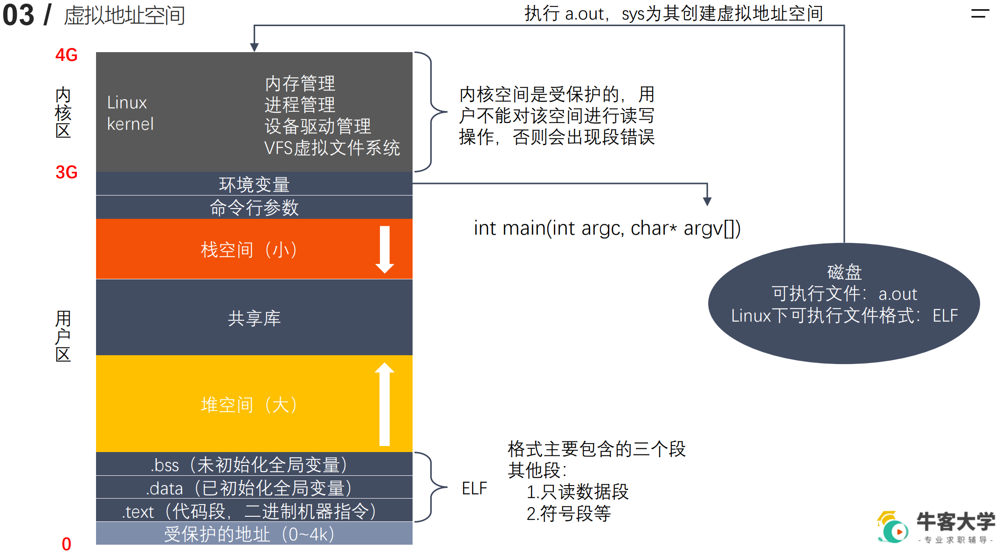

# 指针常量于常量指针

int a = 10;
int * p;
p = &a;

int * p = &a;

**常量指针**，指针指的值不可以修改（带*的操作不可以），指针指向可以修改
const int * p = &a;

**指针常量**，指针指的值可以修改，指向不可以修改（p的操作不可以）
int * const p = &a;


const int * const p = &a;


# 智能指针

[现代 C++：一文读懂智能指针 - 知乎 (zhihu.com)](https://zhuanlan.zhihu.com/p/150555165)


**智能指针，本质上是对资源所有权和生命周期管理的抽象**：

1. 当资源是被独占时，使用 std::unique_ptr 对资源进行管理。
2. 当资源会被共享时，使用 std::shared_ptr 对资源进行管理。
3. 使用 std::weak_ptr 作为 std::shared_ptr 管理对象的观察者。
4. 通过继承 std::enable_shared_from_this 来获取 this 的 std::shared_ptr 对象。


C++11 引入了 3 个智能指针类型：

1. `std::unique_ptr<T>` ：独占资源所有权的指针。可以使用move转移所有权
2. `std::shared_ptr<T>` ：共享资源所有权的指针。
3. `std::weak_ptr<T>` ：共享资源的观察者，需要和 std::shared_ptr 一起使用，不影响资源的生命周期。


## `std::shared_ptr`

`std::shared_ptr` 是C++标准库中的智能指针类型之一，用于管理动态分配的内存。`std::shared_ptr` 提供了共享所有权的内存管理机制，允许多个智能指针共同管理同一块内存，当最后一个`std::shared_ptr`离开作用域或被重置时，内存将被释放。以下是关于`std::shared_ptr`的详细介绍：

### 创建和初始化 `std::shared_ptr`：

您可以使用多种方式来创建和初始化 `std::shared_ptr`。

**使用`std::make_shared`：** 推荐的方法是使用`std::make_shared`函数，它可以在一次内存分配中同时创建对象并返回`std::shared_ptr`：

```cpp
#include <memory>

std::shared_ptr<int> sharedPtr = std::make_shared<int>(42);
```

**使用构造函数：** 也可以使用`std::shared_ptr`的构造函数来初始化：

```cpp
std::shared_ptr<int> sharedPtr(new int(42));
```

### 共享所有权：

`std::shared_ptr` 允许**多个智能指针共享对相同内存资源的所有权**。当多个`std::shared_ptr`指向同一块内存时，内部维护一个引用计数，以跟踪有多少个`std::shared_ptr`共享该资源。

```cpp
std::shared_ptr<int> sharedPtr1 = std::make_shared<int>(42);
std::shared_ptr<int> sharedPtr2 = sharedPtr1; // 共享所有权

// 引用计数现在为2
```

### 智能指针的释放和析构：

当最后一个持有 `std::shared_ptr` 的对象离开作用域，或者当`std::shared_ptr` 显式地被重置（例如，调用`reset()`函数），内存将被释放。

```cpp
std::shared_ptr<int> sharedPtr1 = std::make_shared<int>(42);
{
    std::shared_ptr<int> sharedPtr2 = sharedPtr1; // 共享所有权
} // sharedPtr2 离开作用域，但内存仍然存在
// 当 sharedPtr1 离开作用域时，内存将被释放
```

### 避免循环引用：

虽然`std::shared_ptr`非常强大，但要注意避免循环引用问题。如果两个或多个 `std::shared_ptr` 彼此引用，可能会导致资源泄漏，因为它们的引用计数永远不会减少到零。为了解决这个问题，可以使用 `std::weak_ptr` 来打破循环引用。

### 线程安全性：

`std::shared_ptr` 内部使用引用计数来跟踪资源的所有权。它可以在多线程环境中安全地共享，并且自动处理引用计数的增加和减少，以确保线程安全。

总之，`std::shared_ptr` 提供了共享所有权的内存管理机制，可以有效避免内存泄漏问题。然而，在使用时需要小心处理循环引用问题，以确保正确的资源管理。此外，它也是多线程环境下的一种安全的内存管理工具。


## 循环引用及解决方案

循环引用是指**两个或多个对象之间的引用关系形成一个环**，其中**每个对象都引用了其他对象**，从而导致对象无法被正确地释放，从而产生内存泄漏。在C++中，使用智能指针（如`std::shared_ptr`）时，循环引用问题可能会出现。

考虑以下示例，其中两个对象`A`和`B`相互引用：

```cpp
#include <memory>

class B; // 前向声明

class A {
public:
    std::shared_ptr<B> b_ptr;
    A() {
        std::cout << "A constructor\n";
    }
    ~A() {
        std::cout << "A destructor\n";
    }
};

class B {
public:
    std::shared_ptr<A> a_ptr;
    B() {
        std::cout << "B constructor\n";
    }
    ~B() {
        std::cout << "B destructor\n";
    }
};

int main() {
    std::shared_ptr<A> a = std::make_shared<A>();
    std::shared_ptr<B> b = std::make_shared<B>();
    
    a->b_ptr = b;
    b->a_ptr = a;
    
    return 0;
}
```

在这个示例中，对象`A`和`B`都包含一个`std::shared_ptr`，它们**相互引用对方**。当`main`函数结束时，这两个对象的引用计数不会减少到零，因为它们相互引用，导致它们的析构函数永远不会被调用，从而产生内存泄漏。

为了解决循环引用问题，可以使用以下两种方法：

1. **使用`std::weak_ptr`**：将其中一个智能指针替换为`std::weak_ptr`，从而打破了循环引用。通常，一个对象使用`std::shared_ptr`来拥有资源，而另一个对象使用`std::weak_ptr`来观察资源。

   ```cpp
   #include <memory>
   
   class B; // 前向声明
   
   class A {
   public:
       std::shared_ptr<B> b_ptr;
       A() {
           std::cout << "A constructor\n";
       }
       ~A() {
           std::cout << "A destructor\n";
       }
   };
   
   class B {
   public:
       std::weak_ptr<A> a_ptr;
       B() {
           std::cout << "B constructor\n";
       }
       ~B() {
           std::cout << "B destructor\n";
       }
   };
   
   int main() {
       std::shared_ptr<A> a = std::make_shared<A>();
       std::shared_ptr<B> b = std::make_shared<B>();
       
       a->b_ptr = b;
       b->a_ptr = a;
       
       return 0;
   }
   ```

   这种方式可以有效地解决循环引用问题，因为`std::weak_ptr`不会增加引用计数，且在资源被释放后可以检测到。

2. **手动释放引用**：如果不使用`std::weak_ptr`，可以手动打破循环引用，通过将其中一个对象的引用置为`nullptr`或使用`reset()`函数来释放引用。这会导致资源在适当的时候被释放，但需要更小心地管理资源。

   ```cpp
   a->b_ptr.reset(); // 或者 a->b_ptr = nullptr;
   b->a_ptr.reset(); // 或者 b->a_ptr = nullptr;
   ```

总之，循环引用是一个潜在的内存管理问题，可以通过使用`std::weak_ptr`或手动释放引用来解决。在设计和实现中，需要特别小心以确保资源正确释放，以避免内存泄漏。


## `std::unique_ptr`

`std::unique_ptr` 是C++标准库中的智能指针类型之一，用于管理动态分配的内存。与 `std::shared_ptr` 不同，`std::unique_ptr` 提供了独占所有权的内存管理，意味着只有一个 `std::unique_ptr` 可以拥有对特定内存块的所有权。以下是关于 `std::unique_ptr` 的详细介绍：

### 创建和初始化 `std::unique_ptr`：

您可以使用多种方式来创建和初始化 `std::unique_ptr`。

**使用`std::make_unique`：** 推荐的方法是使用 `std::make_unique` 函数，它可以一次性创建对象并返回 `std::unique_ptr`：

```cpp
#include <memory>

std::unique_ptr<int> uniquePtr = std::make_unique<int>(42);
```

**使用构造函数：** 也可以使用 `std::unique_ptr` 的构造函数来初始化：

```cpp
std::unique_ptr<int> uniquePtr(new int(42));
```

### 独占所有权：

`std::unique_ptr` 与其名称一样，提供了独占所有权的内存管理。只有一个 `std::unique_ptr` 可以拥有对特定内存资源的所有权。如果您尝试将所有权转移给另一个 `std::unique_ptr` 或创建副本，编译器将会产生错误。

```cpp
std::unique_ptr<int> uniquePtr1 = std::make_unique<int>(42);
// std::unique_ptr<int> uniquePtr2 = uniquePtr1; // 编译错误，独占所有权不能复制
// std::unique_ptr<int> uniquePtr3 = std::move(uniquePtr1); // 正确，使用 std::move 转移所有权
```

### 手动释放内存：

当 `std::unique_ptr` 离开其作用域或显式被重置时，它会自动释放内存。

```cpp
std::unique_ptr<int> uniquePtr = std::make_unique<int>(42);
// 当 uniquePtr 离开作用域或显式被 reset() 时，内存会被自动释放
```

### 使用 std::unique_ptr 的优点：

1. **资源管理的安全性**：由于独占所有权，`std::unique_ptr` 在资源释放方面非常安全，不会出现多个指针试图释放同一块内存的问题。

2. **轻量级**：与 `std::shared_ptr` 相比，`std::unique_ptr` 更轻量，因为它不需要维护引用计数。

3. **清晰的所有权语义**：`std::unique_ptr` 提供了明确的所有权语义，使得代码更容易理解和维护。

4. **性能**：由于没有引用计数，`std::unique_ptr` 在性能方面通常更高效。

### 使用注意事项：

1. **不能复制**：`std::unique_ptr` 不能像 `std::shared_ptr` 一样进行复制，**只能通过移动语义（`std::move`）来转移所有权。**

2. **不适用于共享资源**：如果需要多个智能指针共享同一块内存资源，请考虑使用 `std::shared_ptr` 或 `std::weak_ptr`。

3. **避免悬空指针**：一旦 `std::unique_ptr` 所有权被移动到另一个 `std::unique_ptr`，原始指针将变为空悬空指针。

总之，`std::unique_ptr` 是一种用于独占所有权的内存管理工具，可以确保资源在适当的时候被释放，并提供了清晰的所有权语义。它是C++中管理动态分配内存的重要工具之一，特别适合用于管理独立的资源。


## `std::weak_ptr`

`std::weak_ptr` 是C++标准库中的智能指针类型之一，用于解决 `std::shared_ptr` 可能引发的循环引用问题，并允许观察由 `std::shared_ptr` 管理的资源，同时不拥有资源的所有权。以下是关于 `std::weak_ptr` 的详细介绍：

### 创建和初始化 `std::weak_ptr`：

您通常**无法直接创建 `std::weak_ptr`，而是从已存在的 `std::shared_ptr` 创建**。这是因为 `std::weak_ptr` 用于观察 `std::shared_ptr` 拥有的资源。

```cpp
#include <memory>

std::shared_ptr<int> sharedPtr = std::make_shared<int>(42);
std::weak_ptr<int> weakPtr = sharedPtr; // 从 shared_ptr 创建 weak_ptr
```

创建方式2：

std::weak_ptr<A> a_ptr;

A包含一个shared_ptr，被weak_ptr引用，用weak_ptr监控shared_ptr


### 弱引用：

`std::weak_ptr` 是一种弱引用智能指针，它不会增加资源的引用计数。与 `std::shared_ptr` 不同，`std::weak_ptr` 不会影响资源的生命周期。当最后一个 `std::shared_ptr` 离开作用域时，资源可能会被释放，而不管是否存在 `std::weak_ptr`。

```cpp
{
    std::shared_ptr<int> sharedPtr = std::make_shared<int>(42);
    std::weak_ptr<int> weakPtr = sharedPtr;
} // sharedPtr 离开作用域，资源可能被释放
```

### 使用 `std::weak_ptr`：

要使用 `std::weak_ptr` 来访问资源，通常需要将其转换为 `std::shared_ptr`。这可以使用 `lock()` 函数来实现。如果资源已经被释放，`lock()` 将返回一个空的 `std::shared_ptr`。

```cpp
std::shared_ptr<int> sharedPtr2 = weakPtr.lock();
if (sharedPtr2) {
    // 使用 sharedPtr2 访问资源，如果资源未被释放
} else {
    // 资源已被释放
}
```

### 循环引用解决方案：

一个主要应用 `std::weak_ptr` 的场景是解决 `std::shared_ptr` 可能引发的循环引用问题。循环引用可能导致资源无法释放，而使用 `std::weak_ptr` 可以避免这个问题。

```cpp
#include <memory>

class B; // 前向声明

class A {
public:
    std::shared_ptr<B> b_ptr;
    A() {
        std::cout << "A constructor\n";
    }
    ~A() {
        std::cout << "A destructor\n";
    }
};

class B {
public:
    std::weak_ptr<A> a_ptr; // 使用 weak_ptr 避免循环引用
    B() {
        std::cout << "B constructor\n";
    }
    ~B() {
        std::cout << "B destructor\n";
    }
};

int main() {
    std::shared_ptr<A> a = std::make_shared<A>();
    std::shared_ptr<B> b = std::make_shared<B>();
    
    a->b_ptr = b;
    b->a_ptr = a;
    
    return 0;
}
```

### 线程安全性：

`std::weak_ptr` 可以在多线程环境中安全地使用，以安全地观察由 `std::shared_ptr` 管理的资源。它不会增加引用计数，因此不会引发竞争条件。

### 使用 `std::weak_ptr` 的优点：

1. **解决循环引用问题**：`std::weak_ptr` 可以用于解决 `std::shared_ptr` 可能引发的循环引用问题，确保资源正确释放。

2. **资源观察**：`std::weak_ptr` 允许观察由 `std::shared_ptr` 管理的资源的状态，而无需拥有所有权。

3. **线程安全**：`std::weak_ptr` 在多线程环境中使用时非常安全，不会引发竞争条件。

总之，`std::weak_ptr` 是一种有用的智能指针类型，用于解决循环引用问题并观察由 `std::shared_ptr` 管理的资源的状态。它在设计和实现中，特别适合用于管理共享资源和避免循环引用问题。

# 内存对齐

[C/C++内存对齐详解 - 知乎 (zhihu.com)](https://zhuanlan.zhihu.com/p/30007037)


现代计算机中内存空间都是按照 byte 划分的，从理论上讲似乎对任何类型的变量的访问可以从任何地址开始，但是**实际的计算机系统对基本类型数据在内存中存放的位置有限制**，它们会**要求这些数据的首地址的值是某个数k（通常它为4或8）的倍数，这就是所谓的内存对齐。**


尽管内存是以字节为单位，但是**大部分处理器并不是按字节块来存取内存的**.它一般会以双字节,四字节,8字节,16字节甚至32字节为单位来存取内存，我们将上述这些存取单位称为**内存存取粒度**.


现在考虑**4字节存取粒度的处理器取int类型变量**（32位系统），该**处理器只能从地址为4的倍数的内存开始读取数据。**

假如没有内存对齐机制，数据可以任意存放，现在一个int变量存放在从地址1开始的连续四个字节地址中，该处理器去取数据时，**要先从0地址开始读取第一个4字节块,剔除不想要的字节（0地址）,然后从地址4开始读取下一个4字节块,同样剔除不要的数据（5，6，7地址）,最后留下的两块数据合并放入寄存器.这需要做很多工作.**


内存对齐**可以提升数据的读取效率**


对齐规则:
1.基本类型的对齐值就是其sizeof值;
2.结构体的对齐值是其成员的最大对齐值;
3.编译器可以设置一个最大对齐值，某类型的实际对齐值是该类型的对齐值与默认对齐值取最小值得来。


内存对齐（Memory Alignment）是计算机内存管理的一个重要概念。它涉及如何存储数据在计算机内存中的布局和访问。**内存对齐的目的是优化访问内存的性能，特别是针对硬件架构的要求。**

在内存中，数据通常以特定的字节边界对齐。这意味着数据的起始地址应该是某个固定字节的倍数。最常见的字节对齐要求是以4字节或8字节为边界对齐，具体取决于计算机架构和编译器。这个边界对齐的要求是为了确保访问内存的效率，因为许多现代计算机体系结构（如x86、x86-64和ARM）通常更容易处理按照这些边界对齐的数据。

如果数据没有按照所需的边界对齐存储，可能会导致性能下降或者在某些情况下，甚至会导致程序崩溃。这是因为许多CPU架构要求数据在正确的边界上，否则可能需要额外的指令来处理不对齐的数据，这会增加访问内存的成本。

C++编译器会自动处理大多数内存对齐的细节，但在某些情况下，开发人员可能需要手动控制内存对齐，通常通过特殊的编译器指令或数据结构属性来实现。

内存对齐在数据结构、编程性能优化和与硬件交互的情况下都非常重要。因此，在C++编程中，了解内存对齐的概念和如何应用它可以帮助您编写更高效和可移植的代码。


# 引用

## 引用简介

引用是C++中的一种重要概念，它提供了对已存在变量的别名或引用，允许您通过不同的名字来访问相同的数据。引用通常用于以下几个方面：

1. **变量的别名**：引用允许您为现有变量创建一个别名，这意味着您可以使用不同的名称来操作相同的数据。引用本质上是一个变量的别名，它并不拥有自己的内存地址。

   ```cpp
   int x = 10;
   int &y = x; // 创建整数引用 y，它是 x 的别名
   ```

2. **传递参数**：引用通常用于函数参数中，允许将参数传递给函数而不进行副本的复制。这可以提高性能，并且允许函数修改原始数据。

   ```cpp
   void modifyValue(int &value) {
       value *= 2; // 修改原始数据
   }

   int main() {
       int x = 10;
       modifyValue(x); // 传递 x 的引用
       // 此时 x 的值变为 20
       return 0;
   }
   ```

3. **返回引用**：函数可以返回引用，允许您从函数中返回引用的数据，以便在调用方代码中进行修改。

   ```cpp
   int &getByReference(int &value) {
       return value;
   }

   int main() {
       int x = 10;
       int &y = getByReference(x); // 获取 x 的引用
       y = 20; // 修改 x 的值
       // 此时 x 的值变为 20
       return 0;
   }
   ```

4. **避免拷贝**：引用避免了不必要的数据复制，因为它们允许多个变量引用相同的数据，而不需要为每个引用创建副本。

引用的一些重要特性和注意事项：

- 引用必须在定义时进行初始化，且一旦初始化，它将始终引用同一块数据。
- 引用不拥有自己的内存空间，它只是一个别名，因此无法引用空值。
- 使用 `const` 关键字可以创建常量引用，防止通过引用修改数据。
- 使用引用传递函数参数时，函数内对参数的修改会影响到原始数据。
- 引用通常用于提高性能，减少内存使用，并允许函数修改调用方数据。

总之，引用是C++中的一个强大工具，用于创建别名、传递参数和返回引用等情况。了解如何正确使用引用是编写高效和清晰的C++代码的关键。


## 引用本质


本质：**引用的本质在c++内部实现是一个指针常量.**

指针常量的**指针指向不可以改变**，因此引用一旦初始化，将始终指向一块内存。

讲解示例：

```C++
//发现是引用，转换为 int* const ref = &a;
void func(int& ref){			// int& ref = a;
	ref = 100; // ref是引用，转换为*ref = 100
}
int main(){
	int a = 10;
    
    //自动转换为 int* const ref = &a; 指针常量是指针指向不可改，也说明为什么引用不可更改（但引用的值可以修改）
	int& ref = a; 
	ref = 20; //内部发现ref是引用，自动帮我们转换为: *ref = 20;
    
	cout << "a:" << a << endl;
	cout << "ref:" << ref << endl;
    
	func(a);
	return 0;
}
```

结论：C++推荐用引用技术，因为语法方便，引用本质是指针常量，但是所有的指针操作编译器都帮我们做了


# vector 扩容

`std::vector` 是C++标准库中的容器类型之一，它提供了动态数组的功能，可以自动调整大小以容纳更多元素。`std::vector` 的扩容机制是它如何管理内部存储，以使其能够动态增加容量以容纳新元素的过程。以下是关于`std::vector`的扩容机制的详细介绍：

1. **初始容量**：当您创建一个空的 `std::vector` 时，它通常会分配一小块内存作为初始容量，以便存储一些元素。这个初始容量通常是平台相关的，但是不会太大。

2. **元素插入**：当您向 `std::vector` 中添加新元素时，它会检查当前元素数量和容量。如果元素数量超过了容量，`std::vector` 需要扩容。

3. **扩容策略**：`std::vector` 采用一种策略来决定何时以及如何扩容。通常情况下，它会将容量翻倍，以分摊分配内存的成本。这个策略有时被称为指数增长。

4. **内存重新分配**：当需要扩容时，`std::vector` 将为新容量分配一块内存，并将当前元素复制到新内存中。然后，旧的内存将被释放。

   例如，如果当前容量为 4，但需要添加第 5 个元素，`std::vector` 会重新分配一个容量为 8 的内存块，将现有的 4 个元素复制到新内存中，然后添加新的元素。

5. **扩容开销**：由于内存重新分配和元素复制，扩容操作可能会导致一定的性能开销。但由于指数增长策略，平均来说，插入单个元素的时间复杂度是常数时间，即O(1)。

6. **预留内存**：为了避免频繁的内存重新分配，您可以使用 `reserve()` 函数来预留一定数量的内存，以便 `std::vector` 能够在不重新分配内存的情况下容纳更多元素。

```cpp
std::vector<int> vec;
vec.reserve(100); // 预留内存以容纳至少 100 个元素
```

总之，`std::vector` 使用一种指数增长的策略来扩容，以容纳更多的元素。虽然扩容会导致一些性能开销，但平均情况下，插入和访问元素的时间复杂度都是O(1)，使其成为一个高效的动态数组实现。要提高性能，可以使用 `reserve()` 预留足够的内存。


# char、int取值范围

`int` 的取值范围在不同计算机体系结构和编译器中可能会有所不同，但通常遵循C++标准的规定。C++标准规定了 `int` 的最小和最大值，您可以使用 `<limits>` 头文件中的 `std::numeric_limits` 模板类来查询这些值。

在大多数计算机上，`int` 是一个32位有符号整数类型，其取值范围通常为：

- 最小值（`std::numeric_limits<int>::min()`）：通常是 `-2,147,483,648`（-2^31）。
- 最大值（`std::numeric_limits<int>::max()`）：通常是 `2,147,483,647`（2^31 - 1）。

请注意，这些值可能因编译器和计算机体系结构的不同而有所变化。在某些特定的编译器和平台上，`int` 可能是16位或64位，因此取值范围也会相应改变。要获得确切的 `int` 取值范围，请使用上述代码查询您的编译环境中的值。

如果您需要一个具有已知大小的整数类型，可以使用C++11引入的 `int32_t` 或 `int64_t`，它们分别表示32位和64位有符号整数。这些类型的大小和范围是固定的，不受编译器或平台的影响。例如：

```cpp
#include <iostream>
#include <cstdint>

int main() {
    std::int32_t x = std::numeric_limits<std::int32_t>::max();
    std::cout << "int32_t 最大值：" << x << std::endl;

    std::int64_t y = std::numeric_limits<std::int64_t>::max();
    std::cout << "int64_t 最大值：" << y << std::endl;

    return 0;
}
```

这将输出确切的 `int32_t` 和 `int64_t` 的最大值，而不受平台的影响。


8位 * 4 = 32 位

32 - 1 = 31


在C++中，`char` 是一个字符数据类型，通常用来表示单个字符。`char` 可以是有符号的或无符号的，具体的取值范围取决于编译器和平台。

1. **有符号 `char`**：有符号的 `char` 可以表示正数、负数和零。通常情况下，有符号 `char` 的取值范围为 `-128` 到 `127`（包括这两个值），因此它可以表示包括ASCII字符在内的所有可能的字符。

2. **无符号 `char`**：无符号的 `char` 只能表示非负整数，通常范围为 `0` 到 `255`（包括这两个值）。无符号 `char` 主要用于存储字节数据。

需要注意的是，`char` 的取值范围可能因编译器、操作系统和硬件平台而异。为了确保可移植性，如果需要确切的范围信息，可以使用 `<limits>` 头文件中的 `std::numeric_limits` 模板类来查询 `char` 的最小值和最大值：

```cpp
#include <iostream>
#include <limits>

int main() {
    std::cout << "最小值：" << (int)std::numeric_limits<char>::min() << std::endl;
    std::cout << "最大值：" << (int)std::numeric_limits<char>::max() << std::endl;
    return 0;
}
```

这将输出您当前系统上 `char` 的最小值和最大值。需要注意的是，为了将 `char` 的最小值和最大值输出为整数，使用了 `(int)` 强制类型转换。


# -2 的表示

在计算机中，**负数通常使用二进制补码表示**。负数的存储方式依赖于数据类型和计算机体系结构。让我们以有符号整数为例，讨论如何存储负数 `-2`：

1. **数据类型**：首先，数据类型会影响如何存储 `-2`。通常情况下，使用的数据类型是有符号整数（`signed int` 或 `signed char` 等）。这意味着该数据类型可以表示正数和负数。

2. **二进制表示**：计算机使用二进制表示数字。负数通常使用二进制补码表示法。

3. **二进制补码**：二进制补码是一种表示有符号整数的方法，它是通过将正整数的二进制表示取反并加1来得到的。这种表示方式使得负数的加法、减法等操作可以与正数一样进行，从而简化了计算。

   - `2` 的二进制表示是 `0000 0010`。
   - 取反：`1111 1101`
   - 加1：`1111 1110`

   因此，`-2` 的二进制补码表示是 `1111 1110`。

4. **存储**：负数的二进制补码会存储在计算机的内存中。具体存储方式取决于数据类型和计算机体系结构。通常，一个字节（8位）的有符号整数类型可以存储 `-2`，并且 `1111 1110` 这个二进制补码会以二进制形式存储在内存中。

总之，计算机通常使用二进制补码来存储负数。在这种表示法下，`-2` 的二进制补码是 `1111 1110`。存储方式取决于数据类型和计算机体系结构，但一般来说，它会以二进制形式存储在内存中。


# 原码、补码、反码

原码、反码和补码是计算机中用来表示有符号整数的三种不同的二进制表示方式。

1. **原码（Sign-Magnitude）**：
   - 原码最简单，最直观的表示方式。
   - 原码中最高位为符号位（0表示正数，1表示负数），其余位表示数值的绝对值。
   - 例如，+5 的原码是 `00000101`，-5 的原码是 `10000101`。

   原码的优点是可以直观地区分正数和负数，但它有一个问题，即0有两种表示方式，正零和负零。

2. **反码（One's Complement）**：
   - 反码是通过对原码中的正数部分保持不变，对负数部分按位取反得到的。
   - 反码中最高位仍然表示符号，其余位表示数值的绝对值。
   - 例如，+5 的反码是 `00000101`，-5 的反码是 `11111010`。

   反码解决了原码中0的两种表示方式的问题，但引入了一种新的问题，即在进行加法运算时可能会出现"溢出进位"的情况。

3. **补码（Two's Complement）**：
   - 补码是计算机中最常用的有符号整数表示方式。
   - 补码中最高位仍然表示符号，其余位表示数值的绝对值。
   - 对于正数，补码与原码相同。
   - 对于负数，补码是将反码加1。
   - 例如，+5 的补码是 `00000101`，-5 的补码是 `11111011`。

   补码解决了0的两种表示方式和"溢出进位"的问题，而且在加法和减法运算中可以使用相同的硬件电路。

总结一下，原码、反码和补码是用来表示有符号整数的不同二进制表示方式。在现代计算机中，通常使用补码来表示有符号整数，因为它解决了多种问题，并具有较好的数学性质。


# 虚拟内存

**操作系统提供的内存管理技术，用于管理虚拟地址空间和物理内存之间的映射关系**


进程想要运行程序需要将程序从外存装入到内存，每个进程都有一片内存空间，操作系统不让进程直接操作物理内存，而是给每个进程提供一个虚拟地址空间（也就是提供给一块虚拟的内存），操作系统将该虚拟地址空间和物理内存建立映射关系，进程操作该虚拟地址空间时，由操作系统实现对物理内存的操作，这就是虚拟内存技术

通过程序部分装入、请求调入内存页等技术，可以给程序提供比真实物理内存大得多的虚拟内存

提供了内存保护机制，让每个进程都有一个单独的虚拟地址空间，避免了相互之间的干扰


虚拟内存：一块虚拟的内存（构成了虚拟地址空间）、一种技术（将虚拟内存与物理内存建立映射关系）


# 虚拟地址空间

描述了每个进程内部的虚拟内存布局，虚拟地址空间是一块虚拟的内存，是每个进程看到的内存布局（每个进程只可以看到自己的虚拟地址空间）

虚拟地址空间由虚拟内存技术实现，是进程内部对虚拟内存的抽象表示


进程的虚拟地址空间情况：

​			


1. 代码段/文本段(Code Segment)：存储程序的机器代码和可执行指令；包含了程序的执行代码，通常是只读的；通常是共享的，由多个进程及线程共享相同的代码段，从而节省内存
2. 数据段(Data Segment)：存放程序的全局变量、静态变量，在程序的整个生命周期内存在；分为data、bss两部分；通常是可读写的
3. 堆区(Heap)：地址从低地址向高地址增长；用于动态内存分配的区域，程序可以在堆中按需求动态分配和释放内存块；堆的大小由操作系统和分配策略（如malloc、new）决定，可以动态增长、缩小；堆区内存的分配、释放由程序员手动显式管理，注意防止内存泄露
4. 栈区(stack)：地址从高地址向低地址增长；存储程序的局部变量、参数、返回值等；是一个后进先出(LIFO)的数据结构，用于跟踪函数的调用和返回顺序；栈区内存的分配、释放由编译器自动管理


# 动态内存分配

一种计算机编程的内存管理技术，允许程序在运行时动态请求、分配内存（可以使用不同的数据结构和运行情况），而不是在编译时静态分配

动态内存分配分配的内存通常是在堆中，堆是一块用于进行动态内存分配的内存区域，从低地址向高地址增长


动态内存分配分配的是虚拟内存（虚拟地址空间中堆区的虚拟内存）：当调用malloc或new操作符来分配内存时，其会在进程的虚拟地址空间的堆区分配一块要求大小的虚拟内存，分配的虚拟内存块在虚拟地址空间中是连续的（并没有马上映射到物理内存）


虚拟内存是虚拟地址空间的一部分

虚拟地址空间是进程对虚拟内存的抽象表示


在虚拟内存的支持下进行的。程序使用new来动态申请内存


## C++动态内存分配方法

在C++中，有多种方法可以用于动态内存分配。以下是一些常见的方法：

1. **new 和 delete 操作符**：
   - `new` 操作符用于分配单个对象或数组，并返回一个指向分配内存的指针。
   - `delete` 操作符用于释放通过 `new` 分配的内存。
   - 这是C++中最常用的动态内存分配方法。

   示例：
   ```cpp
   int *ptr = new int; // 分配一个整数的内存
   delete ptr; // 释放分配的内存
   ```

2. **new[] 和 delete[] 操作符**：
   - `new[]` 操作符用于分配数组，并返回一个指向数组的指针。
   - `delete[]` 操作符用于释放通过 `new[]` 分配的数组内存。

   示例：
   ```cpp
   int *arr = new int[10]; // 分配包含 10 个整数的数组内存
   delete[] arr; // 释放分配的数组内存
   ```

3. **malloc 和 free 函数**：
   - `malloc` 函数用于在堆上分配内存，返回一个指向分配内存的指针。
   - `free` 函数用于释放通过 `malloc` 分配的内存。

   示例：
   ```cpp
   int *ptr = (int *)malloc(sizeof(int)); // 分配一个整数的内存
   free(ptr); // 释放分配的内存
   ```

4. **calloc 和 realloc 函数**：
   - `calloc` 函数用于分配一块指定大小的内存，并将其初始化为零。
   - `realloc` 函数用于重新分配已分配内存的大小。

   示例：
   ```cpp
   int *arr = (int *)calloc(10, sizeof(int)); // 分配包含 10 个整数的内存，并初始化为零
   arr = (int *)realloc(arr, 20 * sizeof(int)); // 重新分配内存大小
   free(arr); // 释放分配的内存
   ```

5. **智能指针（Smart Pointers）**：
   - C++提供了智能指针类（例如 `std::shared_ptr` 和 `std::unique_ptr`），它们用于管理动态分配的内存。
   - 智能指针可以自动处理内存的分配和释放，以防止内存泄漏。

   示例（使用 `std::shared_ptr`）：
   ```cpp
   #include <memory>
   
   std::shared_ptr<int> ptr = std::make_shared<int>(42); // 使用 std::make_shared 创建 shared_ptr
   // 内存会在 ptr 离开作用域时自动释放，无需显式 delete 或 free
   ```

这些方法提供了不同的方式来动态分配内存，每种方法都适用于不同的场景。在现代C++中，推荐使用智能指针，因为它们可以更安全和方便地管理内存，减少内存泄漏和指针错误的风险。但在某些情况下，仍然需要使用传统的 `new`、`delete`、`malloc` 和 `free`，特别是在与C代码交互或需要更精细的内存控制时。


# `malloc` 和 `new`

**`malloc `**

​			是C语言的标准库函数（无法重载），包含在头文件 `<stdlib.h>` 中；

​			用于分配一块指定大小的内存，需要显示指定要分配的内存块的字节数；（也是动态内存分配的方法）

​			**返回的是一个`void` 类型的指针**，需要强转一下转为需要的类型；

​			申请的内存是在堆空间；

​			申请的内存通过**free释放**；

​			内存分配失败时，返回NULL

​			有扩张内存机制：使用malloc分配内存后，后面使用时发现内存不够用了，可以调用realloc函数扩张内存（realloc函数会判断当前内存后面是否有足够的内存空间来扩张，有的话则向后面继续申请空间，并返回原来的地址指针；若当前内存后面没有足够空间的话realloc会在另外有足够大小的内存申请一块空间，并将当前空间的内容拷贝到新申请的空间，返回新的内存空间的地址指针）

**`new `**

​			是C++ 的**操作符**，不是函数；

​			用于创建并初始化对象、动态分配内存，操作符根据new后面的类型**自动计算要分配的内存大小**，无需显式指定；

​			符合类型安全性，**返回的是指向new出来的对象（类型）的指针，因此C++中new比malloc安全；**

​			分配的内存是在自由存储区（动态内存分配的概念，可以是堆区、全局区、静态存储区等，很多C++编译器new默认使用malloc实现，因此new默认在堆区申请内存），new可以进行重载，让其分配在内存的其他区；

​			申请的自由存储区通过**delete释放**，delete默认使用free实现；

​			内存分配失败时，不会返回NULL，会抛出`bac_alloc`异常，需要通过异常捕捉获取该异常（否则程序会异常退出）

​			没有扩张内存机制


使用new操作符进行分配对象内存时经历的步骤：

​			1、调用operator new / operator newp[] 函数分配一块足够的内存空间（底层默认使用malloc，除非重载了new）以便存储特定类型的对象；

​			2、编译器调用相应的构造函数以构造对象，并为其初始化；

​			3、对象构造完成，返回指向该对象的指针；

使用delete操作符释放对象内存是经历的步骤：

​			1、调用对象析构函数；

​			2、编译器调用operator delete / operator delete[] 函数释放内存空间（底层默认使用free，除非重载了delete）


# 内存泄漏

内存泄漏（Memory Leak）是指在程序运行中，程序分配了一块内存（通常是动态分配的内存，如使用 `new` 或 `malloc` 分配的内存），但在**不再需要该内存时未能正确释放或回收它**。这导致分配的内存一直占用着系统的内存资源，而无法再次使用，最终可能导致系统内存资源耗尽，程序变得不稳定或崩溃。

内存泄漏通常是由程序员的错误或疏忽造成的，例如：

1. **忘记释放内存**：程序员分配了内存，但忘记在不再需要内存时使用 `delete`（在C++中）或 `free`（在C中）来释放它。

2. **失去内存指针**：程序中的内存指针丢失了，因此无法释放分配的内存。这通常发生在指针被重新赋值，但旧的指针仍然指向先前分配的内存块。

3. **循环引用**：在具有循环引用的数据结构中，对象之间相互引用，导致无法释放内存。

内存泄漏可能导致以下问题：

- **资源耗尽**：内存泄漏会逐渐消耗系统的可用内存资源，最终可能导致系统性能下降或崩溃。

- **程序崩溃**：长时间运行的程序中的内存泄漏可能导致程序崩溃或变得不稳定。

- **性能下降**：内存泄漏会导致程序占用更多的内存，从而降低程序的性能。

为了避免内存泄漏，程序员应该注意在动态分配内存后，及时释放不再需要的内存。在现代C++中，可以使用智能指针（如 `std::shared_ptr` 和 `std::unique_ptr`）来帮助自动管理内存，从而减少内存泄漏的风险。此外，使用静态分析工具和内存分析工具可以帮助检测和诊断内存泄漏问题。


# 内核泄露

内核泄漏（Kernel Leak）是指计算机操作系统内核（通常是指操作系统的核心组件，如Linux内核、Windows内核等）中存在的内存泄漏问题。与应用程序内存泄漏类似，内核泄漏涉及到操作系统内核中的内存分配和释放。

内核泄漏通常指的是**操作系统内核未能正确释放或回收其内部数据结构、缓冲区或其他资源所使用的内存**。这种情况可能导致操作系统内核的内存资源逐渐耗尽，最终可能引发系统不稳定、性能下降或崩溃。

内核泄漏通常是由以下原因引起的：

1. **内核程序错误**：操作系统内核的程序代码中可能存在缺陷，导致未能正确处理内存分配和释放。

2. **驱动程序错误**：内核驱动程序是操作系统内核的一部分，它们负责管理硬件设备和与操作系统交互。驱动程序中的错误可能导致内核泄漏。

3. **不当的系统调用或API使用**：应用程序通过系统调用或API与内核交互，如果应用程序使用不当，可能导致内核内存泄漏。

内核泄漏是一种严重的问题，因为它会直接影响到整个操作系统的稳定性和性能。修复内核泄漏需要深入的操作系统知识和系统编程技能，通常由操作系统的维护者或开发者来处理。操作系统的维护者通常会定期发布更新和补丁，以解决已知的内核泄漏问题，因此保持操作系统及其驱动程序的最新版本也是减少内核泄漏风险的一种方式。


异常捕捉


# 虚函数、虚函数指针

[C++中的虚函数表实现机制以及用C语言对其进行的模拟实现 - 陪她去流浪 (twofei.com)](https://blog.twofei.com/496/)


含有虚函数的父类有一个虚函数表指针，指向一个虚函数表

虚函数表是一个数组，存储了每个虚函数的地址


# 左值右值

[【C++】左值和右值、左值引用（&）和右值引用（&&）_c++ arg&&_Jacky_Feng的博客-CSDN博客](https://blog.csdn.net/Jacky_Feng/article/details/120742414)


# 强制类型转换

[C++ 四种强制类型转换 - 静悟生慧 - 博客园 (cnblogs.com)](https://www.cnblogs.com/Allen-rg/p/6999360.html)


# static 关键字

被修饰的成员存放在全局区，程序结束后才被释放

静态成员

- 静态成员变量类内类外初始化，所有对象共享同一个静态成员变量
- 静态成员函数只能访问静态成员变量


# this 指针

类

类实例出一系列对象

每个对象的内存地址都是不同的

空对象占1字节，要存储对象的内存地址


类有很对实例对象，每个对象都有一个this指针，指向相应的对象实例，是类的非静态成员函数的一个隐式参数，

this指针指向其所属的对象，存储了所属对象的地址

通过this指针可以访问对象的其他变量、方法


类的所有对象共享相同的非静态成员函数实现，而数据使用的是对象实例自己的

因为有this指针的存在，类的非静态成员函数可以区分是哪个对象调用的自己，进而可以访问实例的其他变量


# 虚函数

用virtue修饰函数

虚函数针对类，而不是类的实例

若类有虚函数（无论几个），那么该类就有一个虚函数指针（占4或8字节），指向一张虚函数表

该虚函数表存储了该类的所有虚函数的地址


子类继承父类，会同时继承父类的虚函数指针（可以继承多个父类的虚函数指针，每个4字节）

- 若子类未重写父类的虚函数，则该虚函数指针指向的虚函数表中存储的还是父类的函数地址，子类和父类共享相同的虚函数表（多个子类也可以共享相同的虚函数表）

- 若子类重写了父类的虚函数，则该虚函数指针指向的虚函数表中存储的函数地址替换为子类的地址（即派生类在自己的虚函数表中存储自己的函数地址，不会影响父类的），从而实现多态；重写后每个子类会创建自己的虚函数表，在自己的虚函数表上存储自己重写后的函数地址


若有多个子类


