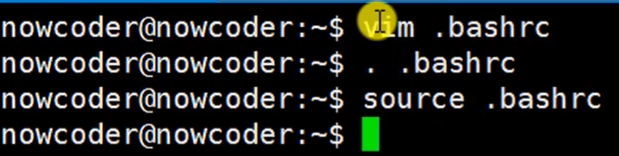
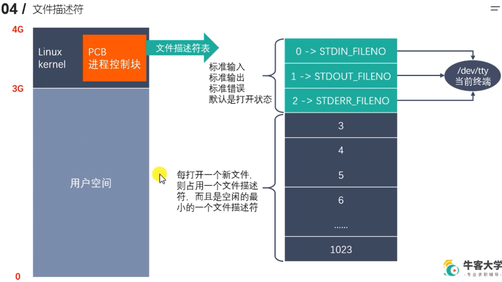
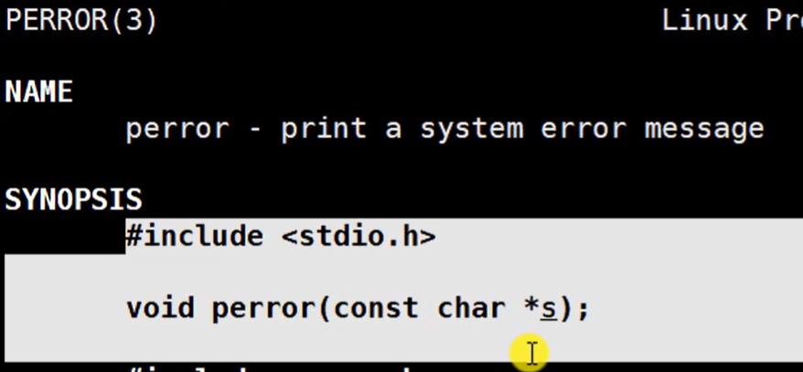

# GCC

2023.8.14开始

2023.8.20结束

## 什么是GCC


安装编译器：

` sudo apt install gcc g++`

查看版本：

`gcc -v`


清空命令:

`ctrl + l`


编译源代码：

`gcc test.c -o app`

会生成一个名为app的可执行文件


## 编程语言的发展


编译器：将高级语言翻译成汇编语言	编程语言的翻译器


## GCC工作流程


预处理：

去掉注释、替换宏 等


## GCC常用参数选项


只进行代码**预处理**： （生成test.i文件）

`gcc test.c -E -o test.i`

只进行预处理后代码的**编译**：

`gcc test.i -S -o test.s`

只进行编译后代码的**汇编**：  （生成了可执行文件）

`gcc test.s -s -o test.o`


`gcc test.c -E`

直接在命令行窗口输出了test.i的内容，没生成文件


`gcc test.c -S`

生成了test.s文件（编译后的文件，编译器自动进行了预处理）


`gcc test.c -s`

`gcc test.c `

生成了a.out 可执行文件


`gcc test.c -s test.o`

`gcc test.c -o test.o`

生成了test.o可执行文件

（-o代表生成文件的名字，用的话后面必须有参数）

（**linux中加不加后缀都可以，效果一样**）


`gcc -c test.c`

生成test.o文件


编译的时候指定宏：（方便调试）

`gcc test.c -o test -DDEBUG`

`gcc test.c -o test -D DEBUG`

（编译的时候给程序指定了一个名为DEBUG的宏）

（相当于在程序的正上方定义了一个宏）

作用举例：

将调试信息代码设置为只有宏定义了才执行，

开发时进行宏定义，发布版本不进行宏定义


不需要进程链接的程序，只进行汇编，生成的可执行文件.o即可执行


## gcc与g++的区别


对于C语言代码：

整个过程，gcc，g++都等价


对于C++代码：

编译阶段g++,gcc都是等价的(g++会调用gcc)

链接阶段只能使用g++

所以编译、链接都用g++即可


对于误区二，.c，.cpp两种文件，以及gcc，g++两种编译器，只有用 gcc 解释 .c 时，才没有宏__cplusplus的定义

__cplusplus标识代码是C++代码


优化:


作用：防止别人通过反汇编看出自己的代码逻辑，等


# 静态库与动态库


## 静态库


静态库和动态库都是在链接阶段被使用


安装tree工具，可视化工具，查看目录树

`sudo apt install tree`


`gcc -c add.c sub.c multi.c div.c -I ../include/`

`ar rcs libcalc.a add.o sub.o multi.o div.o`
`mv libcalc.a ../lib/`

库的名字：calc，

库文件的名字：libcalc.a

` gcc main.c -o app -I ./include -L ./lib -l calc`


## 动态库


`-fpic`可以得到与位置无关的代码

动态库制作：

`gcc -c -fpic a.c b.c`

`gcc -shared a.o b.o -o libcac.so`

动态库使用：

`gcc main.c -o app -I include/ -L lib/ -l cac`


``gcc main.c -o app -I include/ -L lib/ -l cac`` 对动态库编译时，只是把动态库的信息放到可执行程序中，不会把动态库加载到可执行程序中，也没有将动态库加载到内存中

`./app` 运行时，会把动态库加载到内存中


`ldd app`可查看可执行程序`app`所有的依赖库


动态库载入器获取可执行程序所依赖的动态库的路径，

动态库加载失败原因：动态库载入器的搜索路径中没有动态库的绝对路径。

**解决方法：**将动态库的绝对路径配置在搜索路径中。

**方式一：**将动态库的绝对路径添加到环境变量中：

`export LD_LIBRARY_PATH=$LD_LIBRARY_PATH:home/nowcoder/Linux/lesseon06/library/lib`

`$`用来加载`LD_LIBRARY_PATH`的内容，`:`用来在后面添加（拼接）新的内容


想要配置一次环境变量永久有效，有两种方式：用户级别、系统级别

**用户级别：**

修改`.bashrc`文件



用`vim`在`.bashrc`文件最后添加动态库的绝对路径

`source`与`.`的作用都是保存修改的环境变量

**系统级别：**


`sudo vim /etc/profile`


最后再`source`一下该文件（不用加`sudo`）


**方式二：**

编辑`/etc/ld.so.cache`，由于其是二进制文件，

通过`sudo vim /etc/ld.so.conf`修改，将动态库的绝对路径加入到其中

更新`sudo ldconfig`

即可

**方式三：**

修改 `/lib/`或`/usr/lib` 目录

不建议方式三，因为以上两个目录有很多系统的库文件，防止误操作

## 静态库与动态库对比

程序执行过程：


在链接阶段：

- 静态库被复制到了可执行程序中，运行阶段直接使用
- 动态库的调用等信息被复制到了可执行程序中，在运行阶段需要知道动态库绝对路径以找到动态库


动态库使用时需要加载

需要**将动态库的绝对路径配置到相应文件中**


库小：建议使用静态库，否则使用动态库


更新时需要更改程序


需要调用某个库的API时才加载（加载整个库）


# Makefile

作用：源文件很多时，简化编译


eg：

```
vim Makefile

app:add.c sub.c mult.c div.c main.c
	gcc add.c sub.c mult.c div.c main.c			（这两行为一条规则）
	
:wq
```

`sudo install make`

`make`		（直接使用make即可运行）

默认只执行第一条规则，其他规则为第一条服务


## 工作原理


检测更新：如果依赖的文件被改过（即依赖的文件比目标晚），则需要重新执行以生成新的目标

依赖晚：依赖未被改过


先有依赖，再有目标，		即根据依赖生成目标：目标更晚

如果依赖变晚了，则需要重新生成目标

如果目标更晚，则不需要重新生成目标


上面的写法更科学，当只有一个`.c`文件更新时，只需要执行该文件的编译代码（其余文件不用重新编译，只重新链接一下）


上面的写法：当有一个`.c`文件更新时，所有文件都要一起被更新

因此第一种效率更高


## 变量


自动变量：`$@`	`$<`	 `$^`


## 模式匹配


两个 `$` 匹配为同样的字符串即可执行

左边的一列代码用右边两行就可以实现：

```
%.o:%.c
	$(CC) -c $< -o $@
```


```
#先定义变量
src=sub.o add.o mult.o div.o main.o
target=app
#规则语句				//本条为第一条规则语句，make只执行第一条，后面的服务于第一条
$(target):$(src)
	$(CC) $(src) -o $(target)
#规则语句（模式匹配）（服务于第一条规则语句）
%.o:%.c
	$(CC) -c $< -o $@

```

## 函数


```
#定义变量
#add.c sub.c main.c mult.c div.c			// --> $(src)的内容
src=$(wildcard ./*.c)
objs=$(patsubst %.c, %.o, $(src))
target=app
$(target):$(objs)	//执行时，add.o依赖没有，则检查下面的规则，发现有匹配上的规则可以生成该依赖，执行
	$(CC) $(objs) -o $(target)

%.o:%.c
	$(CC) -c $< -o $@
```


`*` 与 `%` ：

​	`*` 不知道要比配的内容

​	`%` 带着要内容去看看能不能匹配


`clean`用来清除生成的一系列`.o`文件，想执行该语句：`make clean`（由于`make`只会执行第一条，所以必须指明了执行）

`clean`没有任何依赖，首次执行生成一个`clean`文件（目标），之后由于依赖没有更新（没有依赖），由于检测更新机制的存在，`make clean`也不会再执行改代码

`.PHONY:clean` 表示 `clean` 是伪目标，不会生成 `clean` 文件，所以以后每次`make clean`都可以执行`clean`


# GDB

[用图文带你彻底弄懂GDB调试原理-腾讯云开发者社区-腾讯云 (tencent.com)](https://cloud.tencent.com/developer/article/1823078)

```
gdb main
l
b 10
run
```

一般步骤：

先 gdb 进一个程序，再通过 l 查看程序代码

通过 b 行号 设置断点

通过 run 开始运行


## 基础信息


可执行文件：二进制的，机器指令

`-g` 选项让可执行文件中包含源代码的对应信息，而不是整个源代码，**在调试的时候看到相应信息需要去加载源代码，因此必须保证`gcb`可以找到源代码**

```
gcc test.c -o test -g
gdb test
```

如果不加`-g`参数，则生成的可执行文件无法进行调试


向函数传递参数：

`set args 10 20`

查看传入的参数：

`show args`

退出：

`quit` 或者 `q`


`gdb` 是`shell` 命令

其余是`gdb`命令

`gdb`中直接按回车：执行上一次的命令 

查看代码：`list` 或 `l`


```
g++ test.c test1.c -o test -g
gdb test
(gdb)l					// 查看当前文件的代码
(gdb)l 10				// 查看当前文件第10行代码（显示第十行的上下文，共十行）
(gdb)l test1.c:5		// 查看其他文件的代码（必须加行数或函数名，不加会被认为是当前文件的函数）
```


`set list 20`


## 断点操作


断点删除后，断点编号也不会被再使用


设置无效断点：

`n`：程序不会停在该断点


条件断点：一般用循环里


上图右错误，正确写法：---（上图写法也对，两种都可）

设置条件断点：

```
b 16 if i==3

stop only if i==3
```


## 调试


```
gdb main
(gdb) run
```

程序停在断点行，还没有执行断点行


循环内没有断点，才能出循环


自动变量：

将某变量设置为自动变量，每次执行自动打印该变量


# 标准C库IO函数和Linux系统IO函数对比


输入输出：**站在内存的角度**

输入：从文件读数据到内存

输出：将内存中数据写入文件

## 标准C库函数


标准C库函数：

跨平台	在不同平台调用不同平台的API

标准C库IO函数调用Linux系统的IO函数


`fopen` 返回文件的指针，是一个结构体，包含三部分：

1. **文件描述符**指向文件，作用：定位文件（文件描述符通过调用Linux系统I/O函数返回）

2. **文件读写指针**：读取数据、写数据

3. **I/O缓冲区**（内存地址）：向文件写入数据先写入缓冲区（内存），等内存满了再调用Linux的IO函数写入文件（避免频繁操纵磁盘，提高效率），`fflush,fclose` 都可以使得缓冲区的数据立即写入磁盘

   缓冲区默认大小8K


使用场景：

C标准库I/O函数：适合对磁盘进行读写，有缓冲区可以提高效率

Linux系统I/O函数：网络通信等，实时性要求高时


## 关系


二者关系：调用与被调用

Linux系统的I/O函数连接磁盘与缓冲区

C标准I/O库链接缓冲区与用户程序

减少对磁盘的操作


## 虚拟地址空间

虚拟地址空间描述了每个进程内部的虚拟内存布局


进程：程序执行起来

虚拟地址空间：

​		不存在，程序员想象的，其大小由计算机决定，

用来解决内存加载的一些问题，以及解决栈、堆等模型

每个进程都有一个虚拟地址空间

由CPU的MMU（内存管理单元）将虚拟地址空间映射到物理地址

`0~3G`是用户区，用户可以操作，`3~4G`是内核区，用户不可以操作，可以通过Linux系统的API（如读写函数）操作


## 文件描述符

程序：一段代码，只占用磁盘空间，不占用内存空间

进程：正在运行的程序，占用内存空间




内核：一个程序

进程的PCB：非常复杂的结构体，包含一个文件描述符表（用一个数组来存储），存储了很多个文件的文件描述符（因此一个进程可以打开多个文件）

文件描述符默认大小为1024，因此一个进程最多打开1024个文件

文件描述符的前三个被占用，标准输入、标准输出、标准错误：这三个文件描述符都指向当前终端（设备文件）

Linux一切皆文件

文件描述符从3开始分配


## Linux系统IO函数

### open和close函数


通过`man`查看文档，Linux系统API：`man 2`，标准C库的：`man 3`


Linux通过可变参数实现”重载“			printf等也使用了可变参数


**`open()` 函数：**			作用：打开一个文件或创建一个新文件

```
int open(const char *pathname, int flags);
```

参数：

1. 要打开文件的路径

2. flags：对文件的操作权限设置以及其他设置 （eg : `O_RDONLY, O_WRONLY, O_RDWR`		//这三个互斥的，只能选一个）

3. 返回值：一个新的文件描述符（可用来找到文件），如果调用失败，返回-1	（通过`/return value`查看返回值）

   

   


`errno`：属于系统函数库，库里的一个全局变量，记录的是最近的错误号（Linux每种错误都对应一个错误号）

`perror`,可以**打印错误号`error`对应的错误描述**，（通过`man 3 perror`查看其说明文档）



**`perror` 函数：**

`void perror(const char *s)`

- 参数`s`：传入用户描述，比如`hello`，最终输出的内容是`helle:xxx(实际的错误描述)`

`perror` 不需要传入错误号`error`，只需要传入一个用户描述，`perror` 即打印错误号对应的错误描述


`close` 函数：


- 参数：传入一个文件描述符	 


demo：


### read和write函数


**`read` 函数**


​	

**write函数**


demo：

```
#include <unistd.h>			// Unix标准头文件
#include <stdio.h>
#include <sys/types.h>		// 存放宏的定义
#include <sys/stat.h>	
#include <fcntl.h>

int main() {

	// 1.通过open打开test.txt文件
	int srcfd = open("test.txt", O_RDONLY);
	if (srcfd == -1){
		perror("open");
		return -1;
	}
	
	// 2.创建一个新的文件（拷贝文件）
	int destfd = open("cpy.txt", O_WRONLY | O_CREAT, 0664);		//0664是权限
	if (destfd == -1) {
		perror("open");
		return -1;
	}
	
	// 3.频繁读写操作
	char* temp[1024] = {0};
	int len = 0;
	// read(srcfd, temp, 1024);
	while((len = read(srcfd, temp, sizeof(temp))) > 0) { 	// read函数不断向后读
		write(destfd, temp, len);	// 从temp中读数据到，temp中数据长度为len（不一定为1024）
	}
		
	// 4.关闭文件
	close(destfd);
	close(srcfd);
	return 0;
	}
}
```


`len = read(srcfd, temp, sizeof(temp))`

​	// temp是要读取的文件存放的地方（地址），temp大小为sizeof(temp)	，其实就是1024

​	// 即从srcfd指定的文件读数据到temp，每次直到把temp读满为止

`write(destfd, temp, len)`

​	// 从temp中读数据写入到destfd指向的文件中，	temp可以是地址，也可以是具体要写入的内容

​	// len是要写入的数据的大小


### lseek 函数


`lseek` 函数返回值：文件指针偏移后的位置

 **作用：**

- 移动文件指针到文件头（以便再从头开始读文件）

​		`lseek(fd, 0, SEEK_SET)` 	// SEEK_SET 表示从文件头部开始偏移，从文件头偏移0个，即可将文件指针指向文件头

- 获取当前文件指针的位置

​		`lseek(fd, 0, SEEK_CUR);`	 // SEEK_CUR 表示从当前位置开始偏移，偏移0，便可知道当前文件指针位置

- 获取文件的长度

​		`lseek(fd, 0, SEEK_END)`		//  SEEK_END 表示从文件末尾开始偏移，偏移0，便可知道文件的长度

- 拓展文件的长度

  `lseek(fd, 100, SEEK_END)`    //  eg：当前文件大小为11b，从文件末尾向后偏移100b，文件增加了100字节，		需要写一次数据，才管用（eg：本来11b，从末尾向后移动100b，再写入1b，最后文件为102b）

  实际作用：先拓展文件大小，再慢慢向里面填数据

### 	stat 函数、lstat 函数


`stat` 函数的返回结果存储在	`stat` 结构体中

如果有一个软连接，`stat` 查看软链接的信息，查看的是软链接指向的文件的信息，

`lstat` 查看的是软链接本身的信息

`stat` 函数需传入文件路径、`statbuf` 结构体的指针（作为传出参数，将信息写入`statbuf` 结构体中）


第一列为变量类型，第二列为变量名


`st_mode` 判断文件权限、文件，方法不一样

判断文件权限：用st_mode变量和 相应的宏 做 与操作		（eg：宏S_IXOTH为00001，与权限做与操作便可知有没有x权限）（与宏值作与操作，相当于将其他变0，只剩下该处的值）

判断文件类型：文件类型与掩码S_IFMT（八进制为0170000，二进制为11110000……） 做与操作，也相当于将其他位值为零


demo：


### 模拟实现 ls -l

`argc ` 与  `argv`

[C/C++ argc 和argv - 知乎 (zhihu.com)](https://zhuanlan.zhihu.com/p/267822985)

argc 是argument count的缩写

表示传入main函数中的参数个数，包括这个程序本身

argv 是 argument vector的缩写

表示传入main函数中的参数列表，其中argv[0]表示这个程序的名字


注意：仅能查询和程序在同一文件夹下（进程的工作路径）的文件的信息，查看其他文件可以使用绝对路径

shell 命令 ls -l  也是


```
#include <sys/types.h>
#include <sys/stat.h>
#include <unistd.h>
#include <stdio.h>
#include <pwd.h>
#include <grp.h>
#include <time.h>
#include <string.h>


// 模拟实现ls-l命令

int main(int argc, char* argv[]) {

    // 判断调用函数的时候传入的参数是否正确
    if(argc < 2) {                                      // argc 是传入的参数数量
        printf("%s plz type filename\n", argv[0]);      // argv[0]就是函数名（ls-l),argv[1]是filename（输入的参数）
        return -1;
    }

    // 使用stat函数获取用户传入的文件的信息
    struct stat st;
    int ret = stat(argv[1], &st); // 文件信息写入st 结构体中
    if (ret == -1) {              // ret值为0或-1，0表示读取信息失败
        perror("stat_error");
        return -1;
    }
    // 获取文件类型和权限
    char typePermissions[11] = {0};      // 第一位为类型，后面9位为权限，最后一位为空字符，全部初始化为0
    switch(st.st_mode & S_IFMT) {        // 判断文件类型
        case __S_IFLNK:
            typePermissions[0] = 'l';
            break;
        case S_IFREG:
            typePermissions[0] = '-';
            break;
        case S_IFBLK:
            typePermissions[0] = 'b';
            break;
        case S_IFDIR:
            typePermissions[0] = 'd';
            break;
        case __S_IFCHR:
            typePermissions[0] = 'c';
            break;
        case __S_IFSOCK:
            typePermissions[0] = 's';
            break;
        case __S_IFIFO:
            typePermissions[0] = 'p';
            break;
        default:
            typePermissions[0] = '?';
            break;
        }
    typePermissions[1] = (st.st_mode & S_IRUSR) ? 'r' : '-';   // 做与操作，为1则代表有相应权限
    typePermissions[2] = (st.st_mode & S_IWUSR) ? 'w' : '-';
    typePermissions[3] = (st.st_mode & S_IXUSR) ? 'x' : '-';
    typePermissions[4] = (st.st_mode & S_IRGRP) ? 'r' : '-';
    typePermissions[5] = (st.st_mode & S_IWGRP) ? 'w' : '-';
    typePermissions[6] = (st.st_mode & S_IXGRP) ? 'x' : '-';
    typePermissions[7] = (st.st_mode & S_IROTH) ? 'r' : '-';
    typePermissions[8] = (st.st_mode & S_IWOTH) ? 'w' : '-';
    typePermissions[9] = (st.st_mode & S_IXOTH) ? 'x' : '-';


    // 硬链接数量
    int linkNum = st.st_nlink;

    // 接下来获取文件所有者信息
    char* fileUser = getpwuid(st.st_uid)->pw_name;

    // 文件所在组
    char* fileGroup = getgrgid(st.st_uid)->gr_name;

    // 文件大小
    long int fileSize = st.st_size;

    // 修改时间
    char* time = ctime(&st.st_mtime);   //将秒数转为时间
    char mtime[512] = {0};
    strncpy(mtime, time, strlen(time) - 1);     // 将time拷贝给mtime，最后一个元素（换行符）不拷贝

    char buf[1024];
    // 给buf赋值
    sprintf(buf, "%s %d %s %s %ld %s %s",typePermissions, linkNum, fileUser, fileGroup, fileSize, mtime, argv[1]);

    printf("%s\n", buf);

    return 0;

}
```


```
gcc ls-l.c -o ls-l
./ls-l test.c		// 查看test.c文件的信息（自己实现的方法）
ls -l test.c 		// 系统方法查看
```


# 文件属性操作函数


## access


返回值：成功，返回0，失败，返回-1


demo：


## chmod


[linux文件权限8进制详解--一看就懂了_文件权限对应的八进制_mossGao的博客-CSDN博客](https://blog.csdn.net/hnhygkx/article/details/104280304)


```
#include <sys/stat.h>
#include <stdio.h>

int main() {

    int ret = chmod("test.c", 0775);

    if (ret == -1) {
        perror("chmod error");
        return -1;
    }
    return 0;
}
```


## chown


输入：文件路径、所有者id、所在组id

用户id查看：`vim /etc/passwd`    或  `id 用户名`

组id查看：`vim /etc/group`


## truncate


缩减文件尺寸：文件会被截断

扩展文件尺寸：文件用空字符填充


# 目录操作函数

## mkdir

创建一个目录


注意：文件权限用**八进制**传的话，要写成 **0777** 

（777会被认为10进制数）

**一个目录，必须有可执行权限，才可以进入目录**


## rmdir

删除一个空目录（若目录非空，需先将目录里的内容删除）

成功返回0，失败返回-1


## chdir、getcwd


作用：**修改进程的工作路径**

修改成功后，**进程接下来的操作是在修改后的路径中**

（在某个路径下运行一个进程，进程是在该路径下工作，此路径可以用chdir修改）


`getcwd `的**返回值是一个指针**，和传入其的传出参数 buf 指向同一块地址（对该地址，可以用getcwd返回值操作，也可以用buf操作）


## 目录遍历函数


### `opendir` 函数


`DIR` 是一个结构体，对用户不开放，理解为**目录流**，包含了目录的信息，包含了一系列目录


### `readdir` 函数


`readdir` 函数的参数是一个 `DIR` 结构体的指针，

返回值是一个 `dirent` 结构体的指针，

readdir()返回（参数dirp目录流）的**下个目录进入点**

（因此可以实现对目录中所有目录的遍历）

若读到末尾，返回NULL，errno还是之前的；

如果读取失败，返回NULL，errno会被设置

[C语言readdir()函数：读取目录函数 - tiny~~ - 博客园 (cnblogs.com)](https://www.cnblogs.com/gangzilife/p/9083470.html)


`d_irent` 结构体的 `d_type` 取 `DT_REG` 则代表是普通文件

### `closedir` 函数


实现读取目录中普通文件的个数：

```
#include <sys/types.h>
#include <dirent.h>
#include <stdio.h>
#include <string.h>
#include <stdlib.h>

// 读取某个目录下所有的普通文件的个数（其他类型文件不管）

int getFileNum(const char * path);
int main(int argc, char * argv[]) {    // 需要向程序传入参数
    // 某个目录下可能有目录：利用递归实现
    // 使用方法： ./ yxc
    if (argc < 2) {
        printf("%s plz cin dir\n", argv[0]);
        return -1;
    }

    int num = getFileNum(argv[1]);

    printf("regular file num: %d\n", num);


    
    
    return 0;

}

int getFileNum(const char * path) {

    // 1.打开目录
    DIR * dir = opendir(path);

    if(dir == NULL) {
        perror("Fail to open dir");
        exit(0);
    }

    struct dirent * ptr;    // readdir 函数返回一个指向dir结构体的指针，先定义好
    // 记录普通文件的个数
    int totalFileNum = 0;

    while((ptr = readdir(dir))) {  // 没有读到末尾，就一直读
        // 判断文件名
        char * dname = ptr->d_name;
        if(strcmp(dname, ".") == 0 || strcmp(dname, "..") == 0) {
            continue;
        }
        // 判断是否为普通文件、目录
        if(ptr->d_type == DT_DIR) {
            // 目录 ，需递归    递归新的目录（需拼接）
            char newPath[256];
            sprintf(newPath, "%s/%s", path, dname);
            totalFileNum += getFileNum(newPath);
        }

        if(ptr->d_type == DT_REG) {
            // 普通文件
            totalFileNum++;
        }
         
    }

    closedir(dir);
    return totalFileNum;
} 
```


# `dup、dup2` 函数


## `dup` 函数


## `dup2` 函数


返回值也是一个文件描述符，和 `newfd` 相同

不同文件描述符指向相同的文件


# `fcntl` 函数


可变参数

```
#include <unistd.h>
#include <fcntl.h>

int fcntl(int fd, int cmd, ...)		//可变参数
	参数 :
		fd : 需要被操作的文件描述符
		cmd : 表示对文件描述符进行如何操作
			- F_DUPFD : 复制文件描述符（第一个参数fd），得到一个新的文件描述符（通过返回值返回）
				int ret = fcntl(fd, F_DUPFD);
			- F_GETFL : 获取指定的文件描述符文件状态flag
				获取的flag和通过open函数传递的flag是一个东西（一样的）
			- F_SETFL : 修改、设置文描述符文件状态flag
				必选项 :  O_RDONLY	O_WRONLY O_RDWR 不可以被修改
				可选项 :  O_APPEND (追加数据) O_NONBLOK(设置成非阻塞) 等可以被修改
						 需要先获取文件描述符状态，再将要添加的flag加入进去（否则必选项会被修改）
```

阻塞和非阻塞：函数调用行为，阻塞函数在调用结果返回前一直等待

终端是阻塞进程，执行过程中没有输入就一直在那里等着


**demo:**

```
#include <unistd.h>
#include <fcntl.h>
#include <stdio.h>
#include <string.h>

int main() {
    int fd = open("1.txt", O_RDWR);       // 权限设为仅写， 如果设为仅读的话，即使后面加上O_APPEND权限也无法写
    if (fd == -1) {
        perror("open fail");
        return -1;
    }
    // int fd2 = fcntl(fd, F_DUPFD);

    int flag = fcntl(fd, F_GETFD);          // 获取flag
    if (flag == -1) {
        perror("fcntl F_GETFD fail");
        return -1;
    }

    flag = flag | O_APPEND;                 // 在必选项后跟上要添加的可选项（不然会将必选项覆盖）

    int ret = fcntl(fd, F_SETFL, flag);     // 更改flag
    if (ret == -1) {
        perror("fcntl F_SETFL fail");
        return -1;
    }

    char * temp = "\nnihao";
    int ret1 = write(fd, temp, strlen(temp));
    if (ret1 == -1) {
        perror("writer fail");
        return -1;
    }
    close(fd);


}
```

如果 flag 为  O_RDWR ， 进行写的话，会将原来的内容覆盖点，

加入O_APPEND 后，可以实现在原来的内容后面写


