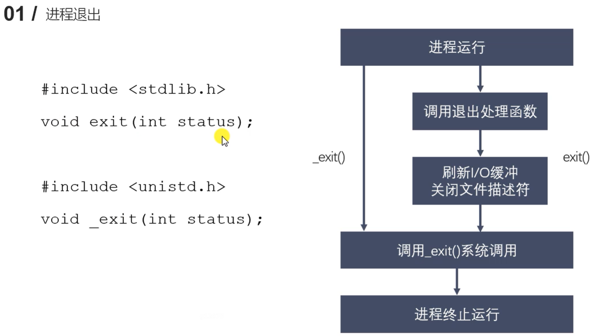
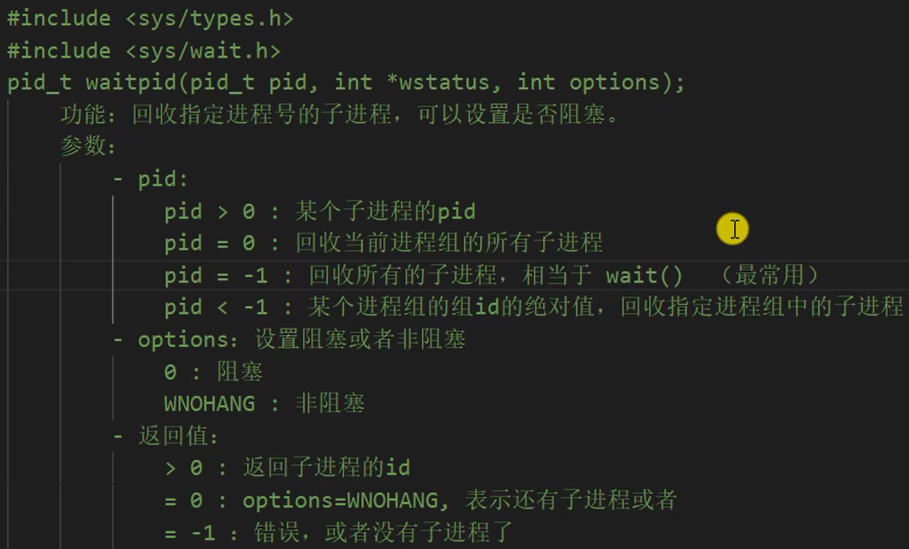
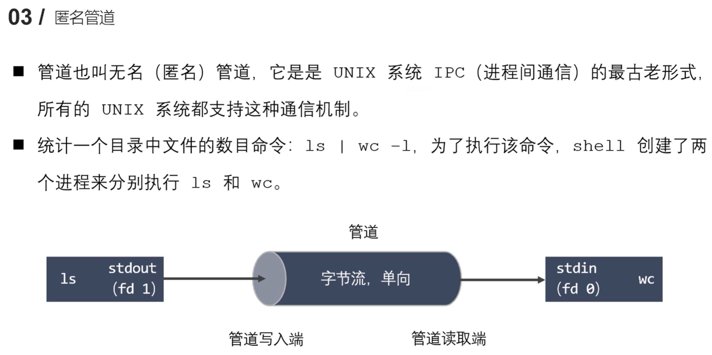
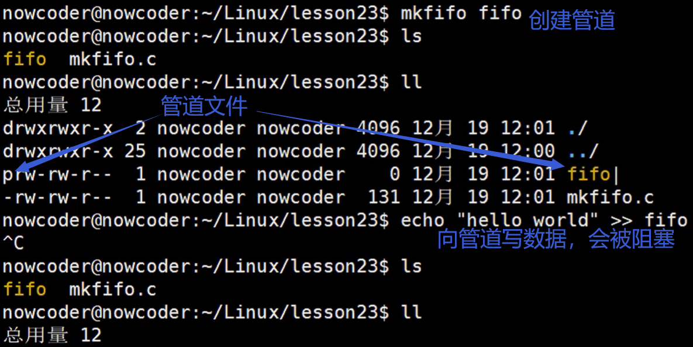
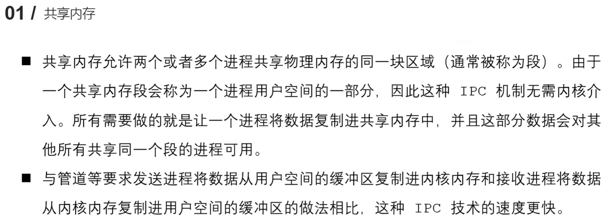

# 2.1 进程概述

## 程序和进程


 


程序只占用磁盘空间

进程占用CPU

程序是文件，进程是程序要运行，系统为其分配的资源等，抽象的概念


第一章，虚拟地址空间：


`.text`	 段存放代码，变量等存放在栈中


## 单道、多道程序设计


任意时刻，CPU上只运行了一个进程，其在不同进程之间切换

由于CPU速度非常快，从宏观上看，仿佛有多个程序同时在运行


## 时间片


时间片：不能过长也不能过短

过短：来回切换也耗费时间，使得整体真正做事的时间少

过长：人容易感觉出来

**Linux进程调度策略**	要掌握


## 并行和并发


**主要研究的是并发**

eg：天猫双十一，同一时刻有很多访问，高并发


## 进程控制块(PCB)


当前工作目录存放在环境变量中


`ulimit -a ` 命令可以查看当前系统的资源上限

`ulimit -a -n 2048` 可以修改打开文件数上限，其他同理

一般不会修改内核的信息


# 2.2 进程状态转换

以及与进程相关的一些 shell 命令

面试常考

## 进程的状态


有专门的调度程序

进程一开始是就绪态

不能由阻塞态变为运行态

只有运行态被分配了CPU

 

阻塞态  举例：

程序等待用户输入、	`sleep`一个进程等


从就绪态、阻塞态、运行态，都可以进入终止态

进入终止态后，用户区的数据被释放，内核区的数据还没被释放，等善后后，所有资源都被释放


## 进程相关命令

### 静态查看进程信息


**`ps aux`**


1. USER：进程所属用户
2. PID：进程ID
3. %CPU：CPU利用情况
4. %MEM：内存利用情况
5. TTY：进程对应的终端	（可通过`tty` 命令查看所对应的终端）
6. STAT：进程的状态
7. START：开始的时间
8. TIME：持续的时间
9. COMMAND：执行的命令（执行哪个产生的进程）


`ps ajx`

打印的信息是执行命令的时间点上，那一瞬间所有进程的信息 	---->   那一瞬间的一个进程快照

并不是动态显示


1. PPID：父进程的ID
2. PID：进程的ID
3. PGID：进程组的ID　（多个进程组成一个进程组）
4. SID：会话的ID　　（多个进程组　组成一个会话）


### 实时显示进程状态


只输入`top` 则按默认时间及顺序动态输出进程状态

输入 `q` 退出


### 杀死进程


杀死进程：	`kill 进程ID`	

**强制杀死进程：	`kill -9 进程ID`**		`kill -SIGKILL 进程ID`

不可以杀死当前终端所在进程

`-9` ：9号信号

通过 `kill -l` 查看信号（信号：一些宏）


`sleep(1)` 表示进程休眠一秒，之后接着执行

上述代码一直执行：


通过其PID杀死：


`./a.out`  程序默认在前台运行

`./a.out &` 程序将在后台运行


程序在后台运行，其输出也将输出到终端，现在用户可以进行输入，用户不可以通过终端对其进行控制

程序在前台运行，则程序会被阻塞在终端，一直输出，用户不可以进行输入，用户可以通过终端对其进行控制

## 进程号和相关函数


`init` 进程是操作系统内核进程，任何进程都是由其创建

任何进程都有父进程，例如：运行程序，其父进程是当前终端


`pid_t getpid(void);` :  获取当前进程的进程号（在哪个进程调用，就调用哪个进程的）

`pid_t getppid(void);` :  获取当前进程的父进程进程号

`pid_t getpgid(pid_t pid);` :  不传入参数，获取当前进程的进程组号；传入参数（进程ID），获取进程ID的进程的进程号


# 2.3 进程创建


eg: 终端是一个进程，在终端中执行一个可执行程序（子进程）

`pid_t fork (void)` 函数用来创建子进程


通过复制调用`fork` 函数的进程，创建一个子进程


```C++
#include <sys/types.h>
#include <unistd.h>
#include <stdio.h>

int main() {
    pid_t pid = fork();     // 在这一步，当前进程被复制为两个进程，两个进程一模一样
    /* 
        两个进程都不再执行上面的语句，都接着执行下面的语句
        fork() 给父、子进程都返回了一个值给 pid 变量
        返回给父进程 pid 变量的值为子进程的 ID
        返回给子进程 pid 变量的值为 0
        父、子两个进程将轮流执行（具体过程取决于CPU调度方式）
    */
    // 根据 pid 的不同，让父子进程执行不同观点代码
    if (pid > 0) {      // 说明是父进程, 父进程的父进程可能是运行时的终端
        printf("I am parent process , my ID : %d, my parent ID : %d\n", getpid(), getppid());
    }
    else if (pid == 0)  // 说明是子进程
    {
        printf("I am child process, my ID : %d, my parent ID : %d\n", getpid(), getppid());
    }

    for (int i = 0; i < 5; i++) {
        printf("i : %d, pid : %d\n", i, getpid());
        sleep(3);
    }
    
    return 0;

    
}

```


结论：两个进程是交替运行的（CPU分给每个进程一个时间片）（并不一定是每个进程轮流执行，可能出现一个进程执行好几次，再执行另一个进程的情况，取决于CPU调度策略）

​	

>`fork` 出一个子进程
>
>两个进程**都不再执行fork上面的语句，都接着执行下面的语句** （代码是有的，只是不执行）
>fork() 给父、子进程都返回了一个值给 pid 变量
>返回给父进程 pid 变量的值为子进程的 ID
>返回给子进程 pid 变量的值为 0
>父、子两个进程将轮流执行（具体过程取决于CPU调度方式）


# 2.4 父进程虚拟地址空间情况


进程的 ID 等，存放在内核区

进程的一些变量（比如上面程序中的 pid 存放在栈空间）

代码存放在 .text 区


fork() 之后，父子进程的数据都一样（除进程ID等） 注：fork返回给父子进程的值不一样

之后，父子进程的操作互不影响


实际上，更准确来说，Linux 的fork()使用是通过**写时拷贝**(copy- on-write) 实现。写时拷贝是种可以推迟甚至避免拷贝数据的技术。

内核此时并不复制整个进程的地址空间，而是让父子进程共享同一个地址空间。只用在需要写入的时候才会复制地址空间，从而使各个进程拥有各自的地址空间。也就是说，**资源的复制是在需要写入的时候才会进行**，在此之前，只有以只读方式共享。
注意：fork之后父子进程共享文件，fork产生的子进程与父进程相同的文件文件描述符指向相同的文件表，引用计数增加，共享文件偏移指针。


**读时共享，写时拷贝**


并不是一创建子进程后，就拷贝整个内存	（最初版本是）

当仅有读操作时，父子进程共享同一块物理地址（读操作不会改变数据）

当有写操作时，进行拷贝，将新值映射到新的物理地址

**最大程度减少拷贝，避免浪费时间、内存**


### 什么是虚拟地址空间

虚拟地址空间是每个运行在计算机操作系统下的进程所拥有的抽象地址空间。它是一种逻辑上的地址空间，而不是物理内存的直接映射。虚拟地址空间提供了进程在其中执行的程序的内存表示。

以下是虚拟地址空间的关键特点和概念：

1. **连续地址范围：** 虚拟地址空间通常是一个连续的地址范围，它的大小可以根据操作系统和硬件的支持而有所不同。例如，在32位系统上，虚拟地址空间通常为4GB；而在64位系统上，它通常非常大，可以达到几TB。

2. **分段：** 虚拟地址空间通常被划分为多个不同的段，每个段用于存储不同类型的数据。常见的段包括代码段（存储可执行程序的指令）、数据段（存储程序的全局和静态数据）、堆栈段（用于函数调用和局部变量）等。

3. **虚拟地址和物理地址的映射：** **操作系统负责将虚拟地址映射到物理地址**。这个**映射关系通常存储在页表中**，页表将虚拟地址映射到物理内存中的实际位置。这使得程序可以使用虚拟地址来访问内存，而不需要关心内存的物理布局。

4. **内存保护和隔离：** 虚拟地址空间提供了内存保护和隔离的机制。每个进程的虚拟地址空间都是独立的，一个进程不能直接访问另一个进程的虚拟地址空间。这增加了系统的安全性和稳定性。

5. **懒加载和分页：** 虚拟地址空间允许操作系统采用懒加载（延迟加载）策略，只有在需要时才将虚拟页映射到物理内存中。这提高了内存利用率和程序的启动速度。此外，虚拟地址空间也支持分页机制，将虚拟页映射到物理页框，使得内存管理更高效。

6. **地址翻译：** 当程序访问虚拟地址时，操作系统负责将虚拟地址翻译成物理地址。这个过程通常涉及硬件支持，例如内存管理单元（MMU）。

总的来说，虚拟地址空间是计算机操作系统中的一个关键概念，它为每个进程提供了一个独立且抽象的内存地址空间，使得程序可以在其中执行，而不需要担心物理内存的细节。这种虚拟化的方式提供了更高的灵活性、安全性和内存管理能力，允许操作系统同时运行多个进程。

### 什么是虚拟内存

虚拟内存是**计算机操作系统中的一个关键概念**，它允许程序使用比物理RAM（随机访问内存）更大的内存空间。虚拟内存通过将物理内存（RAM）和磁盘上的存储器结合起来，为计算机提供了更灵活的内存管理机制。

以下是虚拟内存的一些关键特点和工作原理：

1. **虚拟地址空间：** 每个运行的进程都有自己的虚拟地址空间，它是一个连续的地址范围，可以让程序以假定自己独占计算机内存的方式访问内存。虚拟地址空间通常非常大，远远超过了物理内存的大小。

2. **分页机制：** **虚拟内存使用分页机制将虚拟地址空间划分为固定大小的块（页面），同时也将物理内存划分成相同大小的页面帧**。这允许操作系统将虚拟内存中的页面映射到物理内存中的页面帧，以便访问数据。

3. **页面置换：** 当物理内存不足时，操作系统可以选择将某些页面从物理内存中换出到磁盘上，以为新的页面腾出空间。这个过程称为页面置换。操作系统使用页面置换算法来确定哪些页面应该被换出。

4. **保护和隔离：** 虚拟内存提供了进程间的内存保护和隔离。每个进程的虚拟地址空间都是独立的，一个进程不能直接访问另一个进程的虚拟地址空间。这增加了系统的安全性和稳定性。

5. **地址翻译：** 当程序访问虚拟地址时，操作系统负责将虚拟地址翻译成物理地址。这个过程涉及到页表，其中包含虚拟地址到物理地址的映射。

6. **提高内存利用率：** 虚拟内存使操作系统能够更有效地使用可用的物理内存，因为它可以根据需要将数据从磁盘复制到内存中，并在不再需要时将其换出到磁盘上。

7. **简化内存管理：** 虚拟内存简化了内存管理，因为它允许程序使用连续的虚拟地址空间，而不需要关心物理内存的碎片或大小。

8. **懒加载和共享内存：** 虚拟内存允许操作系统采用懒加载（延迟加载）策略，只有在需要时才将虚拟页映射到物理内存中。此外，多个进程可以共享相同的物理内存页面，以节省内存空间。

总的来说，虚拟内存是一种重要的内存管理技术，它提供了更大的内存空间、内存隔离、内存保护和更灵活的内存管理方式。这使得操作系统能够同时运行多个程序，并为它们提供所需的内存资源，而不会出现内存不足的情况。虚拟内存在现代计算机系统中广泛使用。


# 2.5 父子进程关系及`GDB`多进程调试

## 父子进程间的关系

**区别：**

1. fork()函数的返回值不同

  	父进程中:  >0  返回的是子进程的ID
  	子进程中:  =0
2. pcb中的一些数据不同
        当前的进程的 id   pid
         当前的进程的父进程的id   ppid 
         信号集

**共同点：**

- 某些状态下（子进程刚被创建出来时），还没有执行任何的写数据的操作
  		用户区的数据、文件描述符表 等都相同


**父子进程对变量是否共享？**

- 刚开始时，是一样的（共享），若修改了数据，就不共享了
- 读时共享，写时拷贝
- 读时共享：子进程刚被拷贝，没有进行写的操作


进程对变量的操作互不影响（不共享变量），因此不可用变量进行进程间通信


## `GDB`多进程调试


`gdb` 默认调试父进程（子进程直接运行完），停在父进程的断点处


**`show follow-fork-mode`** 查看 gdb 跟踪的进程 （默认是父进程）

**`set follow-fork-mode child`** 设置gdb跟踪子进程

设置之后 gdb 将停在子进程的断点处，父进程直接运行完


**`show detach-on-fork`**  查看是否脱离，默认为 `on`  eg：调试父进程的时候，子进程继续运行（二者是脱离的）

**`set detach-on-fork off`**  设置为 `off`  不再脱离  ： 调试父进程的时候，子进程被挂起在 fork 位置（不脱离）

查看当前调试的进程的信息：

```
(gdb) info inferiors
```

**切换到其他进程进行调试：**

```
(gdb) inferiors 进程编号（不是进程id）
```


刚切换到要调试的新进程时，要按 `c` ，表示继续


某一进程调试到末尾后（描述会变为null）		，自动切换到其他待调试进程？


**`detach inferiors 进程编号`**  :  使进程脱离 gbd 的调试（直接运行完）


# 2.6 `exec` 函数族

函数组：一组功能相同/相似的函数

## 原理


在一个进程里调用`exec 可执行文件` 会**将该进程的用户区的所有内容被替换为被调用的可执行文件**。内核区的数据不变，用户区的相应数据被替换，接下来从调用的可执行程序的main函数处开始执行

注：不是新建了一个进程，是在原进程内部调用，**替换了原进程**

通常用法：原进程先`fork` 出一个子进程，再在子进程里调用`exec` ，（这样原父进程里后面的内容还可以继续执行） 


## 函数


7个函数功能相似

前6个是标准C库的函数，第7个是Linux的函数

前6个都来源于第7个

最常用的是前两个


### `execl` 函数


`execl` 传入的第一个参数是需要执行的文件的路径或名词，可以是绝对路径，也可以是相对路径		建议用绝对路径，这样即使换一个工作目录，也可以执行

第二个参数`arg` 是可执行文件所需要的参数列表

**`arg` 的第一个参数**一般没什么用，**一般写的是程序的名称；从第二个参数开始往后，就是程序执行所需要的参数列表，参数最后以` NULL` （不是字符串）（哨兵）作为结束**

仅调用失败的时候才有返回值，返回-1（此时可以执行原程序后面的语句，因为execl没有执行成功，原程序没有被替换）调用失败的原因可能是根据路径找不到可执行文件

调用成功，原进程被替换，不会返回任何参数

```
#include <unistd.h>
#include <stdio.h>

int main() {

    // 创建一个子进程，在子进程里执行exec函数
    pid_t pid = fork();

    if (pid > 0) {
        // 父进程
        printf("I am a parent process, pid : %d\n", getpid());
        sleep(1);		// 防止孤儿进程 
    }
    else if (pid == 0) {
        // 子进程
        execl("hello", "hello", NULL);  // arg 第一个参数是可执行文件名，最后一个是NULL
        printf("I am a child process, pid : %d\n", getpid());
    }

    for(int i = 0; i < 3; i++) {
        printf("i = %d, pid : %d\n", i, getpid());
        // sleep(3);
    }

    return 0;
}
```


子进程只执行力hello,world ，没有打印 i

上图的执行结果中，子进程的打印内容没有和父进程在一起，是因为孤儿进程的问题

在父进程打印完之后写加上 `sleep(1)` 便可解决此问题：


上图中子进程和父进程实现了轮流执行，交错打印


`exexl` 函数不仅可以执行自己实现的可执行命令，也可以执行 shell 命令：

```
which ps
/bin/ps
```

查看到ps 命令的路径，将以下代码添加到程序中：

```
execl("/bin/ps", "ps", "aux", NULL);
```

便可实现在程序中调用 `ps aux` 命令


### `execlp` 


传入的第一个参数是需要执行的可执行文件的文件名（不需要写出路径），会**到环境变量中查找指定的可执行文件**，如果找到就执行，找不到就执行不成功

使用`env` 查看环境变量，输入`env` 后，找到`PATH` ，就是环境变量


### 其他


将可执行文件的参数写在一个数组中，将该数组传入


可以自己手动指定环境变量，将存放环境变量的字符数组传入函数，函数将在该数组指定的一系列环境变量中查找可执行文件


# 2.7 进程退出、孤儿进程、僵尸进程

## 进程退出




**上面的是标准C库函数**，下面是Linux系统函数

**一般用标准C库的函数 `exit`** （做的事情更多一些）
标准C库的`exit` 调用了Linux函数`_exit` 


在父进程中退出子进程

可以通过`status` 查看子进程是因为什么原因退出的


`status` 参数：进程退出时的一个状态信息。父进程回收子进程资源的时候可以获取到（`wait`  函数）。


demo:

```c++
#include <stdlib.h>
#include <unistd.h>
#include <stdio.h>

int main() {

    printf("hello\n");
    printf("world");

    exit(0);
    //_exit(0);

}
```

上面调用的退出函数是标准C库的函数，其在退出进程前会检测I/O缓冲区

`printf` 是标准C库函数，其带有缓冲区（标准C库函数一般都有缓冲区）

`\n` 会刷新缓冲区

在执行`printf("hello\n");` 后，由于有`\n` ，要打印的内容被打印，缓冲区被清空

接着执行`printf("world");` 要打印的内容被放入缓冲区（而不是直接打印，此时还没有打印，只是防止了I/O缓冲区）

再执行**`exit(0)` ，这一标准C库函数会刷新（检查）I/O 缓冲，将缓冲区的内容进行打印，再退出该进程**


```
#include <stdlib.h>
#include <unistd.h>
#include <stdio.h>

int main() {

    printf("hello\n");
    printf("world");

    //exit(0);
    _exit(0);

}
```

上面调用的退出函数是Linux系统的函数，

其不会检查I/O缓冲区，而是直接将进程退出

因此上述代码的输出是`hello`， 而没有`world` 


## 孤儿进程


父进程已经运行结束，子进程还在运行，此子进程就没有父进程了

子进程运行完，父进程有义务回收其内核区`PCB` 的资源

若父进程运行完了，就没有父进程来负责回收该子进程的资源了

**`init` 是pid为1 的进程，其会被设置为孤儿进程的父进程，负责对孤儿进程资源的回收**


demo:  (调用fork函数，然后让子进程sleep(1)，父进程执行完了，子进程才开始执行)


知识补充：

当在当前终端执行一个程序`./orphan` ，该程序会在后台执行，当有输出时，会输出到当前终端，

输出完毕后，会**阻塞在等待输入的状态**

上例中，父进程打印完，终端阻塞在等待输入的状态，但马上子进程开始打印

终端会一直处于阻塞状态等待用户输入


## 僵尸进程


用户区的数据（栈、堆等），该进程结束后会自己释放掉

**父进程负责回收子进程内核区的`PCB` 等资源**

**只有当父进程运行结束的时候，才能回收子进程的资源**

**若父进程一直在执行，而没有来得及回收子进程的资源，那么该子进程就变成了僵尸进程**


僵尸进程不能被 `kill -9` 杀死，因为是僵尸进程，而不是正常进程


解决方法（演示的时候）：**将父进程结束，僵尸进程被`init` 接管，由该进程回收僵尸进程的资源**

开发时的解决方法：**调用`wait()` 或 `waitpid()`**	(这样不用父进程结束就可以实现回收子进程的资源)


# 2.8 `wait` 函数


功能：等待任意一个子进程结束，若有进程结束了，`wait` 会回收子进程的资源

**调用`wait` 函数的 进程会被挂起（阻塞），直到它的一个子进程执行结束、退出或收到一个不能被忽视的信号时才被唤醒（相当于继续向下执行），如果该父进程没有子进程了，`wait`函数立刻返回（返回-1），若子进程都结束了，也立即返回（返回-1）。**

```
#include <sys/types.h>
#include <sys/wawit.h>

pid_t wait(int *wstatus);
```

`int *wstatus` 是传出参数， 一个int型的地址，将进程退出的状态写入该地址中，该状态信息可以传入到`exit` 函数中

`wait` 每次只能回收一个子进程的资源，若要回收多个子进程的资源，则需要一个`while` 循环


## 退出信息相关宏函数


```c++
#include <sys/types.h>
#include <sys/wait.h>
#include <stdio.h>
#include <unistd.h>
#include <stdlib.h>

int main() {
    pid_t pid;
    
    for(int i = 0; i < 5; i++) {    // 父进程创建出五个子进程
        pid = fork();
        if (pid == 0) break;        // 父进程创建一个子进程后，不会执行此语句，
    }                           // 子进程被创建后，执行到这条语句，直接退出循环，因此保证子进程不会再创建子进程

    if (pid > 0) {
        while(1) {				   // 要回收多个子进程，因此要有循环
            printf("parent, pid : %d\n", getpid());
            int st;
            int ret = wait(&st);   // 传入NULL表示不需要获得进程退出时的状态，
                                   // 父返回值ret是被回收的子进程id, 进程被阻塞在该语句
            if (ret == -1) break;

            if (WIFEXITED(st)) {
                // 表示正常退出
                printf("退出的状态码 : %d\n", WEXITSTATUS(st));
            }
            if (WIFSIGNALED(st)) {
                // 表示异常退出（例如被信号9终止）
                printf("异常退出，被信号 %d 终止\n", WTERMSIG(st));
            }

            printf("a child process die, pid : %d\n", ret);
            sleep(1);
        }
    } else if (pid == 0) {
        while(1) {
            printf("child, pid : %d\n", getpid());
            sleep(1);
        }
        exit(0);
    }
    return 0;       // 退出状态码
}
```


# 2.9 `waitpid` 函数




若某进程想成为一个组，默认情况组 id 就是该进程的 id

将options设为WNOHANGL：父进程执行到waitpid语句时，若子进程在执行&没有子进程退出（没有子进程需要回收），则立即返回（返回0），继续执行下面的语句


```
#include <sys/types.h>
#include <sys/wait.h>
#include <stdio.h>
#include <unistd.h>
#include <stdlib.h>

int main() {
    pid_t pid;
    
    for(int i = 0; i < 5; i++) {    // 父进程创建出五个子进程
        pid = fork();
        if (pid == 0) break;        // 父进程创建一个子进程后，不会执行此语句，
    }                           // 子进程被创建后，执行到这条语句，直接退出循环，因此保证子进程不会再创建子进程

    if (pid > 0) {          // 父进程执行
        while(1) {          // 要回收多个子进程，因此要有循环
            printf("parent, pid : %d\n", getpid());
            sleep(1);
            int st;                // 存放进程退出的状态信息
            int ret = waitpid(-1, &st, 0);        // 返回值ret是被回收的子进程id 或 -1, 进程被阻塞在该语句（因为option为0）
                                   
            //int ret = waitpid(-1, &st, WNOHANG);  // 父返回值ret是被回收的子进程id、0，或-1, 进程不会被阻塞在该语句（option为WNOHANG）
            if (ret == -1) {
                // 子进程都结束了,不再进行循环调用waitpid
                break;
            } else if (ret == 0) {
                // 有子进程在执行，但没有退出的
                continue;       // 直接进行下一次循环以便继续调用waitpid（而不执行下面的语句）
            } else {
                // 有子进程退出了，执行下面的语句，执行完后再进行循环
                if (WIFEXITED(st)) {
                    // 表示正常退出
                    printf("退出的状态码 : %d\n", WEXITSTATUS(st));
                }
                if (WIFSIGNALED(st)) {
                    // 表示异常退出（例如被信号9终止）
                    printf("异常退出，被信号 %d 终止\n", WTERMSIG(st));
                }

                printf("a child process die, pid : %d\n", ret);
                sleep(1);
            }

        }
    } else if (pid == 0) {      // 子进程执行
        // while(1) {
        //     printf("child, pid : %d\n", getpid());
        //     sleep(1);
        // }
        printf("child, pid : %d\n", getpid());
        exit(0);
    }
    return 0;       // 退出状态码
}
```


父进程会被阻塞在`int ret = waitpid(-1, &st, 0);` 语句，直到有子进程退出了，或没有子进程执行了

将`int ret = waitpid(-1, &st, 0);` 替换为：**`int ret = waitpid(-1, &st, WNOHANG);`**

则**父进程不会被阻塞在该语句**，若

有子进程在运行&没有要回收的子进程将返回0 | 有要回收的子进程将返回被回收子进程的id | 子进程全部运行结束返回 -1

（option为WNOHANG时）无论如何都会立即执行完该语句并继续向下执行，而不用被阻塞在该语句

# 2.10 进程间通信简介

面试重要问题

[一文搞懂六大进程通信机制原理(全网最详细) - 知乎 (zhihu.com)](https://zhuanlan.zhihu.com/p/465574868)


进程间通信，eg：不同计算机上的qq进程通信、迅雷边下边播，下载进程与播放进程间的通信


本章下文提到的通信方式：

- 匿名管道
- 有名管道
- 信号
- 共享内存
- 内存映射


# 2.11 匿名管道概述




管道一般默认为匿名管道

**`ls` 命令的输出文件默认为fd为1的文件，即当前终端（标准输出），将其输出文件改为管道写入端，**

**`wc` 命令的标准输入默认为0，即当前终端（标准输入），将其改为管道的读取端**


管道这一缓冲器是在内核的内存中的

管道的两端分别对应了两个文件描述符fd1、fd2，一端进行读，另一端进行写

**匿名管道用在有关系的进程间，有名管道用在无关系的进程间**


消息由协议头、数据组成

管道是字节流，不以消息传输，传入数据，可以读取任意字节的数据


管道是队列（环形队列）


单工：遥控器与电视机

双工：打电话、视频聊天

半双工：对讲机


子进程刚被创建时，与父进程共享一样的文件描述符表，

eg：父进程和子进程的5号文件描述符指向管道的同一端、6号文件描述符指向同一端

父进程传递信息给子进程：父进程通过5号文件描述符写入管道，子进程通过其6号文件描述符从管道中读取数据

子进程传递信息给父进程：子进程通过6号文件描述符写入管道，父进程通过其5号文件描述符从管道中读取数据

同一时刻是单向传递的，半双工通信


由于线性队列中元素被清除后不能再使用该存储位置

管道使用 环形队列 （并不是内存是环形的，通过算法实现）

环形队列可以将原先的内容覆盖掉，重复利用队列空间


# 2.12 父子进程通过匿名管道通信


在fork之前创建管道，这样父子进程才对应同一个管道

`pipefd[2]` 是两个文件描述符，其中`pipefd[0]` 是管道的读端，`pipefd[1]` 是管道的写端

先创建管道，再`fork` 这样父子进程对应同一个管道以及两端，可以正常进行通信

**管道默认阻塞：**

- 如果管道中无数据，`read` 阻塞
- 如果管道满了，`write` 阻塞

```
#include <unistd.h>
#include <sys/types.h>
#include <stdlib.h>
#include <string.h>
#include <stdio.h>

int main() {
    // 先创建管道
    int pipefd[2];
    int ret = pipe(pipefd);         // 传出参数，传入数组的地址,pipefd[0]是管道的读端，pipefd[1]是管道的写端
    if (ret == -1) {
        perror("pipe error");
        exit(0);
    }
    // 创建子进程，子进程与父进程有相同的管道以及pipefd
    pid_t pid = fork();
    if (pid > 0) {
        // 父进程,读取来自子进程的数据，通过管道的读取端读取数据
        char buf[1024] = {0};
        int len = read(pipefd[0], buf, sizeof(buf));      // 参数：要读取的文件的描述符、读取后放在的缓冲区、缓冲区大小
        printf("this is parent, pid : %d, got message from chid : %s\n", getpid(), buf);
    } else if (pid == 0) {
        // 子进程，通过管道的写入端写入数据
        sleep(10);
        char * str = "hello, child's message\n";
        write(pipefd[1], str, strlen(str));     // 参数：被写入文件的描述符、被写入内容的地址、被写入内容的长度
    }

}
```

由于子进程会睡眠10秒才向管道写数据，父进程从管道读数据会被阻塞，当子进程写好之后才读成功，进而继续执行

```
#include <unistd.h>
#include <sys/types.h>
#include <stdlib.h>
#include <string.h>
#include <stdio.h>

int main() {
    // 先创建管道
    int pipefd[2];
    int ret = pipe(pipefd);         // 传出参数，传入数组的地址,pipefd[0]是管道的读端，pipefd[1]是管道的写端
    if (ret == -1) {
        perror("pipe error");
        exit(0);
    }
    // 创建子进程，子进程与父进程有相同的管道以及pipefd
    pid_t pid = fork();
    if (pid > 0) {
        // 父进程
        while(1) {
            char buf[1024] = {0};                             // 若管道中没数据，read会被阻塞
            int len = read(pipefd[0], buf, sizeof(buf));      // 参数：要读取的文件的描述符、读取后放在的缓冲区、缓冲区大小
            printf("this is parent, pid : %d, got message from chid : %s\n", getpid(), buf);

            char * str = "hello, parent's message\n";   // 父进程写数据到管道，传递个子进程
            write(pipefd[1], str, strlen(str));         // 参数：被写入文件的描述符、被写入内容的地址、被写入内容的长度
            sleep(1);

        }

    } else if (pid == 0) {
        // 子进程
        // printf("i am a child, pid : %d\n", getpid());
        while(1) {
            char * str = "hello, child's message\n";
            write(pipefd[1], str, strlen(str));     // 参数：被写入文件的描述符、被写入内容的地址、被写入内容的长度
            sleep(1);

            char buf[1024] = {0};
            int len = read(pipefd[0], buf, sizeof(buf));      // 参数：要读取的文件的描述符、读取后放在的缓冲区、缓冲区大小
            printf("this is child, pid : %d, got message from parent : %s\n", getpid(), buf);
        }
        
    }

}
```


- 子进程不断进行 写入信息到管道、从管道中读取信息 的循环
- 父进程不断进行 从管道中读取信息、写入信息到管道的循环

注意：不能让父子进程都先进行从管道中读取信息的操作，因为这样父子进程都会被阻塞

​	

若子进程在写入数据后不进行sleep(1) ，则可能子进程刚向管道中写完，子进程子集又从管道中读取自己刚刚写的数据（父进程同理）

所以子进程在向管道写完数据之后要sleep(1)，这样时间片被分给父进程，被阻塞在read的父进程将从管道中读数据

但实际开发中不会让进程sleep(1)，在实际开发中匿名管道是被用来单向传播的


`ulimit -a` 查看管道大小：


利用函数查看：

```
#include <unistd.h>
#include <sys/types.h>
#include <stdlib.h>
#include <string.h>
#include <stdio.h>

int main() {
    // 先创建一个管道
    int pipfd[2];
    int ret = pipe(pipfd);

    // 利用fpahtconf函数查看管道大小
    long size = fpathconf(pipfd[0], _PC_PIPE_BUF);

    printf("pipe size: %ld\n", size);

    return 0;
}
```


# 2.13 匿名管道通信案例


若子进程在写入数据后不进行sleep(1) ，则可能子进程刚向管道中写完，子进程自己又从管道中读取自己刚刚写的数据（父进程同理）

所以子进程在向管道写完数据之后要sleep(1)，这样时间片被分给父进程，被阻塞在read的父进程将从管道中读数据

但实际开发中不会让进程sleep(1)，在实际开发中匿名管道是被用来单向传播的

因此可在上述代码中，将父进程的写端关闭：

```
if (pid > 0) close(pipefd[1]);
```

将子进程的读端关闭：

```
if (pid == 0) close(pipefd[0]);
```


案例：

实现`ps aux | grep xxx` 

先不进行过滤


由于管道容量有限，只能写入一部分数据

按理说应该循环写入数据，案例中没有实现

```
/*
    实现 pa aux | grep xxx  利用父子进程间的通信
    
    子进程：
            执行  ps aux ， 利用 execlo()
            将 ps aux 的标准输出由当前终端（stdout_fileno) 重定向到 管道的写入端 --- 利用 dup2 来修改文件描述符

    父进程：
            从管道的读端获取数据
            过滤
*/


#include <sys/types.h>
#include <stdlib.h>
#include <stdio.h>
#include <unistd.h>
#include <string.h>
#include <wait.h>

int main() {
    // 创建一个匿名管道
    int fd[2];
    int ret = pipe(fd);  // 得到两个文件描述符，分别对应管道的读端与写端
    if (ret == -1) {
        perror("pipe error");
        exit(0);
    }

    pid_t pid = fork();

    if (pid > 0) {
        // 父进程
        // 关闭写端
        close(fd[1]);
        // 从管道中读取数据
        char buf[1024] = {0};
        int len = -1;
        while ((len = read(fd[0], buf, sizeof(buf) - 1)) > 0)
        {
            printf("%s", buf);
            memset(buf, 0, 1024);
        }
        wait(NULL);   // 回收子进程
        } else if (pid == 0) {
        // 子进程
        // 关闭读端
        close(fd[0]);
        // 执行 ps aux 
        // 先进行文件描述符重定向: STDOUT_FILENO -> fd[1]
        dup2(STDOUT_FILENO, fd[1]);

        execlp("ps", "ps", "aux", NULL);    // 运行成功不会返回任何结果，将子进程全部替换掉
        perror("execlp");       // 子进程只有运行失败了才会执行这两条语句
        exit(0);

    } else {
        // 错误
        perror("fork error");
        exit(0);
    }
}
```


# 2.14 匿名管道的读写特点和管道设置为非阻塞

管道默认为阻塞

管道读写特点（假设都是I/O阻塞操作）：

**读管道：**

- 管道中有数据：read直接读取，返回读取到的字节数
- 管道无数据：
  - 写端全部被关闭，read到0，相当于读到文件末尾；
  - 写端没有被关闭，read被阻塞等待

**写管道：**

- 读端全部被关闭：进程异常终止（进程收到SIGPIPE信号）
- 读端没有全部被关闭：
  - 管道已满：write被阻塞
  - 管道没慢：write向管道写入数据，并返回写入的字节数


将管道设为非阻塞，则read管道时，如果没有数据会返回-1，并执行下一句

```
/*
    设置管道非阻塞
    int flags = fcntl(fd[0], F_GETFL);  // 获取flag
    flags |= O_NONBLOCK;                // 修改flag
    fcntl(fd[0], F_SETFL, flags);       // 设置flag
*/

#include <unistd.h>
#include <sys/types.h>
#include <stdlib.h>
#include <string.h>
#include <stdio.h>
#include <fcntl.h>

int main() {
    // 先创建管道
    int pipefd[2];
    int ret = pipe(pipefd);         // 传出参数，传入数组的地址,pipefd[0]是管道的读端，pipefd[1]是管道的写端
    if (ret == -1) {
        perror("pipe error");
        exit(0);
    }
    // 创建子进程，子进程与父进程有相同的管道以及pipefd
    pid_t pid = fork();
    if (pid > 0) {
        // 父进程
        close(pipefd[1]);

        char buf[1024] = {0};                           // 若管道中没数据，read会被阻塞

        int flags = fcntl(pipefd[0], F_GETFL);          // 获取pipefd[0] 的flags
        flags |= O_NONBLOCK;                            // 设置非阻塞
        fcntl(pipefd[0], F_SETFL, flags);               // 修改管道的读flags

        while(1) {
            int len = read(pipefd[0], buf, sizeof(buf)); // 参数：要读取的文件的描述符、读取后放在的缓冲区、缓冲区大小
            
            printf("this is parent, pid : %d, got message from chid : %s\n", getpid(), buf);
            printf("len : %d\n", len);
            memset(buf, 0, 1024);
            sleep(1);
        }

    } else if (pid == 0) {
        // 子进程
        // printf("i am a child, pid : %d\n", getpid());
        while(1) {
            char * str = "hello, child's message";
            write(pipefd[1], str, strlen(str));     // 参数：被写入文件的描述符、被写入内容的地址、被写入内容的长度
            sleep(2);
        }
        
    }

}
```


将read设为非阻塞

父进程读取时若管道中没有数据，就返回-1，执行下一句

若有数据，就返回读取到的数据的长度


# 2.15 有名管道介绍及使用





**利用函数创建管道：**

```
#include <stdio.h>
#include <sys/types.h>
#include <sys/stat.h>
#include <stdlib.h>
#include <unistd.h>

int main() {

    // 先判断管道是否存在
    int ret = access("fifo1", F_OK);
    if (ret == -1) {
        printf("管道不存在，现在创建\n");
        int ret = mkfifo("fifo1", 0624);    // 在当前目录下创建了一个名为fifo1 的管道文件，权限为0664
        if (ret == -1) {
        perror("fifo error");
        exit(0);
    }
    }
    else {
        printf("管道已存在\n");
    }

    return 0;

}
```

**利用管道实现两个进程间通信：**

`write`

```
#include <stdio.h>
#include <sys/types.h>
#include <sys/stat.h>
#include <stdlib.h>
#include <unistd.h>
#include <fcntl.h>
#include <string.h>

int main() {

    // 1.先判断管道是否存在
    int ret = access("test", F_OK);
    if (ret == -1) {
        printf("管道不存在，现在创建\n");
        // 2.创建管道
        int ret = mkfifo("test", 0624);    // 在当前目录下创建了一个名为fifo1 的管道文件，权限为0664
        if (ret == -1) {
        perror("fifo error");
        exit(0);
    }
    }
    else {
        printf("管道已存在\n");
    }
    // 3. 以只写的方式打开管道
    int fd = open("test", O_WRONLY);    // 权限设为只写，否则和匿名管道一样了
    if (fd == -1) {
        perror("open error");
        exit(0);
    }

    // 4.写数据
    for(int i = 0; i < 100; i++) {
        char buf[1024];
        sprintf(buf, "hello, %d\n", i);
        printf("writting data : %s\n", buf);
        write(fd, buf, strlen(buf));    // 若没有读端，会被阻塞在这里
        sleep(1);
    }

    close(fd);

    return 0;

}
```

`read`

```
#include <stdio.h>
#include <sys/types.h>
#include <sys/stat.h>
#include <stdlib.h>
#include <unistd.h>
#include <fcntl.h>

int main() {

    // 1.打开管道文件
    int fd = open("test", O_RDONLY);
    if (fd == -1) {
        perror("read error");
        exit(0);
    }

    // 2.读数据
    while(1) {
        char buf[1024] = {0};
        int len = read(fd, buf, sizeof(buf));   // 若有写端，管道没有内容，会被阻塞
        if (len == 0) {
            printf("写端断开连接了...\n");
            break;
        }
        printf("receive buf : %s\n", buf);
    }
    close(fd);


    return 0;

}
```


# 2.16 有名管道实现简单版聊天功能


只能实现发送一条、接受一条

如果想要实现连续发送，就要分别创建读写进程

```
#include <stdio.h>
#include <unistd.h>
#include <sys/types.h>
#include <sys/stat.h>
#include <stdlib.h>
#include <fcntl.h>
#include <string.h>

int main() {
    // 判断有名管道1是否存在
    int ret = access("fifo1", F_OK);
    if (ret == -1) {
        // 管道1不存在
        printf("有名管道1不存在,创建对应的有名管道\n");
        ret = mkfifo("fifo1", 0664);
        if (ret == -1) {
            perror("mkfifo");
            exit(0);
        }
    }

    // 管道1存在
    // 判断管道2是否存在
    ret = access("fifo2", F_OK);
    if (ret == -1) {
        // 管道2不存在
        printf("管道2不存在,创建对应的有名管道\n");
        ret = mkfifo("fifo2", 0664);
        if (ret == -1) {
            perror("mkfifo");
            exit(0);
        }
    }

    // 2.以只写的方式打开管道1
    int fdw1 = open("fifo1", O_WRONLY);
    if (fdw1 == -1) {
        perror("open");
        exit(0);
    }
    printf("chatA成功打开管道1,现在可以写入\n");

    // 3.以只读的方式打开管道2
    int fdr2 = open("fifo2", O_RDONLY);
    if (fdr2 == -1) {
        perror("open");
        exit(0);
    }
    printf("chatA成功打开管道2,现在可以读取\n");

    // 4.循环写入、读取数据
    char buf[128];
    while(1) {
        memset(buf, 0, 128);
        // 获取标准输入的数据
        fgets(buf, 128, stdin);
        // 向管道1写入数据
        ret = write(fdw1, buf, strlen(buf));
        if (ret == -1) {
            perror("write");
            exit(0);
        }
        // 从管道2读取数据
        memset(buf, 0, 128);
        ret = read(fdr2, buf, 128);
        if (ret <= 0) {
            perror("read");
            break;
        }
        printf("get message from chatB : %s\n", buf);
    }

    // 5.关闭文件描述符
    close(fdr2);
    close(fdw1);

    return 0;

}
```


```
#include <stdio.h>
#include <unistd.h>
#include <sys/types.h>
#include <sys/stat.h>
#include <stdlib.h>
#include <fcntl.h>
#include <string.h>

int main() {
    // 判断有名管道1是否存在
    int ret = access("fifo1", F_OK);
    if (ret == -1) {
        // 管道1不存在
        printf("有名管道1不存在,创建对应的有名管道\n");
        ret = mkfifo("fifo1", 0664);
        if (ret == -1) {
            perror("mkfifo");
            exit(0);
        }
    }

    // 管道1存在
    // 判断管道2是否存在
    ret = access("fifo2", F_OK);
    if (ret == -1) {
        // 管道2不存在
        printf("管道2不存在,创建对应的有名管道\n");
        ret = mkfifo("fifo2", 0664);
        if (ret == -1) {
            perror("mkfifo");
            exit(0);
        }
    }

    // 2.以只读的方式打开管道1
    int fdr1 = open("fifo1", O_RDONLY);
    if (fdr1 == -1) {
        perror("open");
        exit(0);
    }
    printf("chatB成功打开管道1,现在可以读取\n");

    // 3.以只写的方式打开管道2
    int fdw2 = open("fifo2", O_WRONLY);
    if (fdw2 == -1) {
        perror("open");
        exit(0);
    }
    printf("chatB成功打开管道2,新在可以写入\n");

    // 4.循环读取、写入数据
    char buf[128];
    while(1) {
        memset(buf, 0, 128);
        
        // 从管道1读取数据
        ret = read(fdr1, buf, 128);
        if (ret <= 0) {
            perror("read");
            exit(0);
        }
        printf("get message from chatA : %s\n", buf);

        memset(buf, 0, 128);
        // 获取标准输入的数据(本行代码应该在相关到写数据之前一行，不能间隔)
        fgets(buf, 128, stdin);
        // 向管道2写入数据
        ret = write(fdw2, buf, strlen(buf));
        if (ret == -1) {
            perror("write");    
            exit(0);
        }
        
    }

    // 5.关闭文件描述符
    close(fdw2);
    close(fdr1);

    return 0;

}
```


# 2.17 内存映射(1)


由于是对内存进行操作的，速度比较快


```
#include <sys/mman.h>
void *mmap(void *add, size_t length, int prot, int flags, int fd, off_t off) 
	- 功能：将一个文件或设备的数据映射到内存（进程地址空间）中
	- 参数：
		- void *add : NULL，要映射到哪里，一般由内核决定（返回值也是该地址）
		- lengh : 要映射的数据的长度，不能为0。建议使用文件的长度。  获取文件长度：stat、lseek
		- prot : 对申请的内存映射区的操作权限
			- PROT_EXEC : 可执行权限
			- PROT_READ : 读权限
			- PROT_WRITE : 写权限
			- PROT_NONE : 没有权限
			要操作映射内存，必须要有读权限
			PROT_READ、 PROT_READ | PROT_WRITE
		- flags : 同步方式
			- MAP_SHARED : 内存映射区的数据会自动和磁盘文件进行同步，要实现进程间通信，必须设为该值。
			- MAP_PRIVATE : 不同步，内存映射区的数据改变了，对原来的文件不会修改，会创建一个新的文件。
		- fd : 需要映射的磁盘文件的文件描述符，通过open一个磁盘文件得到
			- 注意 : open的磁盘文件大小不能为0，open指定的权限不能和prot参数有冲突。
				prot : PROT_READ					open : 只读/读写
				prot : PROT_READ | PROT_WRITE       open : 读写
				prot的权限 ≤ open的权限
		- offset : 偏移量，一般不用。必须是4k的整数倍，0表示不偏移（将整个磁盘文件都映射）
		
	- 返回值 :
		- 成功 : 返回指向内存区域的指针
		- 失败 : 返回MAP_FAILED, (void *) -1  	将-1转换为void * 返回并设置错误号
		
int munmap(void *addr, size_t length)
	- 功能 : 释放内存映射的内存
	- 参数 :
		- addr : 要释放的内存的首地址
		- length : 要释放的内存的大小，要和mmap函数中的length参数的值一样。
```


（父子进程通信也需要创建磁盘文件并打开）

```c++
#include <stdio.h>
#include <sys/mman.h>
#include <fcntl.h>
#include <sys/types.h>
#include <unistd.h>
#include <string.h>
#include <stdlib.h>
#include <wait.h>

int main() {
    
    // 1.打开一个文件
    int fd = open("test.txt", O_RDWR);
    int size = lseek(fd, 0, SEEK_END);      // 获取文件大小

    // 2.创建内存映射区,ptr存储内存映射区的地址
    void *ptr = mmap(NULL, size, PROT_READ | PROT_WRITE, MAP_SHARED, fd, 0);
    if (ptr == MAP_FAILED) {
        perror("mmap");
        exit(0);
    }

    // 3.创建子进程     子进程写，父进程读
    pid_t pid = fork();

    if (pid > 0) {
        // 父进程，从内存（文件）读取数据
        wait(NULL);     // 先将子进程回收掉，再读取数据
        char buf[64];
        strcpy(buf, (char*)ptr);    // 将参数2的数据读入到参数1中
        printf("i am father process, i got message : %s\n", buf);
    } else if (pid == 0) {
        // 子进程，向内存（文件）写数据
        strcpy((char *)ptr, "hello i am child process"); 
        printf("i am child process, i have sent messasge\n");
    }

    // 关闭内存映射区
    munmap(ptr, size);

    return 0;
}
```


# 2.18 内存映射(2)


**通过内存映射实现文件拷贝：**


不能拷贝太大的文件，容易超出内存限制

一般不会利用内存映射进行文件拷贝

```
#include <stdio.h>
#include <sys/mman.h>
#include <sys/types.h>
#include <sys/stat.h>
#include <fcntl.h>
#include <unistd.h>
#include <string.h>
#include <stdlib.h>

int main() {
    // 1.对原始文件进行内存映射
    int fd = open("test.txt", O_RDWR);
    if (fd == -1)
    {
        perror("open");
        exit(0);
    }
    // 获取原始文件的大小
    int len = lseek(fd, 0, SEEK_END);

    // 2.创建一个新文件
    int fd1 = open("test1.txt", O_RDWR | O_CREAT, 0664);
    if (fd1 == -1) {
        perror("open");
        exit(0);
    }
    // 扩展新文件
    truncate("test1.txt", len);
    write(fd1, " ", 1);

    // 3.进行内存映射
    void * ptr = mmap(NULL, len, PROT_READ | PROT_WRITE, MAP_SHARED, fd, 0);
    void * ptr1 = mmap(NULL, len, PROT_READ | PROT_WRITE, MAP_SHARED, fd1, 0);

    if (ptr == MAP_FAILED) {
        perror("mmap");
        exit(0);
    }
    if (ptr1 == MAP_FAILED) {
        perror("mmap");
        exit(0);
    }

    // 4.进行内存拷贝
    memcpy(ptr1, ptr, len);         // 将ptr中的数据拷贝到ptr1中

    munmap(ptr1, len);
    munmap(ptr, len);

    return 0;

    
}
```


**匿名映射：**

没有文件实体，进行内存映射

只能用于父子进程间通信，不能用于无关系的两个进程


匿名映射实现父子进程通信：

```
#include <stdio.h>
#include <sys/mman.h>
#include <sys/types.h>
#include <sys/stat.h>
#include <fcntl.h>
#include <unistd.h>
#include <string.h>
#include <stdlib.h>
#include <sys/wait.h>

int main() {

    // 匿名映射也需要len
    int len = 4096;

    // 创建匿名内存映射区
    void * ptr = mmap(NULL, len, PROT_READ | PROT_WRITE, MAP_SHARED | MAP_ANONYMOUS, -1, 0);		// fd 为 -1
    if (ptr == MAP_FAILED) {
        perror("mmap");
        exit(0);
    }

    // 父子进程通信
    pid_t pid = fork();

    if (pid > 0) {
        // 父进程，发送数据
        strcpy((char *)ptr, "hello, father's message\n");
        wait(NULL);
    } else if (pid == 0) {
        // 子进程，读取数据，直接打印数据
        sleep(1);       // 等待一秒，防止父进程没有写 子进程就开始读了
        printf("i am child, got message : %s", (char*)ptr);
    }

    // 释放内存映射区
    int ret = munmap(ptr, len);
    
    if (ret == -1) {
        perror("munmap");
        exit(0);
    }

    return 0;

}
```


# 2.19 信号概述


Linux中的信号：


一般只使用前31个


红色为要掌握的信号


Core文件记录错误信息，调试的时候可用于查看错误信息

```
#include <stdio.h>
#include <string.h>

int main() {
    char * buf;

    strcpy(buf, "hello");

    return 0;
}
```

以上程序中由于buf是一个**野指针**，没有指向合法的内存，所以strcpy命令会产生错误

对无效内存进行访问会产生段错误，产生11号信号，终止进程并生成core文件


# 2.20 `kill`,`raise`,`about` 函数


​							#include <sys/types.h>


```
#include <stdio.h>
#include <sys/types.h>
#include <signal.h>
#include <unistd.h>

int main() {
    pid_t pid = fork();

    if (pid == 0) {
        // 子进程
        for(int i = 0; i < 5; i++) {
            printf("child process\n");
            sleep(1);
        }
    } else if (pid > 0) {
        // 父进程
        printf("father process\n");
        sleep(2);
        printf("kill child process now\n");
        kill(pid, SIGINT);
    }

    return 0;
}
```


# 2.21 `alarm` 函数

​					#include <unistd.h>


当倒计时为0，函数给当前进程发送SIGALARM信号

alarm(99999)   ，计时器是不阻塞的：若倒计时没有结束时，程序便执行到末尾，则程序可以结束，而不用等倒计时结束

**每个进程只有一个计时器**，每次修改，都会将之前的覆盖掉


**实际的时间 = 内核时间 + 用户时间 + 消耗的时间**

内核时间：系统调用时间

用户时间：执行用户的代码

消耗的时间：进行IO操作的时间（比较浪费时间）


定时器与进程的状态无关（自然定时法），无论进程处于什么状态，都会计时


```
// 查看计算机一秒钟可以数多少数字

#include <stdio.h>
#include <unistd.h>

int main() {
    alarm(1);
    
    int i = 1;
    while(1) {
        printf("%d\n", i++);
    }

}
```

由于将数据打印到终端所消耗的时间较大（将数据从缓冲区输出到终端），

可以将数据先暂存到alarm.txt（但同样也会消耗时间，只是消耗得更少一些）


# 2.22 `setitimer` 定时器函数

可以周期性地计时


```
/*
    #include <sys/time.h>
    int setitimer(int which, const struct itimerval *new_value, struct itimerval *old_value);
        - 功能：设置定时器（闹钟）。可以替代alarm函数。精度微秒us，实现周期性计时器。
        - 参数：
            - which：定时器以什么时间计时
                ITIMER_REAL：真实时间，时间到达，发送SIGALRM   常用
                ITIMER_VIRTUAL：用户时间，时间到达，发送SIGVTALRM
                ITIMER_PROF：该进程在用户态和内核态下所消耗的时间，时间到达发送SIGPROF

            - new_value：设置定时器的属性
                struct itimerval {                  // 定时器的结构体
                    struct timeval it_interval;     // 每个阶段的时间，间隔时间
                    struct timeval it_value;        // 延迟多长时间开始执行定时器
                };

                struct timeval {            // 时间的结构体
                    time_t tv_sec;          // 秒数
                    suseconds_t tv_usec;    // 微秒
                }

            - old_value：上一次的定时的时间参数，一般不用，指定NULL

        - 返回值：
            成功 0
            失败 -1 并设置错误号

*/


#include <stdio.h>
#include <sys/time.h>

int main() {

    struct itimerval new_value;
    
    // 间隔时间，每3秒设置一个定时器
    new_value.it_interval.tv_sec = 3;
    new_value.it_interval.tv_usec = 0;

    // 5秒后开始执行定时器
    new_value.it_value.tv_sec = 5;
    new_value.it_value.tv_usec = 0;

    setitimer(ITIMER_REAL, &new_value, NULL);
    printf("已设置定时器\n");

    while(1);


}
```


# 2.23 `signal` 信号捕捉函数


捕捉到信号，做相应操作，而不是必须默认操作

```
/*
    #include <signal.h>
    typedef void (*sighandler_t)(int);      // 匿名函数，参数是int，捕捉到的信号的编号
    sighandler_t signal(int signum, sighandler_t handler);
        - 功能：捕捉某个信号并规定捕捉后的行为
        - 参数：
            - signum：要捕捉的信号
            - handler：捕捉到信号后的行为，如何处理
                - SIG_IGN：忽略捕捉到的信号
                - SIG_DFL：使用信号默认的行为
                - 回调函数：函数由内核调用，程序员只负责写，表示捕捉到信号后的处理，参数int是信号的编号
                    - 需要程序员实现，提前准备好，函数类型根据实际需求写，看函数指针的定义
                    - 不是程序员调用，当信号产生，由内核调用
                    - 函数指针是实现回调的手段，函数实现后，将函数名放到函数指针的位置就可以了
        - 返回值：
            成功，返回上一次注册的信号处理函数的地址，第一次调用返回NULL
            失败，返回SIT_ERR，设置错误号

    SIGKILL SIGSTOP不能被捕捉，不能被忽略
*/

```

```
#include <stdio.h>
#include <sys/time.h>
#include <signal.h>

// 回调函数提前写好
// typedef void (*sighandler_t)(int);      // 匿名函数，参数是int，捕捉到的信号的编号
void myalarm(int num) {
    printf("捕捉到了信号，编号: %d\n", num);
    printf("-------\n");

}


int main() {
    // 应该先注册信号捕捉（先设好陷阱，再等动物来）

    //signal(SIGALRM, SIG_IGN);       // 忽略信号
    //signal(SIGALRM, SIG_DFL);       // 执行默认操作，和没有信号捕捉时一样
    signal(SIGALRM, myalarm);         // 将函数名放入这里，即传入地址

    struct itimerval new_value;
    
    // 间隔时间，每3秒设置一个定时器
    new_value.it_interval.tv_sec = 1;
    new_value.it_interval.tv_usec = 0;

    // 5秒后开始执行定时器
    new_value.it_value.tv_sec = 2;
    new_value.it_value.tv_usec = 0;

    setitimer(ITIMER_REAL, &new_value, NULL);
    printf("已设置定时器\n");

    while(1);


}
```


# 2.24 信号集及相关函数

### 信号集

信号集就是信号掩码


未决信号集只能被读，用户不能设置

**用户可以设置阻塞信号集**，但需要先自定义一个信号集，通过该自定义信号集对PCB中的信号集修改

位图：不同的二进制位对应不同的信号


**信号集类型是sitset_t**，为64位的整数，每一位为0或1


设置阻塞信号集是为了防止信号影响程序。


### 信号集相关函数

前5个是修改自定义信号集的方法

`sigprocmask` 是修改PCB中阻塞信号集的方法

`sigpending` 是获取PCB未决信号集的方法


前四个函数是对**自定义信号集**进行操作的函数


```
/*
    以下信号集相关的函数都是对自定义的信号集进行操作。

    int sigemptyset(sigset_t *set);
        - 功能：清空信号集中的数据,将信号集中的所有的标志位置为0
        - 参数：set,传出参数，需要操作的信号集
        - 返回值：成功返回0， 失败返回-1

    int sigfillset(sigset_t *set);
        - 功能：将信号集中的所有的标志位置为1
        - 参数：set,传出参数，需要操作的信号集
        - 返回值：成功返回0， 失败返回-1

    int sigaddset(sigset_t *set, int signum);
        - 功能：设置信号集中的某一个信号对应的标志位为1，表示阻塞这个信号
        - 参数：
            - set：传出参数，需要操作的信号集
            - signum：需要设置阻塞的那个信号
        - 返回值：成功返回0， 失败返回-1

    int sigdelset(sigset_t *set, int signum);
        - 功能：设置信号集中的某一个信号对应的标志位为0，表示不阻塞这个信号
        - 参数：
            - set：传出参数，需要操作的信号集
            - signum：需要设置不阻塞的那个信号
        - 返回值：成功返回0， 失败返回-1

    int sigismember(const sigset_t *set, int signum);
        - 功能：判断某个信号是否阻塞
        - 参数：
            - set：需要操作的信号集
            - signum：需要判断的那个信号
        - 返回值：
            1 ： signum被阻塞
            0 ： signum不阻塞
            -1 ： 失败

*/
```


```
#include <signal.h>
#include <stdio.h>

int main() {
    // 创建一个信号集
    sigset_t set;      // 自定义的阻塞信号集

    // 清空信号集的内容	因为栈区的数据可能会被随机初始化
    sigemptyset(&set);

    // 判断信号SIGINT是否被阻塞
    int ret = 0;
    ret = sigismember(&set, SIGINT);
    if (ret == 0) {
        printf("SIGINT 没有被阻塞\n");
    } else if (ret == 1) {
        printf("SIGINT 被阻塞\n");
    }
    ret = sigismember(&set, SIGQUIT);
    if (ret == 0) {
        printf("SIGQUIT 没有被阻塞\n");
    } else if (ret == 1) {
        printf("SIGQUIT 被阻塞\n");
    }


    // 将SIGINT,SIGQUIT设为阻塞
    sigaddset(&set, SIGINT);
    sigaddset(&set, SIGQUIT);
    ret = sigismember(&set, SIGINT);
    if (ret == 0) {
        printf("SIGINT 没有被阻塞\n");
    } else if (ret == 1) {
        printf("SIGINT 被阻塞\n");
    }
    ret = sigismember(&set, SIGQUIT);
    if (ret == 0) {
        printf("SIGQUIT 没有被阻塞\n");
    } else if (ret == 1) {
        printf("SIGQUIT 被阻塞\n");
    }


    // 将SIGQUIT设为非阻塞
    sigdelset(&set, SIGQUIT);
    ret = sigismember(&set, SIGINT);
    if (ret == 0) {
        printf("SIGINT 没有被阻塞\n");
    } else if (ret == 1) {
        printf("SIGINT 被阻塞\n");
    }
    ret = sigismember(&set, SIGQUIT);
    if (ret == 0) {
        printf("SIGQUIT 没有被阻塞\n");
    } else if (ret == 1) {
        printf("SIGQUIT 被阻塞\n");
    }
}
```


# 2.25`sigprocmask` 函数使用

信号集也叫信号掩码

`sigprocmask` 是修改PCB中阻塞信号集的方法

```
/*
    int sigprocmask(int how, const sigset_t *set, sigset_t *oldset);
        - 功能：将自定义信号集中的数据设置到内核中（设置阻塞，解除阻塞，替换），即修改PCB中的阻塞信号集
        - 参数：
            - how : 如何对内核阻塞信号集进行处理
                SIG_BLOCK: 将用户设置的阻塞信号集添加到内核中，内核中原来的数据不变
                    假设内核中默认的阻塞信号集是mask， mask | set
                SIG_UNBLOCK: 根据用户设置的数据，对内核中的数据进行解除阻塞
                    mask &= ~set
                SIG_SETMASK:覆盖内核中原来的值
            
            - set ：已经初始化好的用户自定义的信号集
            - oldset : 保存设置之前的内核中的阻塞信号集的状态，可以是 NULL
        - 返回值：
            成功：0
            失败：-1
                设置错误号：EFAULT（set地址错误）、EINVAL（无效的how）

    int sigpending(sigset_t *set);
        - 功能：获取内核中的未决信号集
        - 参数：set,传出参数，保存的是内核中的未决信号集中的信息。
*/
```

sigprocmask**只能设置PCB的阻塞信号集**，未决信号集不能被设置

```
#include <signal.h>
#include <stdio.h>
#include <stdlib.h>
#include <unistd.h>

int main() {
    // 设置自定义信号集
    sigset_t set;
    sigemptyset(&set);
    // 将2、3号信号添加到自定义信号集中
    sigaddset(&set, SIGINT);
    sigaddset(&set, SIGQUIT);

    // 用自定义信号集修改PCB的阻塞信号集
    sigprocmask(SIG_BLOCK, &set, NULL);

    int num = 0;

    while(1) {
        num++;
        // 获取当前未决信号集（通过键盘输入未决信号）
        sigset_t pendingset;
        sigemptyset(&pendingset);

        sigpending(&pendingset);		// 获得未决信号集

        // 遍历前32位信号
        for(int i = 1; i <= 32; i++) {
            if (sigismember(&pendingset, i) == 1) {
                printf("1");
            } else if (sigismember(&pendingset, i) == 0) {
                printf("0");
            } else {
                perror("sigismember");
                exit(0);
            }
        }

        printf("\n");
        sleep(1);

        // 解除阻塞，这样就会处理未决信号集中的信号
        if (num == 10) {
            sigprocmask(SIG_UNBLOCK, &set, NULL);
        }
    }

    return 0;

}
```


先将2、3信号设为阻塞，再循环统计未决信号集（由键盘输入）并打印

一定次数后将2、3设回非阻塞，未决信号便被执行，结束


前台进程：阻塞终端，输出打印到终端，**在终端输入命令没有回应**，可以**通过终端向进程发送信号**

后台进程：输出仍然会打印到终端，**终端正常使用**（除了不时会有打印输出），在终端输入命令有回应，**不可以通过终端像进程发送信号**

以后台的方式运行进程：

```
./a.out &
```


# 2.26 `sigaction` 信号捕捉函数


```
/*
    #include <signal.h>
    int sigaction(int signum, const struct sigaction *act,
                            struct sigaction *oldact);

        - 功能：检查或者改变信号的处理。信号捕捉
        - 参数：
            - signum : 需要捕捉的信号的编号或者宏值（信号的名称）
            - act ：捕捉到信号之后的处理动作，sigaction结构体
            - oldact : 上一次对信号捕捉相关的设置，一般不使用，传递NULL
        - 返回值：
            成功 0
            失败 -1

     struct sigaction {
        // 函数指针，指向的函数就是信号捕捉到之后的处理函数
        void     (*sa_handler)(int);
        // 不常用
        void     (*sa_sigaction)(int, siginfo_t *, void *);
        // 临时阻塞信号集，在信号捕捉函数执行过程中，临时阻塞某些信号。要记得清空
        sigset_t   sa_mask;
        // 使用哪一个信号处理对捕捉到的信号进行处理
        // 这个值可以是0，表示使用sa_handler,也可以是SA_SIGINFO表示使用sa_sigaction
        int        sa_flags;
        // 被废弃掉了
        void     (*sa_restorer)(void);
    };

*/
```


```
#include <sys/time.h>
#include <stdio.h>
#include <stdlib.h>
#include <signal.h>

void myalarm(int num) {     // 捕捉到信号后的处理函数
    printf("捕捉到了信号的编号是：%d\n", num);
    printf("xxxxxxx\n");
}

// 过3秒以后，每隔2秒钟定时一次
int main() {

    struct sigaction act;
    act.sa_flags = 0;           // 使用sa_handler进行处理
    act.sa_handler = myalarm;   // 设置处理函数
    sigemptyset(&act.sa_mask);  // 清空临时阻塞信号集，系统后面会自动设置临时阻塞信号集（将SIGALRM添加到其中，执行act时使用该信号集）
                                // 其他的不使用可以不设置
   
    // 注册信号捕捉
    sigaction(SIGALRM, &act, NULL);     // 捕捉SIGALRM信号，捕捉后行为为act

    struct itimerval new_value;

    // 设置间隔的时间
    new_value.it_interval.tv_sec = 2;
    new_value.it_interval.tv_usec = 0;

    // 设置延迟的时间,3秒之后开始第一次定时
    new_value.it_value.tv_sec = 3;
    new_value.it_value.tv_usec = 0;

    int ret = setitimer(ITIMER_REAL, &new_value, NULL); // 设置计时器（非阻塞的，计时器没结束时也可以结束进程）
    printf("定时器开始了...\n");

    if(ret == -1) {
        perror("setitimer");
        exit(0);
    }

    // getchar();
    while(1);		// 计时器结束后的SIGALRM信号不断被捕捉

    return 0;
}
```

使用sigaction进行信号捕捉， 捕捉SIGALRM信号，设置捕捉到该信号后的行为为act

先注册信号捕捉（挖好陷阱），便可以监控捕捉信号并执行

在捕捉到SIGALRM信号后执行act，一直运行，直到被终止

程序会设置多个计时器，产生多个SIGALRM信号，该信号会被捕捉多次，act会被执行多次，直到程序被终止


**信号捕捉特性：**

捕捉到信号SIGALRM后，执行回调函数act时，若又产生一个目标捕捉信号SIGALRM，信号会被阻塞在未决信号集中（运行act时，系统自动将SIGALRM添加到临时阻塞信号集，暂时替代PCB中的阻塞信号集），待回调函数执行完之后，设回内核PCB阻塞信号集，（待下次程序再次进入内核区回用户模式之前）该信号再被捕捉执行

（程序进入内核区，在离开内核区返回用户区之前检查未决信号，这之前的所有信号会被存储在未决信号集中）

即回调函数act执行时，使用的是临时阻塞信号集sigset_t   sa_mask;

回调函数执行完之后，重新使用内核中的阻塞信号集


信号被添加到未决信号集中，内核PCB阻塞信号集没有将目标捕捉信号阻塞，因此阻塞信号集中的目标信号会被捕捉，并执行act

在执行act时，使用临时阻塞信号集，系统会将目标捕捉信号添加到其中表示阻塞该信号，这样在执行act时如果再来一个目标信号，其会被添加到未决信号集中而不会被捕获（因为临时阻塞信号集中阻塞了该信号）；当 act执行结束后，重新使用内核PCB阻塞信号集，未决信号集中的目标信号会被捕获，并执行act


信号会被统一放到未决信号集，等待处理

程序（因为一些原因）进入内核后，在返回到用户态之前

内核检查未决信号集，对其中的信号进行捕捉，并执行相应的处理函数，

如果某未决信号在阻塞信号集中的位为1，则该信号暂时不会被捕捉

捕捉到信号后运行处理函数时暂时使用的是临时阻塞信号集（目标捕捉信号在该信号集中被设置为阻塞，因此此时来收到一个目标捕获信号后，该信号会被放入未决信号集而不会被捕捉，等下次系统再进入内核态时被捕捉）

运行完后使用PCB阻塞信号集


对于前31个常规信号：由于未决信号集中每个信号只有一位，只能是0或1，因此只能用来表示未决信号集中有没有该信号，而不能表示有多少个（收到10个某信号，该信号在未决信号集中的表示仍然是1），因此不支持排队

后32个实时信号，可以实现排队


## `SIGKILL` 和 `SIGSTOP` 信号

`SIGKILL` 和 `SIGSTOP` 信号是两个特殊的信号，它们**不会被放入未决信号集（pending signal set）中**。未决信号集用于记录已发送但尚未被目标进程处理的信号。

对于一般的信号，当进程接收到信号时，信号会被放入未决信号集中，然后等待进程在合适的时候处理它。进程可以通过信号处理函数或默认操作来处理这些信号。但是，`SIGKILL` 和 `SIGSTOP` 信号不会被放入未决信号集，它们具有特殊的行为：

1. **SIGKILL (信号编号 9)：** 无法阻塞、捕获或忽略 `SIGKILL` 信号。一旦进程接收到 `SIGKILL` 信号，它将立即被终止，不会有任何未决信号。

2. **SIGSTOP (信号编号 19)：** 同样，无法阻塞、捕获或忽略 `SIGSTOP` 信号。一旦进程接收到 `SIGSTOP` 信号，它将被挂起，不会有任何未决信号。

这两个信号的设计目的是**确保它们可以立即终止或挂起目标进程**，**不受进程的信号处理机制的干扰**。因此，它们不会被放入未决信号集中。**其他一般信号可以通过将其添加到未决信号集来等待处理**，但对于 `SIGKILL` 和 `SIGSTOP`，这种等待行为是不适用的。


# 2.27 `SIGCHLD` 信号

由内核发送给父进程


SIGCHILD产生条件中，一般为第一种情况


子进程收到SIGSTOP信号会进入暂停状态停止

暂停≠终止


可以通过捕捉子进程的SIGCHLD信号来终止子进程（解决僵尸进程）


父进程配合`sigaction` 函数，实现对子进程的回收

```
/*
    SIGCHLD信号产生的3个条件：
        1.子进程结束
        2.子进程暂停了
        3.子进程继续运行
        都会给父进程发送该信号，父进程默认忽略该信号。
    
    使用SIGCHLD信号解决僵尸进程的问题。
*/

#include <stdio.h>
#include <unistd.h>
#include <sys/types.h>
#include <sys/stat.h>
#include <signal.h>
#include <sys/wait.h>

void myFun(int num) {
    printf("捕捉到的信号 : %d\n", num);
    // 回收子进程PCB的资源
    // while(1) {
    //     wait(NULL); 
    // }

    // 要循环调用waitpid回收子进程，因为信号集没法排队，
    // 如果同时有多个子进程死亡，一个waipid只能回收一个子进程，因此要循环多次进行子进程回收
    while(1) {
       int ret = waitpid(-1, NULL, WNOHANG);
       if(ret > 0) {
           printf("child die , pid = %d\n", ret);
       } else if(ret == 0) {
           // 说明还有子进程，跳出循环，继续执行main，当再次捕捉到信号后会再次来到此handler
           break;
       } else if(ret == -1) {
           // 没有子进程，跳出循环，继续执行main，不会再有SIGCHLD信号，也不会再来到此handler
           break;
       }
    }
}

int main() {

    // 提前设置好阻塞信号集，阻塞SIGCHLD，因为有可能子进程很快结束，父进程还没有来得及注册完信号捕捉
    // 不设置阻塞SIGCHLD的话会引起段错误
    sigset_t set;
    sigemptyset(&set);
    sigaddset(&set, SIGCHLD);
    sigprocmask(SIG_BLOCK, &set, NULL);

    // 创建一些子进程
    pid_t pid;
    for(int i = 0; i < 20; i++) {
        pid = fork();
        if(pid == 0) {
            break;
        }
    }

    if(pid > 0) {
        // 父进程，设置信号捕捉

        // 捕捉子进程死亡时发送的SIGCHLD信号
        struct sigaction act;
        act.sa_flags = 0;
        act.sa_handler = myFun;             // 设置处理函数
        sigemptyset(&act.sa_mask);          // 临时阻塞信号集清空
        
        sigaction(SIGCHLD, &act, NULL);     // 捕捉SIGCHLD信号，捕捉到之后执行act

        // 注册完信号捕捉以后，解除阻塞SIGCHLD
        sigprocmask(SIG_UNBLOCK, &set, NULL);

        // 父进程会一直执行此循环，当收到SIGCHLD信号后会捕捉并执行handler函数，执行结束后返回次循环
        while(1) {      
            printf("parent process pid : %d\n", getpid());
            sleep(2);
        }
    } else if( pid == 0) {
        // 子进程
        printf("child process pid : %d\n", getpid());
    }

    return 0;
}
```


创建5个子进程：


创建20个子进程：

捕捉到一个SIGCHLD信号后，在执行handler时可能又有多个子进程结束


# 2.28 共享内存(1)

效率最高的进程通信方式

直接操作内存


管道：发送方将数据从用户空间缓冲区赋值到内核内存，然后接收方将数据从内核区复制到用户内存缓冲区

相比于其他IPC方式，共享内存减少了进入内核态的次数




先获取共享内存

在将共享内存附在本进程的虚拟内存

用完了分离共享内存段

共享内存没有进程使用了，删除该共享内存


每个共享内存有key、shmid、shmaddr

key : key_t类型是一个整型，用来找到或者创建一个共享内存，随便给 （10进制也行，系统会自动转换）

shmid：由shmget返回

shmaddr：由shmat返回


```
共享内存相关的函数
#include <sys/ipc.h>
#include <sys/shm.h>

int shmget(key_t key, size_t size, int shmflg);
    - 功能：创建一个新的共享内存段，或者获取一个既有的共享内存段的标识。
        新创建的内存段中的数据都会被初始化为0
    - 参数：
        - key : key_t类型是一个整形，通过这个找到或者创建一个共享内存。
                一般使用16进制表示，非0值
        - size: 共享内存的大小
        - shmflg: 属性
            - 访问权限
            - 附加属性：创建/判断共享内存是不是存在
                - 创建：IPC_CREAT
                - 判断共享内存是否存在： IPC_EXCL , 需要和IPC_CREAT一起使用
                    IPC_CREAT | IPC_EXCL | 0664
        - 返回值：
            失败：-1 并设置错误号
            成功：>0 返回共享内存的引用的ID，后面操作共享内存都是通过这个值。


void *shmat(int shmid, const void *shmaddr, int shmflg);
    - 功能：和当前的进程进行关联
    - 参数：
        - shmid : 共享内存的标识（ID）,由shmget返回值获取
        - shmaddr: 申请的共享内存的起始地址，指定NULL，内核指定
        - shmflg : 对共享内存的操作
            - 读 ： SHM_RDONLY, 必须要有读权限
            - 读写： 0
    - 返回值：
        成功：返回共享内存的首（起始）地址。  失败(void *) -1


int shmdt(const void *shmaddr);
    - 功能：解除当前进程和共享内存的关联
    - 参数：
        shmaddr：共享内存的首地址，由shmat返回值获得
    - 返回值：成功 0， 失败 -1

int shmctl(int shmid, int cmd, struct shmid_ds *buf);
    - 功能：对共享内存进行操作。删除共享内存，共享内存要删除才会消失，创建共享内存的进程被销毁了对共享内存是没有任何影响。
    - 参数：
        - shmid: 共享内存的ID
        - cmd : 要做的操作
            - IPC_STAT : 获取共享内存的当前的状态
            - IPC_SET : 设置共享内存的状态
            - IPC_RMID: 标记共享内存被销毁，通过ipcrm命令可将某个共享内存标记为待删除
        - buf：需要设置或者获取的共享内存的属性信息，容器
            - IPC_STAT : buf存储数据
            - IPC_SET : buf中需要初始化数据，设置到内核中
            - IPC_RMID : 没有用，NULL

key_t ftok(const char *pathname, int proj_id);
    - 功能：根据指定的路径名，和int值，生成一个共享内存的key，而不用自己想
    - 参数：
        - pathname:指定一个存在的路径
            /home/nowcoder/Linux/a.txt
            / 
        - proj_id: int类型的值，但是这系统调用只会使用其中的1个字节
                   范围 ： 0-255  一般指定一个字符 'a'
```


共享内存实现进程间通信：

写进程：

```c++
#include <stdio.h>
#include <sys/ipc.h>
#include <sys/shm.h>
#include <string.h>

int main() {    

    // 1.创建一个共享内存
    int shmid = shmget(100, 4096, IPC_CREAT|0664);
    printf("shmid : %d\n", shmid);
    
    // 2.和当前进程进行关联
    void * ptr = shmat(shmid, NULL, 0);

    char * str = "helloworld";

    // 3.写数据
    memcpy(ptr, str, strlen(str) + 1);

    printf("按任意键继续\n");			// 防止过早将共享内存删除
    getchar();

    // 4.解除关联
    shmdt(ptr);

    // 5.删除共享内存
    shmctl(shmid, IPC_RMID, NULL);

    return 0;
}
```


读进程：

```
#include <stdio.h>
#include <sys/ipc.h>
#include <sys/shm.h>
#include <string.h>

int main() {    

    // 1.获取一个共享内存
    int shmid = shmget(100, 0, IPC_CREAT);		// 第二个参数内存大小：只要小于4096即可，第三个参数也要为IPC_CREAT
    printf("shmid : %d\n", shmid);				// 读写进程的shmid相同

    // 2.和当前进程进行关联
    void * ptr = shmat(shmid, NULL, 0);

    // 3.读数据
    printf("%s\n", (char *)ptr);
    
    printf("按任意键继续\n");
    getchar();

    // 4.解除关联
    shmdt(ptr);

    // 5.删除共享内存
    shmctl(shmid, IPC_RMID, NULL);

    return 0;
}
```


# 2.29 共享内存(2)


十进制100-->十六进制64


通过ipcrm命令可将某个共享内存标记为待删除，


```
问题1：操作系统如何知道一块共享内存被多少个进程关联？
    - 共享内存维护了一个结构体struct shmid_ds 这个结构体中有一个成员 shm_nattch
    - shm_nattach 记录了关联的进程个数

问题2：可不可以对共享内存进行多次删除 shmctl
    - 可以的
    - 因为shmctl 标记删除共享内存，不是直接删除
    - 什么时候真正删除呢?
        当和共享内存关联的进程数为0的时候，就真正被删除
    - 当共享内存的key为0的时候，表示共享内存被标记删除了
        如果一个进程和共享内存取消关联，那么这个进程就不能继续操作这个共享内存。也不能进行关联。

    共享内存和内存映射的区别
    1.共享内存可以直接创建，内存映射需要磁盘文件（匿名映射除外）
    2.共享内存效果更高
    3.内存
        所有的进程操作的是同一块共享内存。
        内存映射，每个进程在自己的虚拟地址空间中有一个独立的内存。
    4.数据安全
        - 进程突然退出
            共享内存还存在（没有被标记删除，共享内存就不会被删除）
            内存映射区消失（内存映射区随进程而消失，还没来得及刷新到磁盘）
        - 运行进程的电脑死机，宕机了
	    内存中的数据都会消失
            数据存在在共享内存中，没有了
            内存映射区的数据 ，由于磁盘文件中的数据还在，所以内存映射区的数据还存在。

    5.生命周期
        - 内存映射区：进程退出，内存映射区销毁
        - 共享内存：进程退出，共享内存还在，手动标记删除（所有的关联的进程数为0），或者关机
            如果一个进程退出，会自动和共享内存进行取消关联（不会自动标记删除）。
```

突然关机：内存区（共享内存、内存映射区）的数据都会消失，磁盘中的数据不会消失

进程突然退出但没关机，内存正常工作：内存映射区随进程而消失，共享内存仍然存在


# 2.30 守护进程(1)

`echo $$` 查看当前终端进程的pid

`tty` 查看当前进程的显示器


每个进程的控制终端信息保存中其PCB中

shell的控制终端是当前终端

通过shell（即当前终端）启动的进程，其控制终端仍然为当前终端


后台进程没有控制终端


控制终端只能给前台进程发送信号


某一时刻，只能有一个前台进程组

bash进程是后台进程

执行命令加上 & ：后台进程


内核不会自动生成控制信号给守护进程

可以**手动执行命令**，让内核发送信号给守护进程

eg: kill -9


# 2.31 守护进程(2)


前两步、最后一步为必选


子进程即守护进程

守护进程新建会话，归入新的会话，该会话没有控制终端

因此守护进程可以一直在后台执行


父进程退出：防止当前控制终端显示提示符（守护进程不应该有提示符）

若用父进程新建会话，则新建的会话可能与已有会话冲突（即创建新会话的进程可能为现有进程组首进程，这样会出现两个同id的会话）


在子进程中运行：父进程的pid可能与其组id相同，而子进程的pid是其父进程的pid，因此**子进程的pid与其组id不同**

这样才可以成功调用setsid

子进程调用setsid，创建的会话与已有会话不冲突（新建会话id为子进程的id、组的id也为子进程的id）

即：**子进程有新的id**，用新的id创建会话，与已有会话不会冲突

通过子进程，保证新建的会话不会与已有会话冲突

守护进程有新的会话，该会话不与任何控制终端连接


通过setsid**创建的新会话没有任何控制终端**，会脱离原先的控制终端

**子进程归入该新建的会话**

因此该**子进程不会被任何终端控制**

**子进程即守护进程**


守护进程没有控制终端，则无法通过当前控制终端控制该进程

内核不会主动发送任何控制信号、与终端相关的信号给守护进程

但是可以通过手动运行命令，让内核发送信号给守护进程，从而控制守护进程

eg: kill -9

守护进程可以收到信号，例如SIGALRM、SIGKILL等信号


0、1、2指向终端

写到/dev/null的数据都会被丢弃


后台进程往往向文件输出信息，而不是终端


```
/*
    写一个守护进程，每隔2s获取一下系统时间，将这个时间写入到磁盘文件中。
*/

#include <stdio.h>
#include <sys/stat.h>
#include <sys/types.h>
#include <unistd.h>
#include <fcntl.h>
#include <sys/time.h>
#include <signal.h>
#include <time.h>
#include <stdlib.h>
#include <string.h>

void work(int num) {        // num是捕捉到的信号
    // 捕捉到信号后，获取系统时间，写入磁盘
    time_t tm = time(NULL);     // 获取到秒数
    struct tm * loc = localtime(&tm);       // 转换为本地时间

    char * str = asctime(loc);              // 将本地实际写入str（设置好了格式）

    int fd = open("time.txt", O_RDWR | O_CREAT | O_APPEND, 0664);   // 要加上O_APPEND
    write(fd, str, strlen(str));
    close(fd);
}

int main() {
    // 1. 创建一个子进程，退出父进程
    pid_t pid = fork();

    if (pid > 0) exit(0);

    // 2. 用子进程新建一个新的会话，以脱离当前会话
    setsid();   // 子进程（守护进程）属于该会话

    // 3. 设置掩码
    umask(022);

    // 4. 更改工作目录
    chdir("/opt/data/private/yxc/webserver/chapter2/deamon");

    // 5. 关闭守护进程继承来的fd
    int fd = open("/dev/null", O_RDWR);

    dup2(fd, STDIN_FILENO);     // 将标准输入改为fd
    dup2(fd, STDOUT_FILENO);
    dup2(fd, STDERR_FILENO);

    // 6. 业务逻辑

    // 为注册信号捕捉做准备
    struct sigaction act;
    act.sa_flags = 0;
    act.sa_handler = work;
    sigemptyset(&act.sa_mask);

    // 注册信号捕捉
    sigaction(SIGALRM, &act, NULL);

    // 为创建计时器做准备
    struct itimerval val;
    val.it_interval.tv_sec = 2;
    val.it_interval.tv_usec = 0;
    val.it_value.tv_sec = 2;
    val.it_value.tv_usec = 0;


    // 创建定时器
    setitimer(ITIMER_REAL, &val, NULL);

    while(1) {				// 保证子进程一直执行，才可以不断捕捉到SIGALRM信号
        sleep(1);
    }
    // 
}
```

