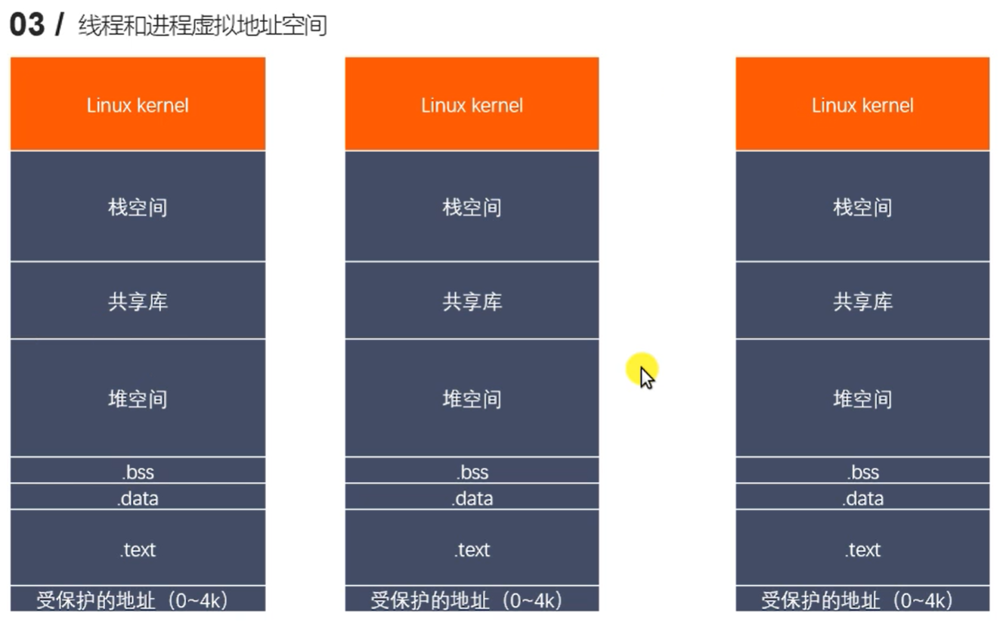
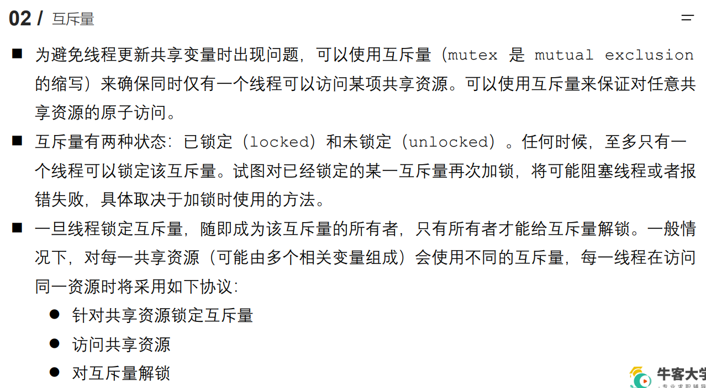

# 线程概述


ps -Lf pid

用于查看进程（id为pid）的所有线程




从一个进程创建出一个子进程，有写入时需要复制虚拟地址空间，耗时大


从一个进程（或线程），创建一个线程，

线程的**栈空间、.text段（代码段），会被划分为一个个子空间**，每个子线程都会有一段特有的区域

而共享库、堆等中的数据是共享的


信号掩码即阻塞信号集

进程虚拟地址空间内核中的数据，线程是共享的


内核将线程当作进程对待

进程是重量级的，线程是轻量级的

进程写时需要复制共享地址空间，线程共享地址空间


# 线程创建

在main中执行的线程称为主线程，只有一个主线程，主线程可以创建多个子线程

**子线程共享主线程的虚拟地址空间**

当**主线程运行结束，释放虚拟地址空间等进程的所有资源，子线程无法再执行**（所以需要让主线程sleep，或采用其他更好的方法）


线程是第三方库实现的，所以在编译的时候需要指定第三方库

```
gcc pthread_creat.c -o creat -l pthread
```

```
gcc pthread_creat.c -o creat -pthread
```

以上两者等效

线程库名称：`pthread`

线程库文件名称：`libpthread.so`


**`pthread_creat` 函数：**

```c
/*
    一般情况下,main函数所在的线程我们称之为主线程（main线程），其余创建的线程称之为子线程。
    程序中默认只有一个进程，fork()函数调用，产生一个子进程
    程序中默认只有一个线程，pthread_create()函数调用，产生一个子线程。

    #include <pthread.h>
    int pthread_create(pthread_t *thread, const pthread_attr_t *attr, void *(*start_routine) (void *), void *arg);
	
        - 功能：创建一个子线程
        - 参数：
            - thread：传出参数，线程创建成功后，子线程的线程ID被写到该变量中。
            - attr : 设置线程的属性，一般使用默认值，NULL
            - start_routine : 函数指针，这个函数是子线程需要处理的逻辑代码（子线程会执行该函数，而不再执行main之后的函数）（exec、回调函数）
            - arg : 给第三个参数使用，传参
        - 返回值：
            成功：0
            失败：返回错误号。这个错误号和之前errno不太一样。
            获取错误号的信息：  char * strerror(int errnum);

*/
```


```
#include <stdio.h>
#include <pthread.h>
#include <string.h>
#include <unistd.h>

void * callback(void * arg) {				// 传入参数为void*，返回值为void*
    printf("child thread...\n");
    printf("arg value: %d\n", *(int *)arg);		// 先将void地址转为int型地址，再去地址所指向的内容
    return NULL;
}

int main() {

    pthread_t tid;

    int num = 10;

    // 创建一个子线程
    int ret = pthread_create(&tid, NULL, callback, (void *)&num);	// 需要将int地址强转为void 地址

    if(ret != 0) {
        char * errstr = strerror(ret);
        printf("error : %s\n", errstr);
    } 

    for(int i = 0; i < 5; i++) {
        printf("%d\n", i);
    }

    sleep(1);		// 防止主线程运行结束，进程的资源被回收（子线程就不能再执行了）

    return 0;   // exit(0);
}
```


# 线程终止

将主线程退出，则进程的资源不会被回收，其他线程（子线程）可继续执行

如果主线程执行return 0; 或 exit(0); 进程就会被退出


通过`pthread_exit(NULL)` 来退出一个线程

可以指定退出时的返回值

该返回值会被`pthread_jion` 接收


```
/*

    #include <pthread.h>
    void pthread_exit(void *retval);
        功能：终止一个线程，在哪个线程中调用，就表示终止哪个线程
        参数：
            retval:需要传递一个指针，作为进程退出的返回值，可以被pthread_join()获取到。

    pthread_t pthread_self(void);
        功能：获取当前的线程的线程ID

    int pthread_equal(pthread_t t1, pthread_t t2);
        功能：比较两个线程ID是否相等
        不同的操作系统，pthread_t类型的实现不一样，有的是无符号的长整型，有的
        是使用结构体去实现的（就无法使用==）。
*/
```


```
#include <stdio.h>
#include <pthread.h>
#include <string.h>

void * callback(void * arg) {			// 子线程执行该函数，不会执行main后面的内容
    printf("child thread id : %ld\n", pthread_self());			// 打印子线程自己的tid
    return NULL;    // 相当于线程退出：pthread_exit(NULL);
} 

int main() {

    // 创建一个子线程
    pthread_t tid;
    int ret = pthread_create(&tid, NULL, callback, NULL);		// 创建子线程，子线程会执行callback，不会执行下面的语句（金蝉脱壳）
																// 子线程的id被写入tid
    if(ret != 0) {		// 如果创建失败
        char * errstr = strerror(ret);		// 获取错误号对应的信息
        printf("error : %s\n", errstr);
    }

    // 主线程
    for(int i = 0; i < 5; i++) {
        printf("%d\n", i);
    }

    printf("tid : %ld, main thread id : %ld\n", tid ,pthread_self());		// 打印子线程的tid以及子集的id

    // 让主线程退出,当主线程退出时，不会影响其他正常运行的线程。
    pthread_exit(NULL);			// 主线程退出，不会再执行下面的语句，不会再执行return 0,因此进程不会被终止（退出主线程而不退出进程）

    printf("main thread exit\n");		// 不会被执行，主线程已经被退出，子线程会执行回调函数

    return 0;   // exit(0);
}
```


注意：主线程会与子线程交替执行，就像进程那样

并发执行


# 连接已终止的线程

若父进程一直在运行，子进程运行结束一直没有被回收，则子进程变为僵尸进程

子线程同样会变为僵尸线程


父进程负责回收子进程（wait、kill父进程让子进程被1号进程领养）

任何一个线程都可以回收别的线程，但一般是**主线程回收子线程**


一般是让主线程连接已经结束的子线程


```
/*
    #include <pthread.h>
    int pthread_join(pthread_t thread, void **retval);
        - 功能：和一个已经终止的线程进行连接
                回收子线程的资源
                这个函数是阻塞函数，调用一次只能回收一个子线程
                一般在主线程中使用
        - 参数：
            - thread：需要回收的子线程的ID
            - retval: 接收子线程退出时的返回值
        - 返回值：
            0 : 成功
            非0 : 失败，返回的错误号
*/
```


主线程通过`pthread_creat(&tid, NULL, callback, NULL)` 创建一个子线程

子线程通过`pthread_exit((void *)&value)` 退出，value是传出参数，即返回值（一级指针）

父线程通过`pthread_join(tid, (void **)&thread_value)` 将子线程tid和父线程连接，并将子线程的返回存储到thread_value 中，要修改thread_value这一一级指针，将其指向子线程返回的指针所指内容，所以传入二级指针

jion函数是阻塞的，如果子线程还没有运行结束，主线程会一直阻塞在该函数


对普通遍历操作，要传入一级指针

对指针操作，要传入二级指针


```

#include <stdio.h>
#include <pthread.h>
#include <string.h>
#include <unistd.h>

int value = 10;			// 全局区的遍历可以保持在不同线程之间是一致的

void * callback(void * arg) {
    printf("child thread id : %ld\n", pthread_self());
    // sleep(3);
    // return NULL; 
    // int value = 10; // 局部变量，每个线程都有自己的栈区（虚拟地址空间的栈区被划分为一个个小区域），不同线程战区数据传递会出现数值错误
    pthread_exit((void *)&value);   // return (void *)&value;		传出一个一级指针
} 

int main() {

    // 创建一个子线程
    pthread_t tid;
    int ret = pthread_create(&tid, NULL, callback, NULL);

    if(ret != 0) {
        char * errstr = strerror(ret);
        printf("error : %s\n", errstr);
    }

    // 主线程
    for(int i = 0; i < 5; i++) {
        printf("%d\n", i);
    }

    printf("tid : %ld, main thread id : %ld\n", tid ,pthread_self());

    // 主线程调用pthread_join(),将子线程连接到主线程，主线程负责回收子线程的资源
    int * thread_retval;		// 传出参数，指针，下一行将修改该一级指针指向子线程退出时的传出参数
    ret = pthread_join(tid, (void **)&thread_retval);		// 传入被回收的子线程id，以及传出参数，要修改指针，所以传入二级指针

    if(ret != 0) {
        char * errstr = strerror(ret);
        printf("error : %s\n", errstr);
    }

    printf("exit data : %d\n", *thread_retval);

    printf("回收子线程资源成功！\n");

    // 让主线程退出,当主线程退出时，不会影响其他正常运行的线程。
    pthread_exit(NULL);

    return 0; 
}
```


# 线程的分离

```
/*
    #include <pthread.h>
    int pthread_detach(pthread_t thread);
        - 功能：分离一个线程。被分离的线程在终止的时候，会自动释放资源返回给系统。
          1.不能多次分离，会产生不可预料的行为。
          2.不能去连接一个已经分离的线程，会报错。
        - 参数：需要分离的线程的ID
        - 返回值：
            成功：0
            失败：返回错误号
*/
```

一个子线程默认是需要被其主线程连接并负责释放的

被分离的子线程运行结束后会自动被释放，回收资源

被分离的线程不能再被连接，不需要再让别的线程负责释放


也可以通过线程属性设置分离


```
#include <stdio.h>
#include <pthread.h>
#include <string.h>
#include <unistd.h>

void * callback(void * arg) {
    printf("chid thread id : %ld\n", pthread_self());
    return NULL;
}		// 子线程被分离，运行完后自动被释放

int main() {

    // 创建一个子线程
    pthread_t tid;

    int ret = pthread_create(&tid, NULL, callback, NULL);		// 创建子线程
    if(ret != 0) {	// 若创建失败
        char * errstr = strerror(ret);
        printf("error1 : %s\n", errstr);
    }

    // 输出主线程和子线程的id
    printf("tid : %ld, main thread id : %ld\n", tid, pthread_self());

    // 设置子线程分离,子线程分离后，子线程结束时对应的资源就不需要主线程释放
    ret = pthread_detach(tid);		// 非阻塞，一下就可以执行完
    if(ret != 0) {	// 若分离失败
        char * errstr = strerror(ret);
        printf("error2 : %s\n", errstr);
    }

    // 设置分离后，对分离的子线程进行连接 pthread_join()
    // ret = pthread_join(tid, NULL);
    // if(ret != 0) {	// 若连接失败-----分离后的线程不能再被连接，因此会若主线程连接被分离的子线程，会连接失败
    //     char * errstr = strerror(ret);
    //     printf("error3 : %s\n", errstr);
    // }

    pthread_exit(NULL);

    return 0;
}
```


子线程被创建后和主线程有关联，

一个子线程，若没有进行任何操作，则其运行结束后需要被主线程连接以释放资源

若子线程被分离，则可以自动释放


线程依赖于进程，若进程退出，则依赖于该进程的所有线程也会退出


# 线程取消


将一个正在运行的线程取消

向tid发送取消信号，收到信号的线程取消与否与与cancleable_type有关

默认创建的线程都可以取消


取消一个线程，不是立马取消，而是等线程执行到取消点的时候再取消该线程

一些函数都是取消点，可以认为：

系统调用是取消点

线程（进程）分为内核区和用户区，当执行到内核区时，便可以取消


```
/*
    #include <pthread.h>
    int pthread_cancel(pthread_t thread);
        - 功能：取消线程（让线程终止）
            取消某个线程，可以终止某个线程的运行，
            但是并不是立马终止，而是当子线程执行到一个取消点，线程才会终止。
            取消点：系统规定好的一些系统调用，我们可以粗略的理解为从用户区到内核区的切换，这个位置称之为取消点。
*/
```


```
#include <stdio.h>
#include <pthread.h>
#include <string.h>
#include <unistd.h>

void * callback(void * arg) {		// 子线程执行该函数，执行到一半会被取消
    printf("chid thread id : %ld\n", pthread_self());
    for(int i = 0; i < 5; i++) {
        printf("child : %d\n", i);		// printf语句是一个取消点
    }
    return NULL;
}

int main() {
    
    // 创建一个子线程
    pthread_t tid;

    int ret = pthread_create(&tid, NULL, callback, NULL);
    if(ret != 0) {
        char * errstr = strerror(ret);
        printf("error1 : %s\n", errstr);
    }

    // 取消子线程
    pthread_cancel(tid);

    for(int i = 0; i < 5; i++) {		// 主线程可以执行完
        printf("%d\n", i);
    }

    // 输出主线程和子线程的id
    printf("tid : %ld, main thread id : %ld\n", tid, pthread_self());

    
    pthread_exit(NULL);

    return 0;
}
```


# 线程属性


线程分离属性有两种：`PTHREAD_CREATE_DETACHED`  `PTHREAD_CREATE_JOINABLE` （默认）


每个线程都有一个线程属性变量，创建线程时指定或使用默认值

创建一个线程属性变量`pthread_attr_t attr;`，

初始化该线程属性变量`pthread_attr_init(&attr);`

设置该线程属性变量`pthread_attr_setdetachstate(&attr, PTHREAD_CREATE_DETACHED);`

获取该线程属性变量信息`pthread_attr_getstacksize(&attr, &size);`  第二个参数为传出参数

可以通过该线程属性变量创建线程`pthread_create(&tid, &attr, callback, NULL);`


```
/*
    int pthread_attr_init(pthread_attr_t *attr);
        - 初始化创建的线程属性变量

    int pthread_attr_destroy(pthread_attr_t *attr);
        - 释放创建的线程属性的资源

    int pthread_attr_getdetachstate(const pthread_attr_t *attr, int *detachstate);
        - 获取线程分离的状态属性，第一个参数为线程属性变量，第二个参数为传出参数

    int pthread_attr_setdetachstate(pthread_attr_t *attr, int detachstate);
        - 设置线程分离的状态属性，第一个参数为线程属性变量，第二个参数为分离属性
*/     
```


```
#include <stdio.h>
#include <pthread.h>
#include <string.h>
#include <unistd.h>

void * callback(void * arg) {
    printf("chid thread id : %ld\n", pthread_self());
    return NULL;
}

int main() {

    // 创建一个线程属性变量
    pthread_attr_t attr;
    // 初始化属性变量
    pthread_attr_init(&attr);

    // 设置属性
    pthread_attr_setdetachstate(&attr, PTHREAD_CREATE_DETACHED);	// 将分离属性设为PTHREAD_CREATE_DETACHED

    // 创建一个子线程
    pthread_t tid;
    int ret = pthread_create(&tid, &attr, callback, NULL);		// 第二个参数传入设置好的属性，而不用NULL
    if(ret != 0) {
        char * errstr = strerror(ret);
        printf("error1 : %s\n", errstr);
    }

    // 获取线程的栈的大小
    size_t size;
    pthread_attr_getstacksize(&attr, &size);	// 第一个参数为线程属性变量，第二个参数为传出参数
    printf("thread stack size : %ld\n", size);

    // 输出主线程和子线程的id
    printf("tid : %ld, main thread id : %ld\n", tid, pthread_self());

    // 释放线程属性资源
    pthread_attr_destroy(&attr);

    pthread_exit(NULL);

    return 0;
}
```


# 线程同步


对共享资源的操作涉及到线程同步

要保证原子性


若有多个线程操作同一个变量，则由于系统轮转调度不同的线程

可能会产生非法的变量值


临界区需要进行线程同步，互斥访问

其他区不需要

临界资源是需要进行同步、互斥访问的资源

临界区是访问临界资源的一段代码   


```
/*
    使用多线程实现买票的案例。
    有3个窗口，一共是100张票。
*/

#include <stdio.h>
#include <pthread.h>
#include <unistd.h>

// 全局变量，所有的线程都共享这一份资源。
int tickets = 100;		// 临界资源

void * sellticket(void * arg) {
    // 卖票
    while(tickets > 0) {		// 临界区----访问临界资源的代码
        usleep(6000);
        printf("%ld 正在卖第 %d 张门票\n", pthread_self(), tickets);
        tickets--;
    }
    return NULL;
}

int main() {

    // 创建3个子线程
    pthread_t tid1, tid2, tid3;
    pthread_create(&tid1, NULL, sellticket, NULL);
    pthread_create(&tid2, NULL, sellticket, NULL);
    pthread_create(&tid3, NULL, sellticket, NULL);

    // 回收子线程的资源,阻塞
    pthread_join(tid1, NULL);
    pthread_join(tid2, NULL);
    pthread_join(tid3, NULL);

    // 设置线程分离。
    // pthread_detach(tid1);
    // pthread_detach(tid2);
    // pthread_detach(tid3);

    pthread_exit(NULL); // 退出主线程

    return 0;
}
```

上面的代码没有实现线程同步

数据存在不安全问题


临界区应该是原子操作

其他区不需要是原子操作


# 互斥锁





互斥量是一个变量，理解为一个锁


`* restrict` 关键字，修饰指针，保证只有一个指针指向某块内存


**互斥量应该放在全局区**

**这样不同的线程都可以用**

若放在main函数内，是在栈区，没法给其他线程用，其他线程单独运行的callback函数，与main没关系


```
/*
    互斥量的类型 pthread_mutex_t
    int pthread_mutex_init(pthread_mutex_t *restrict mutex, const pthread_mutexattr_t *restrict attr);
        - 初始化互斥量
        - 参数 ：
            - mutex ： 需要初始化的互斥量变量
            - attr ： 互斥量相关的属性，NULL
        - restrict : C语言的修饰符，被修饰的指针，不能由另外的一个指针进行操作。
            pthread_mutex_t *restrict mutex = xxx;
            pthread_mutex_t * mutex1 = mutex;	// 错误

    int pthread_mutex_destroy(pthread_mutex_t *mutex);
        - 释放互斥量的资源

    int pthread_mutex_lock(pthread_mutex_t *mutex);
        - 加锁，阻塞的，如果有一个线程加锁了，那么其他的线程只能阻塞等待

    int pthread_mutex_trylock(pthread_mutex_t *mutex);
        - 尝试加锁，如果加锁失败，不会阻塞，会直接返回。

    int pthread_mutex_unlock(pthread_mutex_t *mutex);
        - 解锁
*/
```


```
#include <stdio.h>
#include <pthread.h>
#include <unistd.h>

// 全局变量，所有的线程都共享这一份资源。
int tickets = 1000;

// 创建一个互斥量
pthread_mutex_t mutex;		// 要在全局区创建互斥量

void * sellticket(void * arg) {

    // 卖票
    while(1) {		// 要在循环内，否则卖了一张票就退出了

        // 加锁
        pthread_mutex_lock(&mutex);		// 下面是临界区，先加锁

        if(tickets > 0) {
            usleep(6000);	// 让抢到cpu以及互斥锁的线程少卖一些票（更直观地观察线程并发执行）
            printf("%ld 正在卖第 %d 张门票\n", pthread_self(), tickets);
            tickets--;
        }else {
            // 解锁，如果没票了就解锁并退出
            pthread_mutex_unlock(&mutex);		// 这里解锁是为了让其他线程早点获得锁
            break;
        }

        // 解锁
        pthread_mutex_unlock(&mutex);
    }

    

    return NULL;
}

int main() {

    // 初始化互斥量
    pthread_mutex_init(&mutex, NULL);

    // 创建3个子线程
    pthread_t tid1, tid2, tid3;
    pthread_create(&tid1, NULL, sellticket, NULL);
    pthread_create(&tid2, NULL, sellticket, NULL);
    pthread_create(&tid3, NULL, sellticket, NULL);

    // 回收子线程的资源,阻塞
    pthread_join(tid1, NULL);
    pthread_join(tid2, NULL);
    pthread_join(tid3, NULL);

    pthread_exit(NULL); // 退出主线程

    // 释放互斥量资源
    pthread_mutex_destroy(&mutex);

    return 0;
}
```


离得近的两个临界区，可以使用一个互斥锁来管理

离得远的两个临界区，不能使用同一个互斥锁管理（会降低并发性），需要设置两个互斥锁来管理


# 死锁

使用互斥锁时，可能产生死锁


重复加锁：

a函数加锁，接着调用b函数，在b函数中，又一次加锁


```c++
#include <stdio.h>
#include <pthread.h>
#include <unistd.h>

// 创建2个互斥量
pthread_mutex_t mutex1, mutex2;

void * workA(void * arg) {

    pthread_mutex_lock(&mutex1);
    sleep(1);
    pthread_mutex_lock(&mutex2);

    printf("workA....\n");

    pthread_mutex_unlock(&mutex2);
    pthread_mutex_unlock(&mutex1);
    return NULL;
}


void * workB(void * arg) {
    pthread_mutex_lock(&mutex2);
    sleep(1);
    pthread_mutex_lock(&mutex1);

    printf("workB....\n");

    pthread_mutex_unlock(&mutex1);
    pthread_mutex_unlock(&mutex2);

    return NULL;
}

int main() {

    // 初始化互斥量
    pthread_mutex_init(&mutex1, NULL);
    pthread_mutex_init(&mutex2, NULL);

    // 创建2个子线程
    pthread_t tid1, tid2;
    pthread_create(&tid1, NULL, workA, NULL);
    pthread_create(&tid2, NULL, workB, NULL);

    // 回收子线程资源
    pthread_join(tid1, NULL);
    pthread_join(tid2, NULL);

    // 释放互斥量资源
    pthread_mutex_destroy(&mutex1);
    pthread_mutex_destroy(&mutex2);

    return 0;
}
```

以上代码会产生死锁，对应情况3

A占用了1锁等待2锁

B占用了2锁等待1锁

相互等待资源，死锁


```
#include <stdio.h>
#include <pthread.h>
#include <unistd.h>

// 全局变量，所有的线程都共享这一份资源。
int tickets = 1000;

// 创建一个互斥量
pthread_mutex_t mutex;

void * sellticket(void * arg) {

    // 卖票
    while(1) {

        // 加锁
        pthread_mutex_lock(&mutex);		// 重复加锁，产生死锁
        pthread_mutex_lock(&mutex);

        if(tickets > 0) {
            usleep(6000);
            printf("%ld 正在卖第 %d 张门票\n", pthread_self(), tickets);
            tickets--;
        }else {
            // 解锁
            pthread_mutex_unlock(&mutex);
            break;
        }

        // 解锁
        pthread_mutex_unlock(&mutex);		// 忘记解锁也会死锁
        pthread_mutex_unlock(&mutex);
    }

    return NULL;
}

int main() {

    // 初始化互斥量
    pthread_mutex_init(&mutex, NULL);

    // 创建3个子线程
    pthread_t tid1, tid2, tid3;
    pthread_create(&tid1, NULL, sellticket, NULL);
    pthread_create(&tid2, NULL, sellticket, NULL);
    pthread_create(&tid3, NULL, sellticket, NULL);

    // 回收子线程的资源,阻塞
    pthread_join(tid1, NULL);
    pthread_join(tid2, NULL);
    pthread_join(tid3, NULL);

    pthread_exit(NULL); // 退出主线程

    // 释放互斥量资源
    pthread_mutex_destroy(&mutex);

    return 0;
}
```


# 读写锁

互斥锁只能有一个线程操作

读写锁允许多个线程读


可以允许多个线程加读锁


**想要加写锁的线程获取cpu的概率更高**


互斥锁是一把锁

读写锁也是一把锁----该锁有两种行为

该锁加锁方式有两种

解锁方式就一种


读锁不是为了防止其他线程读，而是防止其他线程写


```
/*
    读写锁的类型 pthread_rwlock_t
    int pthread_rwlock_init(pthread_rwlock_t *restrict rwlock, const pthread_rwlockattr_t *restrict attr);
    int pthread_rwlock_destroy(pthread_rwlock_t *rwlock);
    int pthread_rwlock_rdlock(pthread_rwlock_t *rwlock);		// 设置读锁，有写锁的话会被阻塞
    int pthread_rwlock_tryrdlock(pthread_rwlock_t *rwlock);		// 尝试设置读锁，不会被阻塞
    int pthread_rwlock_wrlock(pthread_rwlock_t *rwlock);		// 设置写锁，有读/写锁的话会被阻塞
    int pthread_rwlock_trywrlock(pthread_rwlock_t *rwlock);		// 尝试设置写锁，不会被阻塞
    int pthread_rwlock_unlock(pthread_rwlock_t *rwlock);		// 解锁，读、写锁都用该函数

    案例：8个线程操作同一个全局变量。
    3个线程不定时写这个全局变量，5个线程不定时的读这个全局变量
*/

#include <stdio.h>
#include <pthread.h>
#include <unistd.h>

// 创建一个共享数据
int num = 1;
// pthread_mutex_t mutex;
pthread_rwlock_t rwlock;

void * writeNum(void * arg) {

    while(1) {		// 不断进行写，需要手动退出进程
        pthread_rwlock_wrlock(&rwlock);		// 获取写锁
        num++;		// 写操作
        printf("++write, tid : %ld, num : %d\n", pthread_self(), num);
        pthread_rwlock_unlock(&rwlock);		// 释放写锁
        usleep(100);
    }

    return NULL;
}

void * readNum(void * arg) {

    while(1) {
        pthread_rwlock_rdlock(&rwlock);		// 获取读锁
        printf("===read, tid : %ld, num : %d\n", pthread_self(), num);		// 读操作
        pthread_rwlock_unlock(&rwlock);		// 释放读锁
        usleep(100);
    }

    return NULL;
}

int main() {

   pthread_rwlock_init(&rwlock, NULL);

    // 创建3个写线程，5个读线程
    pthread_t wtids[3], rtids[5];
    for(int i = 0; i < 3; i++) {
        pthread_create(&wtids[i], NULL, writeNum, NULL);		// 创建3个写线程，写线程执行写操作
    }

    for(int i = 0; i < 5; i++) {
        pthread_create(&rtids[i], NULL, readNum, NULL);			// 创建5个读线程，读线程执行读操作
    }

    // 设置线程分离
    for(int i = 0; i < 3; i++) {
       pthread_detach(wtids[i]);
    }

    for(int i = 0; i < 5; i++) {
         pthread_detach(rtids[i]);
    }

    pthread_exit(NULL);		// 主线程退出，而不退出进程

    pthread_rwlock_destroy(&rwlock);

    return 0;
}
```


一种线程只执行一种操作


# 生产者消费者模型


容器满了：生产者不能再生成，通知消费者消费

容器没东西了：消费者不能再消费，通知生产者生产


生产者消费者都可以有多个：数据同步


简易版生产者消费者模型：

容器容量无限，

没有物品了消费者会一直进行while循环判断有没有来物品（直到时间片被抢走或有物品了，浪费cpu资源），而不会通知生产者生产数据

通过互斥量实现了容器的互斥访问


好的做法：消费者发现没有数据了，通知生产者

```
/*
    生产者消费者模型（粗略的版本）
*/
#include <stdio.h>
#include <pthread.h>
#include <stdlib.h>
#include <unistd.h>

// 创建一个互斥量，数据同步
pthread_mutex_t mutex;

struct Node{
    int num;
    struct Node *next;
};

// 头结点
struct Node * head = NULL;

void * producer(void * arg) {

    // 不断的创建新的节点，添加到链表中
    while(1) {
        pthread_mutex_lock(&mutex);		// 共享数据进行数据同步
        struct Node * newNode = (struct Node *)malloc(sizeof(struct Node));		// 创建一个新的节点
        newNode->next = head;			// 头插法
        head = newNode;
        newNode->num = rand() % 1000;
        printf("add node, num : %d, tid : %ld\n", newNode->num, pthread_self());
        pthread_mutex_unlock(&mutex);
        usleep(100);
    }

    return NULL;
}

void * customer(void * arg) {

    while(1) {
        pthread_mutex_lock(&mutex);
        // 保存头结点的指针
        struct Node * tmp = head;

        // 判断是否有数据
        if(head != NULL) {
            // 有数据
            head = head->next;
            printf("del node, num : %d, tid : %ld\n", tmp->num, pthread_self());
            free(tmp);
            pthread_mutex_unlock(&mutex);
            usleep(100);
        } else {
            // 没有数据，重新进入while循环，不进行消费，不会通知生产者
            pthread_mutex_unlock(&mutex);
        }
    }
    return  NULL;
}

int main() {

    pthread_mutex_init(&mutex, NULL);

    // 创建5个生产者线程，和5个消费者线程
    pthread_t ptids[5], ctids[5];

    for(int i = 0; i < 5; i++) {
        pthread_create(&ptids[i], NULL, producer, NULL);
        pthread_create(&ctids[i], NULL, customer, NULL);
    }

    for(int i = 0; i < 5; i++) {
        pthread_detach(ptids[i]);
        pthread_detach(ctids[i]);
    }

    while(1) {			// 防止过早销毁互斥锁，也可用jion函数，将主线程阻塞住
        sleep(10);
    }

    pthread_mutex_destroy(&mutex);		// 放在主线程退出命令之前，如果放在之后，互斥锁无法被销毁

    pthread_exit(NULL);

    return 0;
}
```


# 条件变量

**条件变量不是锁**

某个条件满足后，阻塞线程/解除线程

配合锁使用


```
/*
    条件变量的类型 pthread_cond_t
    int pthread_cond_init(pthread_cond_t *restrict cond, const pthread_condattr_t *restrict attr);
    int pthread_cond_destroy(pthread_cond_t *cond);
    int pthread_cond_wait(pthread_cond_t *restrict cond, pthread_mutex_t *restrict mutex);
        - 等待，调用了该函数，线程会阻塞。
        - 调用该函数，会首先将互斥锁解锁，等有阻塞态重新开始运行时再次进行加锁
    int pthread_cond_timedwait(pthread_cond_t *restrict cond, pthread_mutex_t *restrict mutex, const struct timespec *restrict abstime);
        - 等待多长时间，调用了这个函数，线程会阻塞，直到指定的时间结束。
    int pthread_cond_signal(pthread_cond_t *cond);
        - 唤醒一个或者多个等待的线程
    int pthread_cond_broadcast(pthread_cond_t *cond);
        - 唤醒所有的等待的线程
*/
```

在全局区创建一个条件变量`pthread_cond_t cond;` 

在main函数里初始化条件变量`pthread_cond_init(&cond, NULL);`

若没有物品，消费者调用 `pthread_cond_wait(&cond, &mutex);` ，将消费者阻塞，该函数需要传入条件变量、互斥锁，该函数会释放互斥锁（以让生产者可以生产临界资源），等再次由阻塞开始运行时（收到生产者条件变量的通知后），再获取该互斥锁（因为是临界区代码）

生产者生产物品后，通过条件变量通知消费者`pthread_cond_signal(&cond);` 进行消费

**生产者、消费者通过条件变量通知对方，通过互斥锁进行临界资源同步**


```c++
#include <stdio.h>
#include <pthread.h>
#include <stdlib.h>
#include <unistd.h>

// 创建一个互斥量,用来实现对容器的互斥访问
pthread_mutex_t mutex;
// 创建条件变量，实现消费者、生产者相互通知
pthread_cond_t cond;

struct Node{
    int num;
    struct Node *next;
};

// 头结点
struct Node * head = NULL;

void * producer(void * arg) {

    // 不断的创建新的节点，添加到链表中
    while(1) {
        pthread_mutex_lock(&mutex);		// 临界资源同步
        struct Node * newNode = (struct Node *)malloc(sizeof(struct Node));
        newNode->next = head;
        head = newNode;
        newNode->num = rand() % 1000;
        printf("add node, num : %d, tid : %ld\n", newNode->num, pthread_self());
        
        // 生产者只要生产了一个，就通知消费者消费
        pthread_cond_signal(&cond);

        pthread_mutex_unlock(&mutex);	// 释放临界资源
        usleep(100);
    }

    return NULL;
}

void * customer(void * arg) {

    while(1) {
        pthread_mutex_lock(&mutex);		// 临界资源同步
        // 保存头结点的指针
        struct Node * tmp = head;
        // 判断是否有数据
        if(head != NULL) {
            // 有数据
            head = head->next;
            printf("del node, num : %d, tid : %ld\n", tmp->num, pthread_self());
            free(tmp);
            pthread_mutex_unlock(&mutex);	// 释放临界资源
            usleep(100);
        } else {
            // 没有数据，需要等待
            // 当这个函数调用阻塞的时候，会对互斥锁进行解锁(防止死锁)，当解除阻塞(条件发生)，继续向下执行时，会先进行重新加锁。
            pthread_cond_wait(&cond, &mutex);	// 传入条件变量、互斥锁
            pthread_mutex_unlock(&mutex);		// while结束进入下一个while前要释放互斥锁，防止死锁
        }
    }
    return  NULL;
}

int main() {

    pthread_mutex_init(&mutex, NULL);
    pthread_cond_init(&cond, NULL);

    // 创建5个生产者线程，和5个消费者线程
    pthread_t ptids[5], ctids[5];

    for(int i = 0; i < 5; i++) {
        pthread_create(&ptids[i], NULL, producer, NULL);
        pthread_create(&ctids[i], NULL, customer, NULL);
    }

    for(int i = 0; i < 5; i++) {
        pthread_detach(ptids[i]);
        pthread_detach(ctids[i]);
    }

    while(1) {
        sleep(10);
    }

    pthread_mutex_destroy(&mutex);
    pthread_cond_destroy(&cond);

    pthread_exit(NULL);

    return 0;
}
```


# 信号量

又称信号灯

阻塞线程，不能保证多线程数据安全

为保证数据安全，需要与互斥锁一起使用


eg：初始化信号量，容量为5，来一个消费者，灭一个灯，生产者生产一次，亮一个灯

调用一次wait，容量-1

调用一次post，容量+1


```
/*
    信号量的类型 sem_t
    int sem_init(sem_t *sem, int pshared, unsigned int value);
        - 初始化信号量
        - 参数：
            - sem : 信号量变量的地址
            - pshared : 0 用在线程间 ，非0 用在进程间
            - value : 信号量中的值，初始时有几个资源

    int sem_destroy(sem_t *sem);
        - 释放资源

    int sem_wait(sem_t *sem);
        - 对信号量加锁，调用一次对信号量的值-1，如果值为0，就阻塞

    int sem_trywait(sem_t *sem);

    int sem_timedwait(sem_t *sem, const struct timespec *abs_timeout);
    int sem_post(sem_t *sem);
        - 对信号量解锁，调用一次对信号量的值+1

    int sem_getvalue(sem_t *sem, int *sval);


    sem_t psem;		// 该信号了标记有几个空位，初始时为8
    sem_t csem;		// 标记有几个物品，初始时为0
    init(psem, 0, 8);
    init(csem, 0, 0);

    producer() {
        sem_wait(&psem);	// 生产前，先申请一个空位
        sem_post(&csem)		// 生产完毕，增加一个物品
    }

    customer() {
        sem_wait(&csem);	// 消费前，先申请一个物品
        sem_post(&psem)		// 消费完毕，增加一个空位
    }

*/
```


```c++
#include <stdio.h>
#include <pthread.h>
#include <stdlib.h>
#include <unistd.h>
#include <semaphore.h>

// 创建一个互斥量
pthread_mutex_t mutex;
// 创建两个信号量
sem_t psem;
sem_t csem;

struct Node{
    int num;
    struct Node *next;
};

// 头结点
struct Node * head = NULL;

void * producer(void * arg) {

    // 不断的创建新的节点，添加到链表中
    while(1) {
        sem_wait(&psem);				// 生产者，先申请一个空位，才能进行生产，若没有空位，会被阻塞（会通知消费者消费）
        pthread_mutex_lock(&mutex);		// 临界区需加锁
        struct Node * newNode = (struct Node *)malloc(sizeof(struct Node));
        newNode->next = head;
        head = newNode;
        newNode->num = rand() % 1000;
        printf("add node, num : %d, tid : %ld\n", newNode->num, pthread_self());
        pthread_mutex_unlock(&mutex);	// 释放临界区
        sem_post(&csem);				// 生产完毕，增加一个物品
    }

    return NULL;
}

void * customer(void * arg) {

    while(1) {
        sem_wait(&csem);				// 消费前，需申请一个物品，若为0，会被阻塞(会通知生产者生产)，代表还没有生产
        pthread_mutex_lock(&mutex);		// 临界资源互斥锁
        // 保存头结点的指针
        struct Node * tmp = head;		// 直接进行消费，若能进入此代码说明有物品（能申请到物品说明肯定有物品）
        head = head->next;
        printf("del node, num : %d, tid : %ld\n", tmp->num, pthread_self());
        free(tmp);
        pthread_mutex_unlock(&mutex);	// 临界资源互斥锁
        sem_post(&psem);				// 消费完毕，增加一个空位
       
    }
    return  NULL;
}

int main() {

    pthread_mutex_init(&mutex, NULL);
    sem_init(&psem, 0, 8);				// 标识空位的信号量，初始化有8个空位
    sem_init(&csem, 0, 0);				// 标识物品的信号量，初始化有0个物品

    // 创建5个生产者线程，和5个消费者线程
    pthread_t ptids[5], ctids[5];

    for(int i = 0; i < 5; i++) {
        pthread_create(&ptids[i], NULL, producer, NULL);
        pthread_create(&ctids[i], NULL, customer, NULL);
    }

    for(int i = 0; i < 5; i++) {
        pthread_detach(ptids[i]);
        pthread_detach(ctids[i]);
    }

    while(1) {
        sleep(10);
    }

    pthread_mutex_destroy(&mutex);		// 销毁互斥锁，信号量（轻量级）不用销毁

    pthread_exit(NULL);

    return 0;
}
```


信号量用于生产者、消费者之间相互通知，**实现对临界资源的同步需要互斥锁**


物品信号量初始化为0，空位信号量初始化为8

生产者先申请空位，空位-1，生产完毕物品+1

消费者先申请物品，物品-1，消费完毕空位+1

`>0` 才能成功申请到，否则会被阻塞
