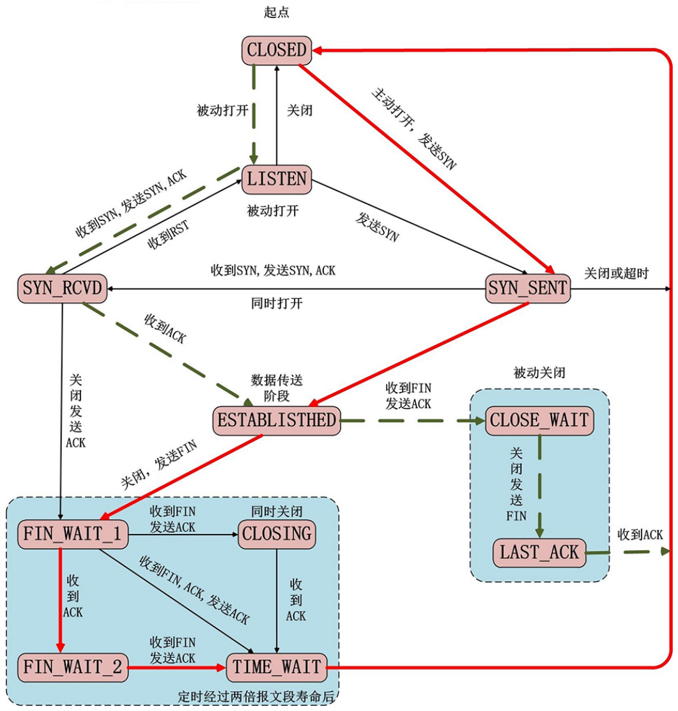

# 1. socket 介绍

所谓 socket（套接字），就是**对网络中不同主机上的应用进程之间进行双向通信的端点的抽象。**
一个套接字就是网络上进程通信的一端，提供了应用层进程利用网络协议交换数据的机制。

从所处的地位来讲，**套接字上联应用进程，下联网络协议栈，是应用程序通过网络协议进行通信的接口**，是应用程序与网络协议根进行交互的接口。
socket 可以看成是两个网络应用程序进行通信时，各自通信连接中的端点，这是一个逻辑上的概念。它是网络环境中进程间通信的 API，也是可以被命名和寻址的通信端点，使用中的每一个套接字都有其类型和一个与之相连进程。通信时其中一个**网络应用程序将要传输的一段信息写入它所在主机的 socket 中，该 socket 通过与网络接口卡（NIC）相连的传输介质将这段信息送到另外一台主机的 socket 中，使对方能够接收到这段信息**。**socket 是由 IP 地址和端口结合的，提供向应用层进程传送数据包的机制。**

socket 本身有“插座”的意思，在 Linux 环境下，用于表示**进程间网络通信的特殊文件类型**。**本质为内核借助缓冲区形成的伪文件**。既然是文件，那么理所当然的，我们可以使用文件描述符引用套接字。与管道类似的，Linux 系统将其封装成文件的目的是为了统一接口，使得读写套接字和读写文件的操作一致。区别是管道主要应用于本地进程间通信，而**套接字多应用于网络进程间数据的传递。**


socket就是一个接口，是提供的一个封装了一系列网络协议操作的接口

**socket体现为一个文件**，该文件用户网络中两进程的通信

在主机中开辟对应文件及fd，文件都有读缓冲区、写缓冲区，

```
主机A中一个应用进程想要向主机B中的应用进程发送信息，则主机A应用进程通过fd将数据write进写缓冲区，然后socket通过一系列操作，进行多层封装（对应网络模型各层），将数据发送给主机B

主机B的socket收到数据，进行多层解封装（网络模型的各层），最后将数据写入B中socket的读缓冲区，应用进程可以从读缓冲区读取数据
```

可以看到，**网络模型各层的操作都是由socket实现的，开发者只需要调用socket的各个API即可（需提供ip及端口）**

因此是一个端点

```
套接字通信分两部分：
    - 服务器端：被动接受连接，一般不会主动发起连接(插座)
    - 客户端：主动向服务器发起连接(插头)
socket是一套通信的接口，Linux 和 Windows 都有，但是有一些细微的差别。
```


# 2. 字节序

## 简介

现代 CPU 的累加器一次都能装载（至少） 4 字节（这里考虑 32 位机），即一个整数。**那么这 4字节在内存中排列的顺序将影响它被累加器装载成的整数的值，这就是字节序问题。**在各种计算机体系结构中，对于字节、字等的存储机制有所不同，因而引发了计算机通信领域中一个很重要的问题，即通信双方交流的信息单元（比特、字节、字、双字等等）应该以什么样的顺序进行传送。如果不达成一致的规则，通信双方将无法进行正确的编码/译码从而导致通信失败。

**字节序，顾名思义字节的顺序，就是大于一个字节类型的数据在内存中的存放顺序**(一个字节的数据当然就无需谈顺序的问题了) 。

字节序分为大端字节序（Big-Endian） 和小端字节序（Little-Endian）。大端字节序是指一个整数的最高位字节（23 ~ 31 bit）存储在内存的低地址处，低位字节（0 ~ 7 bit）存储在内存的高地址处；小端字节序则是指整数的高位字节存储在内存的高地址处，而低位字节则存储在内存的低地址处。

## 字节序举例

- 小端字节序

  高位存储在高字节，低位存储在低字节

   0x 01 02 03 04 - ff = 255

​		内存的方向 ----->
​		内存的低位 -----> 内存的高位

​		一个整数：04 03 02 01		（整数的高位--->整数的地位）

​		0x 11 22 33 44 12 34 56 78（十六进制数)


- 大端字节序

​		高位存储在低地址，低位存储在高地址

​		0x 01 02 03 04

​		内存的方向 ----->

​		内存的低位 -----> 内存的高位

​		01 02 03 04

​		0x 12 34 56 78 11 22 33 44


```c++
/*  
    字节序：字节在内存中存储的顺序。
    小端字节序：数据的高位字节存储在内存的高位地址，低位字节存储在内存的低位地址
    大端字节序：数据的低位字节存储在内存的高位地址，高位字节存储在内存的低位地址
*/

// 通过代码检测当前主机的字节序
#include <stdio.h>

int main() {
	
	// 联合体中的变量共享相同的内存空间
    union {
        short value;    // 2字节
        char bytes[sizeof(short)];  // char xxx[2]  short占两个字节
    } test;

    test.value = 0x0102;		// 存储十六机制数字
    if((test.bytes[0] == 1) && (test.bytes[1] == 2)) {				// 内存的低位存储数字的高位
        printf("大端字节序\n");
    } else if((test.bytes[0] == 2) && (test.bytes[1] == 1)) {		// 内存的高位存储数字的高位
        printf("小端字节序\n");
    } else {
        printf("未知\n");
    }

    return 0;
}
```


## 字节序转换函数

当格式化的数据在两台使用不同字节序的主机之间直接传递时，接收端必然错误地解释之。解决问题的方法是：发送端总是把要发送的数据转换成大端字节序数据后再发送，而接收端知道对方传送过来的数据总是采用大端字节序，所以接收端可以根据自身采用的字节序决定是否对接收到的数据进行转换（实现约定好，传输的数据是大端，接收方是小端机，则需要转换，大端机则不转换）。

规定好**网络字节序都是大端**

**网络字节顺序**是 TCP/IP 中规定好的一种数据表示格式，它与具体的 CPU 类型、操作系统等无关，从而可以保证数据在不同主机之间传输时能够被正确解释，网络字节顺序采用大端排序方式。BSD Socket提供了封装好的转换接口，方便程序员使用。包括从主机字节序到网络字节序的转换函数：htons、htonl；从网络字节序到主机字节序的转换函数：ntohs、ntohl。

```
h - host 主机，主机字节序
to - 转换成什么
n - network 网络字节序
s - short 	即 unsigned short
l - long 	即 unsigned int
```


```
#include <arpa/inet.h>
// 转换端口
uint16_t htons(uint16_t hostshort); // 主机字节序 - 网络字节序
uint16_t ntohs(uint16_t netshort); // 主机字节序 - 网络字节序

// 转IP
uint32_t htonl(uint32_t hostlong); // 主机字节序 - 网络字节序
uint32_t ntohl(uint32_t netlong); // 主机字节序 - 网络字节序
```


```
/*
    网络通信时，源主机需要将字节序转换成网络字节序（大端），
    目的主机获取到数据以后根据情况将网络字节序转换成主机字节序。

    // 转换端口
    uint16_t htons(uint16_t hostshort);		// 主机字节序 - 网络字节序
    uint16_t ntohs(uint16_t netshort);		// 主机字节序 - 网络字节序

    // 转IP
    uint32_t htonl(uint32_t hostlong);		// 主机字节序 - 网络字节序
    uint32_t ntohl(uint32_t netlong);		// 主机字节序 - 网络字节序
*/

#include <stdio.h>
#include <arpa/inet.h>

int main() {

    // htons 转换端口
    unsigned short a = 0x0102;      // 源主机的端口
    printf("a : %x\n", a);
    unsigned short b = htons(a);    // 将源主机字节序转为网络字节序
    printf("b : %x\n", b);

    // ntohs
    unsigned short a1 = 0x0201;      // 获取到的网络字节序
    printf("a1 : %x\n", a1);
    unsigned short b1 = ntohs(a1);   // 将网络字节序转为本机字节序
    printf("b1 : %x\n", b1);

    printf("=======================\n");

    // htonl  转换IP，将主机IP转为网络IP
    char buf[4] = {192, 168, 1, 100};       // 源主机消息（IP）
    int num = *(int *)buf;                  // 获取IP，存为int
    int sum = htonl(num);                   // 源主机字节序转为网络字节序
    unsigned char *p = (char *)&sum;        // 该指针指向网络字节序（按字节存储），实现按字节打印（打印sum没意义）
    printf("%d %d %d %d\n", *p, *(p+1), *(p+2), *(p+3));    // 打印网络字节序（按字节存储)

    // ntohl  将网络IP转为主机IP
    unsigned char buf1[4] = {1, 1, 168, 192};       // 获取到的网络IP
    int num1 = *(int *)buf1;                        // 转为int
    int sum1 = ntohl(num1);                         // 网络字节序转为本机字节序
    unsigned char *p1 = (unsigned char *)&sum1;     // 定义一个指针指向转好的主机字节序
    printf("%d %d %d %d\n", *p1, *(p1+1), *(p1+2), *(p1+3));        // 打印转出的主机字节序
    

    
    return 0;
}
```


```
小端：低地址存放低位，高地址存放高位

大端：低地址存放高位，高地址存放低位

*p 是低地址，*(p+1)是高地址的数据

```


# 3. socket 地址
```
// socket地址其实是一个结构体，封装端口号和IP等信息（这样便于使用）。后面的socket相关的api中需要使用到这个socket地址。
// 客户端 -> 服务器（IP, Port）
```
## 通用 socket 地址
socket 网络编程接口中表示 socket 地址的是结构体 sockaddr，其定义如下：

```
#include <bits/socket.h>
struct sockaddr {
	sa_family_t sa_family;		// 定义所使用的协议族/地址族，是unsigned short类型的
	char 		sa_data[14];	// 具体数据，存放端口、IP
};

typedef unsigned short int sa_family_t;
```

sa_family 成员是地址族类型（sa_family_t）的变量。地址族类型通常与协议族类型对应。常见的协议族（protocol family，也称 domain）和对应的地址族如下所示：


宏 `PF_*` 和 `AF_* `都定义在 bits/socket.h 头文件中，且后者与前者有完全相同的值，所以二者通常混用。

sa_data 成员用于存放 socket 地址值（端口、IP等）。但是，不同的协议族的地址值具有不同的含义和长度，如下所示：


- 若协议族字段是PF_UNIX，则地址字段sa_data存放的是文件的路径名，长度可达108字节

- 若协议族字段是PF_INET，则地址字段sa_data存放的是2字节的端口号、4字节的IPv4地址
- 若协议族字段是PF_INET6，则地址字段sa_data存放的是2字节的端口号、4字节的流标识、16字节的IPv4地址，4字节的范围id，共26字节

由上表可知， 14 字节的 sa_data 根本无法容纳多数协议族的地址值。因此，Linux 定义了下面这个**新的通用的 socket 地址结构体**，这个结构体不仅提供了足够大的空间用于存放地址值，而且是内存对齐的。
```c
#include <bits/socket.h>
struct sockaddr_storage
{
    sa_family_t sa_family;								// 协议族
    unsigned long int __ss_align;						// 用于内存对齐
    char __ss_padding[ 128 - sizeof(__ss_align) ];		// 存放具体的数据
};

typedef unsigned short int sa_family_t;
```


## 专用 socket 地址

很多网络编程函数诞生早于 IPv4 协议，那时候都使用的是 strucct sockaddr 结构体（不好用），为了向前兼容，现在的sockaddr 退化成了（void *）的作用，传递一个地址给函数，至于这个函数是 sockaddr_in 还是sockaddr_in6，由地址族确定，然后函数内部再强制类型转化为所需的地址类型。


没有IPv4协议的时候，使用的是struct sockaddr结构体，操作非常麻烦，需要一个字节一个字节写数据

后来有了struct sockaddr_in 结构体，该结构体中有地址类型成员、端口号成员、IP地址成员以及填充，直接对相应的成员进行操作就可以，容易使用（创建一个对象，给其相应的成员进行赋值即可，不用再逐个字节进行填充）

而相应的网络编程函数，传递的是sockaddr（早期就使用），由于现在使用sockaddr_in 结构体，所以需要将 sockaddr_in 转为 sockaddr 

传递进去后，相应函数就可以根据内容进行操作


UNIX 本地域协议族使用如下专用的 socket 地址结构体：

```
#include <sys/un.h>
struct sockaddr_un
{
    sa_family_t sin_family;
    char sun_path[108];
};
```


结构体中含有多个成员

这样创建一个结构体后，分别给每个成员赋值/取值 即可


TCP/IP 协议族有 sockaddr_in 和 sockaddr_in6 两个专用的 socket 地址结构体，它们分别用于 IPv4 和IPv6：
```c
#include <netinet/in.h>
struct sockaddr_in
{
	sa_family_t sin_family; 		/* __SOCKADDR_COMMON(sin_) */		// 标识使用哪个地址协议族AF_INET
	in_port_t sin_port; 			/* Port number. */					// 2字节short端口号
	struct in_addr sin_addr;  		/* Internet address. */				// 4字节int类型的IP地址
	/* Pad to size of `struct sockaddr'. */
	unsigned char sin_zero[sizeof (struct sockaddr) - __SOCKADDR_COMMON_SIZE -
				sizeof (in_port_t) - sizeof (struct in_addr)];			// 8字节填充
};

struct in_addr
{
	in_addr_t s_addr;
};

struct sockaddr_in6
{
	sa_family_t sin6_family;
	in_port_t sin6_port; 		/* Transport layer port # */
	uint32_t sin6_flowinfo; 	/* IPv6 flow information */
	struct in6_addr sin6_addr; 	/* IPv6 address */
	uint32_t sin6_scope_id; 	/* IPv6 scope-id */
};

typedef unsigned short uint16_t;
typedef unsigned int uint32_t;
typedef uint16_t in_port_t;
typedef uint32_t in_addr_t;
#define __SOCKADDR_COMMON_SIZE (sizeof (unsigned short int))
```

**所有专用 socket 地址（以及 sockaddr_storage）类型的变量在实际使用时都需要转化为通用 socket 地址类型 sockaddr（强制转化即可），因为所有 socket 编程接口使用的地址参数类型都是 sockaddr。**


# 4. IP地址转换

IP地址转换函数可以做两件事：

1. 字符串ip---->整数 
2. 主机、网络字节序的转换


​		通常，人们习惯用可读性好的字符串来表示 IP 地址，比如用点分十进制字符串表示 IPv4 地址，以及用十六进制字符串表示 IPv6 地址。但编程中我们需要先把它们转化为整数（二进制数）方能使用。而记录日志时则相反，我们要把整数表示的 IP 地址转化为可读的字符串。下面 3 个函数可用于**用点分十进制字符串表示的 IPv4 地址和用网络字节序整数表示的 IPv4 地址之间的转换：**

```
#include <arpa/inet.h>
in_addr_t inet_addr(const char *cp);					// 将点分十进制IP地址转为整数unsiged int整数地址（网络字节序）
int inet_aton(const char *cp, struct in_addr *inp);		// 将点分十进制的字符串转为网络字节序的整数IP地址，传入字符串指针、传出参数inp地址
char *inet_ntoa(struct in_addr in);						// 将网络字节序的整数转为点分十进制字符串IP，输出转好的字符串的指针
```

上面三个基本不会用（只支持IPv4）

下面这对更新的函数也能完成前面 3 个函数同样的功能，并且它们同时适用 IPv4 地址和 IPv6 地址：

```
#include <arpa/inet.h>
// p:点分十进制的IP字符串，n:表示network，网络字节序的二进制整数

int inet_pton(int af, const char *src, void *dst);			// convert IPv4 and IPv6 addresses from --text to binary-- form

af:地址族： AF_INET AF_INET
src:需要转换的点分十进制的IP字符串
dst:转换后的结果（二进制整数）保存在这个里面，传出参数

This function converts the character string src into a network address structure in the af address family, then copies the network address structure to dst. The af argument must be either AF_INET or AF_INET6.
dst is written in network byte order.

返回值：
inet_pton() returns 1 on success (network address was successfutly converted) .0 is returned if src does not contain a character
string representing a valid network address in the specified address family. If af does not tontain a valid address family, -1 is returned and errno is set to EAFNOSUPPORT
1 : 成功将字符串IP转为二进制整数IP（网络字节序）
0 : 传入的字符串IP不包含合法的IP
-1 : 传入的af函数组不合法，设置错误号
```


```
#include <arpa/inet.h>
// 将网络字节序的二进制整数，转换成点分十进制的IP地址字符串

const char *inet_ntop(int af, const void *src, char *dst, socklen_t size);
af: 地址族： AF_INET AF_INET
src: 要转换的ip的整数的地址
dst: 转换成IP地址字符串保存的地方
size：第三个参数的大小（数组的大小/容量）
返回值：返回转换后的数据的地址（字符串），和 dst 是一样的（指向一样的地址）
```


demo：

```
/*
    #include <arpa/inet.h>
    // p:点分十进制的IP字符串，n:表示network，网络字节序的整数
    int inet_pton(int af, const char *src, void *dst);
        af:地址族： AF_INET  AF_INET6
        src:需要转换的点分十进制的IP字符串
        dst:转换后的结果保存在这个里面

    // 将网络字节序的整数，转换成点分十进制的IP地址字符串
    const char *inet_ntop(int af, const void *src, char *dst, socklen_t size);
        af:地址族： AF_INET  AF_INET6
        src: 要转换的ip的整数的地址
        dst: 转换成IP地址字符串保存的地方
        size：第三个参数的大小（数组的大小）
        返回值：返回转换后的数据的地址（字符串），和 dst 是一样的

*/

#include <stdio.h>
#include <arpa/inet.h>

int main() {

    // 创建一个ip字符串,点分十进制的IP地址字符串
    char buf[] = "192.168.1.4";
    unsigned int num = 0;

    // 将点分十进制的IP字符串转换成网络字节序的整数
    inet_pton(AF_INET, buf, &num);
    unsigned char * p = (unsigned char *)&num;      // 用来实现按字节打印num（整个打印看不出来）
    printf("%d %d %d %d\n", *p, *(p+1), *(p+2), *(p+3));    // 输出：192 168 1 4，大端(网络二进制整数IP)


    // 将网络字节序的二进制整数IP整数转换成点分十进制的IP字符串
    char ip[16] = "";       // 3*4+3+1=16
    const char * str =  inet_ntop(AF_INET, &num, ip, 16);
    printf("str : %s\n", str);      // 输出：192.168.1.4  （点分十进制字符串）
    printf("ip : %s\n", str);       // 输出：192.168.1.4  （点分十进制字符串） 
    printf("%d\n", ip == str);      // 输出：1      str与ip指向相同

    return 0;
}
```


先写一个IP地址的点分十进制字符串

将该字符串利用inet_pton()，转为二进制整数网络字节序IP（大端），然后按字节打印

再利用inet_ntop()，将二进制整数网络字节序IP转为点分十进制字符串，打印该字符串


# 5. TCP通信流程

```
// TCP 和 UDP -> 传输层的协议

UDP: 用户数据报协议，面向无连接（通信双方没有建立连接），可以单播，多播，广播， 面向数据报（发送的是一个个数据报），不可靠（没有确认机制、不进行拥塞控制）		效率高，适用于实时性要求高的场景

TCP: 传输控制协议，面向连接的（通信双方建立了连接），可靠的（数据安全，不会丢失），基于字节流（按字节发送接受），仅支持单播传输（只能进行点对点传输）

				   UDP		 					TCP

是否创建连接 		   无连接 					 	  面向连接

是否可靠 			不可靠 					   可靠的

连接的对象个数 	  一对一、一对多、多对一、多对多 	 支持一对一

传输的方式 		    面向数据报 					 面向字节流

首部开销 			 8 个字节 					   最少 20 个字节

适用场景 			 实时应用（视频会议，直播）       可靠性高的应用（文件传输）
```


socket创建的fd专门用于监听，没有连接请求时会一直阻塞在listen

若有连接请求，返回给客户端一个fd，用于通信，监听fd再去负责监听

listen会创建一个队列：未连接队列、已连接队列

```c
// TCP 通信的流程
// 服务器端 （被动接受连接的角色）,不知道客户端什么时候连接进来，需要监听

1. 创建一个用于监听的套接字   socket()
	 - 监听：监听有客户端的连接
	 - 套接字：这个套接字其实就是一个文件描述符（指向缓冲区，用于进程间通信）
2. 将这个监听文件描述符和 本机的IP和端口绑定（IP和端口就是服务器的地址信息）		bind()
    将IP及端口号暴露给客户端（客户端通过该IP及端口号，找到服务器的进程；通过该IP及端口号，服务器的进程知道是找自己的）
    监听来自客户端的请求
	- 客户端连接服务器的时候使用的就是这个IP和端口
    通过监听fd监听有没有信息

3. 设置监听，监听的fd开始工作		listen()
4. 阻塞等待，当有客户端发起连接，解除阻塞，接受客户端的连接，会得到一个和客户端通信的套接字（fd）		accept()
5. 通信

- 接收数据		recv()
- 发送数据		send()

6. 通信结束，断开连接		close()
```


```c
#### // 客户端

1. 创建一个用于通信的套接字（fd）	（不用绑定本机IP及端口，随机的）		socket()
2. 连接服务器，需要指定连接的服务器的 IP 和 端口					  connect()
3. 连接成功了，客户端可以直接和服务器通信
	- 接收数据			recv()
	- 发送数据			send()
4. 通信结束，断开连接	 close()
```


# 6. 套接字函数


```
#include <sys/types.h>
#include <sys/socket.h>
#include <arpa/inet.h> // 包含了这个头文件，上面两个就可以省略

int socket(int domain, int type, int protocol);
    - 功能：创建一个套接字
    - 参数：
        - domain: 协议族
              AF_INET : ipv
              AF_INET6 : ipv
              AF_UNIX, AF_LOCAL : 本地套接字通信（进程间通信）
        - type: 通信过程中使用的协议类型
              SOCK_STREAM : 流式协议
              SOCK_DGRAM : 报式协议
        - protocol : 具体的一个协议。一般写 0
              SOCK_STREAM : 流式协议默认使用 TCP
        	  SOCK_DGRAM : 报式协议默认使用 UDP
        - 返回值：
            - 成功：返回文件描述符fd，操作的就是内核缓冲区（fd指向）。（该缓冲区用于监听，若有客户端连接，会写入其读缓冲区）
            - 失败：- 1
            
int bind(int sockfd, const struct sockaddr *addr, socklen_t addrlen); 	// 绑定，又叫socket命名
    - 功能：绑定，将fd 和本地的IP + 端口进行绑定
    - 参数：
        - sockfd : 通过socket函数得到的文件描述符
        - addr : 需要与sockfd绑定的socket地址，这个地址封装了ip和端口号的信息
        - addrlen : 第二个参数结构体占的内存大小
    - 返回值：
    	- 成功：0
    	- 失败：-1，设置错误号
    	
    	
int listen(int sockfd, int backlog); // 在 /proc/sys/net/core/somaxconn 查看
    - 功能：监听这个socket上的连接
    - 参数：
        - sockfd : 通过socket()函数得到的文件描述符，监听该缓冲区
        - backlog : 未连接的和已经连接的和的最大值，一般不需要太大， 5就ok
        	listen会设置两个队列，未连接队列、已连接队列（还没有accept），一般不需要太大， 5就ok，
        	因为已连接的进行通信，一旦accept()开始通信，会从从已连接队列中去除

int accept(int sockfd, struct sockaddr *addr, socklen_t *addrlen);
    - 功能：接收客户端连接，默认是一个阻塞的函数，阻塞等待客户端连接（有连接后解除阻塞）
    - 参数：
        - sockfd : 用于监听的文件描述符（要监听的文件描述符），用于从缓冲区读写数据（从缓冲区读取请求连接的客户端的信息），监听该缓冲区，从该缓冲区读取					数据（若有客户端连接请求，会写入监听fd的读缓冲区，accept从其中读取）
        - addr : 传出参数，记录了连接成功后客户端的地址信息（ip，port）		（数据来自sockfd所指缓冲区）
        - addrlen : 指定第二个参数的对应的内存大小
    - 返回值：
        - 成功 ：用于通信的文件描述符（专门用来与连接的客户端进行通信的缓冲区fd，若创建成功则可以通过该fd进行通信）
        - -1 ： 失败
        
        
        
int connect(int sockfd, const struct sockaddr *addr, socklen_t addrlen);
- 功能： 客户端连接服务器
    - 参数：
        - sockfd : 用于通信的文件描述符
        - addr : 客户端要连接的服务器的地址信息
        - addrlen : 第二个参数的内存大小
    - 返回值：成功 0 ， 失败 - 1
    
ssize_t write(int fd, const void *buf, size_t count); 	// 写数据（从fd缓冲区读）
ssize_t read(int fd, void *buf, size_t count); 			// 读数据（向fd缓冲区写）
```


## TCP通信实现

### 服务端

```c++
// TCP 通信的服务器端

#include <stdio.h>
#include <arpa/inet.h>
#include <unistd.h>
#include <string.h>
#include <stdlib.h>

int main() {

    // 1.创建socket(用于监听的套接字)
    int lfd = socket(AF_INET, SOCK_STREAM, 0);		// 对应一个缓冲区，若有客户端连接进来，会写入其读缓冲区

    if(lfd == -1) {
        perror("socket");
        exit(-1);
    }

    // 2.绑定
    struct sockaddr_in saddr;       // 创建一个sockaddr_in地址（后面转为sockaddr地址），用于和fd绑定
    saddr.sin_family = AF_INET;     // 协议族
    // inet_pton(AF_INET, "127.0.0.1", saddr.sin_addr.s_addr);	// 真实开发中写公网IP
    saddr.sin_addr.s_addr = INADDR_ANY;  // 0.0.0.0		// INADDR_ANY/0标识监听服务器上的任意IP（服务器上可能有多个以太网卡、多个IP）
    saddr.sin_port = htons(9999);		 // 服务器暴露的端口（注册端口）
    // 绑定监听fd与本机的地址信息
    int ret = bind(lfd, (struct sockaddr *)&saddr, sizeof(saddr));      // 绑定监听套接字与主机IP、端口

    if(ret == -1) {
        perror("bind");
        exit(-1);
    }

    // 3.监听		只要建立监听，就可以一直监听
    ret = listen(lfd, 8);       // 未连接队列+已连接队列之和最多有8个，被接收后会从已连接队列去除
    if(ret == -1) {
        perror("listen");
        exit(-1);
    }

    // 4.接收客户端连接
    struct sockaddr_in clientaddr;      // clientaddr用于存储客户端的地址信息（网络字节序），IP是客户端主机的IP，端口是客户端主机随机分配的
    int len = sizeof(clientaddr);

    int cfd = accept(lfd, (struct sockaddr *)&clientaddr, &len);    // 监听的套接字、客户端的地址信息
    
    if(cfd == -1) {
        perror("accept");
        exit(-1);
    }

    // 走到这里说明有一个客户端连接了，并创立了对应的用于通信的fd
    // 输出客户端的信息
    char clientIP[16];      // 3*4+3+1=16   用来存储点分十进制的IP地址
    // 将IP转为点分十进制（包含了字节序转换，二进制整数网络字节序转为本机字节序点分十进制字符串）
    inet_ntop(AF_INET, &clientaddr.sin_addr.s_addr, clientIP, sizeof(clientIP));
    // 将网络字节序的端口转为本机字节序的端口
    unsigned short clientPort = ntohs(clientaddr.sin_port);     // 用来存储端口号
    printf("client ip is %s, port is %d\n", clientIP, clientPort);


    // 客户端与服务器通信写的IP地址是127.0.0.1，代表本机，即客户端与本主机通信
    // 与监听fd绑定的是所有IP地址（包括127.0.0.1，因此可以监听到）
    // 服务器读到的客户端IP是127.0.0.1（表示客户端就是本主机），客户端与服务器进行连接时使用的IP也是127.0.0.1（表示就是要与本主机相连）

    // 5.通信
    char recvBuf[1024] = {0};
    while(1) {
        
        // 获取客户端的数据
        int num = read(cfd, recvBuf, sizeof(recvBuf));		// 阻塞的
        if(num == -1) {
            perror("read");
            exit(-1);
        } else if(num > 0) {
            printf("recv client data : %s\n", recvBuf);
        } else if(num == 0) {
            // 表示客户端断开连接（与管道一样）
            printf("clinet closed...");         
            // 如果客户端被Ctrl+C结束，会打印read: Connection reset by peer （原因与TCP的机制有关）
            break;
        }

        char * data = "hello,i am server";
        // 给客户端发送数据
        write(cfd, data, strlen(data));
    }
   
    // 关闭文件描述符
    close(cfd);
    close(lfd);

    return 0;
}
```

整体流程：

1. 建立socket套接字，获得返回的监听文件描述符`lfd` （用于监听连接请求） `int lfd = socket(AF_INET, SOCK_STREAM, 0);`
2. 将`lfd` 与本机的socket地址`sockadd` 绑定  `int ret = bind(lfd, (struct sockaddr *)&saddr, sizeof(saddr));` （IP是服务器IP，端口是服务器暴露的端口），表明具体要监听哪些连接请求
3. 开始监听 `ret = listen(lfd, 8); `
4. 接受客户端的请求 `int cfd = accept(lfd, (struct sockaddr *)&clientaddr, &len);`   阻塞的，没有请求就一直阻塞在这里。将客户端的信息写入clientaddr这个传出参数中（写入的是网络字节序，二进制整数，IP是客户端的IP，端口是客户端随机分配的）。获得一个用于通信的文件描述符`cfd` ，指向一个缓冲区。
5. 开始通信（利用第4步获得的`cfd ` 进行通信）， `int num = read(cfd, recvBuf, sizeof(recvBuf));`  `write(cfd, data, strlen(data));`


IP地址的转换：

​				` inet_pton(AF_INET, "192.168.193.128", saddr.sin_addr.s_addr);`		（绑定前的本机地址准备）

​				`inet_ntop(AF_INET, &clientaddr.sin_addr.s_addr, clientIP, sizeof(clientIP));`			（获取到客户端地址信息后的数据提取）

​				实现了点分十进制字符串（本机字节序）到二进制整数（网络字节序）、二进制整数（网络字节序）到点分十进制（本机字节序）的转换。（包含字节序				的转换、形式的转换）

​				`uint32_t htonl(uint32_t hostlong);` // 主机字节序 - 网络字节序

​				`uint32_t ntohl(uint32_t netlong);` // 主机字节序 - 网络字节序

​				实现了本机字节序到网络字节序、网络字节序到本机字节序的转化。仅包含字节序的转换。（不包含形式的转换，仅能将整数转为整数，需要进行按字节				打印/读取）

端口号的转换：

​				` saddr.sin_port = htons(9999);`			（绑定前本机地址的准备）

​				`unsigned short clientPort = ntohs(clientaddr.sin_port);`			（获取到客户端地址后的数据提取）

​				实现了主机端口号到网络端口号、网络端口号到主机端口号的转换。


​				端口号不存在形式的问题，只有整数形式，只存在网络字节序、主机字节序的转换问题。利用`htons`  与 `ntohs` 可实现端口字节序的转换。

​				IP不仅存在主机字节序、网络字节序的转换问题，还存在形式问题（点分十进制、二进制整数），利用`inet_pton` 与 `inet_ntop` 可实现形式&字节序的				同时转换。

上面的服务器代码**只可以接受一个客户端的连接**，起初被阻塞在`accept` 有新的连接后不阻塞，向下执行，通信结束后运行结束

服务器要想支持多客户端，必须多次调用`accept` ，但直接在accept处加一个while循环的话，当有一个客户端连接，仍然会一直执行服务器与该客户端通信的while循环，而无法理会新的连接请求（直到该客户端断开连接）

要真正实现服务器并发处理连接请求：**多线程/多线程**

​		**父进程只负责接受请求`accept` ， 子进程负责通信循环**

​		父进程只负责调用`accept` 从ACCEPT队列去除已经通过三次握手建立连接的请求，父进程将获得的通信fd套接字缓冲区给子进程，子进程负责通信


### 客户端

```
// TCP通信的客户端

#include <stdio.h>
#include <arpa/inet.h>
#include <unistd.h>
#include <string.h>
#include <stdlib.h>

int main() {

    // 1.创建套接字
    int fd = socket(AF_INET, SOCK_STREAM, 0);		// 用于通信的fd
    if(fd == -1) {
        perror("socket");
        exit(-1);
    }

    // 2.连接服务器端
    // 构建服务器地址变量，为客户端与服务器的连接做准备
    struct sockaddr_in serveraddr;
    serveraddr.sin_family = AF_INET;
    inet_pton(AF_INET, "127.0.0.1", &serveraddr.sin_addr.s_addr);   // 服务器暴露的IP(本例使用回路测是的本主机IP)
    serveraddr.sin_port = htons(9999);      // 客户端暴露的端口
    // 与服务器进行连接
    int ret = connect(fd, (struct sockaddr *)&serveraddr, sizeof(serveraddr));  // 传入用于通信的fd、服务器地址

    if(ret == -1) {
        perror("connect");
        exit(-1);
    }

    
    // 3. 通信
    char recvBuf[1024] = {0};
    while(1) {

        char * data = "hello,i am client";
        // 给客户端发送数据
        write(fd, data , strlen(data));

        sleep(1);       // 客户端sleep1秒，服务器不用
        
        int len = read(fd, recvBuf, sizeof(recvBuf));
        if(len == -1) {
            perror("read");
            exit(-1);
        } else if(len > 0) {
            printf("recv server data : %s\n", recvBuf);
        } else if(len == 0) {
            // 表示服务器端断开连接
            printf("server closed...\n");   // 如果服务器程序被关闭，会打印server closed...
            break;
        }

    }

    // 关闭连接
    close(fd);

    return 0;
}
```


大体流程：

1. 客户端创建通信套接字，`int fd = socket(AF_INET, SOCK_STREAM, 0);`   获得fd，用于与服务器进行通信
2. 与服务器进行连接，`int ret = connect(fd, (struct sockaddr *)&serveraddr, sizeof(serveraddr));`   ，传入的是用于通信的缓冲区fd、服务器的地址
3. 进行通信（利用第一步获得的缓冲区套接字fd），`write(fd, data , strlen(data));`  `int len = read(fd, recvBuf, sizeof(recvBuf));`


上例中，客户端与服务器通信写的IP地址是127.0.0.1，代表本机（回路测试地址）
服务器中与监听fd绑定的是所有IP地址（包括127.0.0.1，因此可以监听到）
服务器读到的客户端IP是127.0.0.1（表示客户端就是本主机）

客户端与服务器进行连接（connect()）时使用的服务器IP也是127.0.0.1（表示就是要与本主机相连）


# 7. TCP 三次握手

TCP 是一种面向连接的单播协议，在发送数据前，通信双方必须在彼此间建立一条连接（TCP协议帮我们实现的）。所谓的“连接”，其实是**客户端和服务器的内存里保存的一份关于对方的信息，如 IP 地址、端口号等**。（由TCP协议实现，建立连接后进行通信时，直接read、write，而不用写对方的IP等信息，因为TCP帮我们建立了连接，保存了客户端-服务器的信息）

TCP 可以看成是一种字节流，它会处理 IP 层或以下的层的丢包、重复以及错误问题。在连接的建立过程中，双方需要交换一些连接的参数。这些参数可以放在 TCP 头部。

TCP 提供了一种可靠、面向连接、字节流、传输层的服务，采用三次握手建立一个连接。采用 四次挥手来关闭一个连接。

注意：三次握手、四次挥手时TCP协议会进行的行为，socket等封装好了，不用我们自己实现

三次握手：保证双方互相之间建立了连接。

三次握手发生在客户端请求连接时，当调用`connect()` ，底层会通过TCP协议进行三次握手


- 16 位端口号（port number）：告知主机报文段是来自哪里（源端口）以及传给哪个上层协议或应用程序（目的端口）的。进行 TCP 通信时，客户端通常使用系统自动选择的临时端口号。

- 32 位序号seq（sequence number）：一次 TCP 通信（从 TCP 连接建立到断开）过程中**某一个传输方向上的字节流的每个字节的编号**。假设主机 A 和主机 B 进行 TCP 通信，A 发送给 B 的第一个TCP 报文段中，序号值被系统初始化为某个随机值 ISN（Initial Sequence Number，初始序号值）。那么在该传输方向上（从 A 到 B），后续的 TCP 报文段中序号值将被系统设置成 ISN 加上该报文段所携带数据的第一个字节在整个字节流中的偏移。例如，某个 TCP 报文段传送的数据是字节流中的第 1025 ~ 2048 字节，那么该报文段的序号值就是 ISN + 1025。另外一个传输方向（从B 到 A）的 TCP 报文段的序号值也具有相同的含义。TCP面向字节流，为字节流的每一个字节分配一个序号：`seq`  (32位)。TCP报文段的序号值seq：报文段中首个字节的seq序号

- 32 位确认号ack（acknowledgement number）：用作对另一方发送来的 TCP 报文段的响应。其值是**收到的 TCP 报文段的序号值 + 标志位长度（SYN，FIN为1） + 数据长度** 。假设主机 A 和主机 B 进行TCP 通信，那么 A 发送出的 TCP 报文段不仅携带自己的序号，而且包含对 B 发送来的 TCP 报文段的确认号。反之，B 发送出的 TCP 报文段也同样携带自己的序号和对 A 发送来的报文段的确认序号。表示期望收到对方的序号，eg：ack=1024，则表示期望收到对方ack为1024的字节信息，即1024之前的字节都收到了。     

  **仅当 ACK=1 时确认号字段才有效，TCP 规定，在连接建立后所有传达的报文段都必须把 ACK 置 1**

  seq和ACK可以保证完整性、顺序性

- 4 位头部长度（head length）：标识该 TCP 头部有多少个 32 bit(4 字节)。因为 4 位最大能表示15 ，所以 TCP 头部最长是 60 字节。
- 6 位标志位包含如下几项：
  - URG 标志，表示紧急指针（urgent pointer）是否有效。
  - ACK 标志，表示确认号是否有效。我们称携带 ACK 标志的 TCP 报文段为确认报文段。
  - PSH 标志，提示接收端应用程序应该立即从 TCP 接收缓冲区中读走数据，为接收后续数据腾出空间（如果应用程序不将接收到的数据读走，它们就会一直停留在 TCP 接收缓冲区中）。
  - RST 标志，表示要求对方重新建立连接。我们称携带 RST 标志的 TCP 报文段为复位报文段。
  - SYN 标志，表示请求建立一个连接。我们称携带 SYN 标志的 TCP 报文段为同步报文段。
  - FIN 标志，表示通知对方本端要关闭连接了。我们称携带 FIN 标志的 TCP 报文段为结束报文段。

- 16 位窗口大小（window size）：是 TCP 流量控制的一个手段。这里说的窗口，指的是接收通告窗口（Receiver Window，RWND）。它告诉对方本端的 TCP 接收缓冲区还能容纳多少字节的数据，这样对方就可以控制发送数据的速度。

- 16 位校验和（TCP checksum）：由发送端填充，接收端对 TCP 报文段执行 CRC 算法以校验TCP 报文段在传输过程中是否损坏。注意，这个校验不仅包括 TCP 头部，也包括数据部分。这也是 TCP 可靠传输的一个重要保障。
- 16 位紧急指针（urgent pointer）：是一个正的偏移量。它和序号字段的值相加表示最后一个紧急数据的下一个字节的序号。因此，确切地说，这个字段是紧急指针相对当前序号的偏移，不妨称之为紧急偏移。TCP 的紧急指针是发送端向接收端发送紧急数据的方法。


三次握手：

- 第一次握手：确认客户端能发
- 第二次握手：确认服务器能收、服务器能发
- 第三次握手：确认客户端能收


采用三次握手，不采用二次握手：

- 防止历史连接请求（客户端的连接请求若滞留在网络中，变成了失效的连接请求，后来又到达服务器，若采用二次握手，服务器会为该请求建立连接，而客户端不予理会，造成服务器资源的浪费。若采用三次握手，可以避免此问题。

注意：

- SYN/FIN等会携带一个数据，消耗一个序列号
- ACK不消耗序列号，若发送的消息只包含ACK确认，则不消耗序号


```
第一次握手：
    1.客户端将SYN标志位置为1
    2.生成一个随机的32位的序号seq=J ， 这个序号后边是可以携带数据（数据的大小）
第二次握手：
    1.服务器端接收客户端的连接： ACK=1
    2.服务器会回发一个确认序号： ack=客户端的序号 + 数据长度 + SYN/FIN(按一个字节算)		ack=J+1
    3.服务器端会向客户端发起连接请求： SYN=1
    4.服务器会生成一个随机序号：seq = K
第三次握手：
    1.客户单应答服务器的连接请求：ACK=1
    2.客户端回复收到了服务器端的数据：ack=服务端的序号 + 数据长度 + SYN/FIN(按一个字节算)    ack=K+1
```


# 8. TCP 滑动窗口

滑动窗口（Sliding window）**是一种流量控制技术**。早期的网络通信中，通信双方不会考虑网络的拥挤情况直接发送数据。由于大家不知道网络拥塞状况，同时发送数据，导致中间节点阻塞掉包，谁也发不了数据，所以就有了滑动窗口机制来解决此问题。滑动窗口协议是**用来改善吞吐量的一种技术**，即容许发送方在接收任何应答之前传送附加的包（告诉接收方自己的滑动窗口消息）。接收方告诉发送方在某一时刻能送多少包（称窗口尺寸）。

TCP 中采用滑动窗口来进行传输控制，**滑动窗口的大小意味着接收方还有多大的缓冲区可以用于接收数据**（滑动窗口可以理解为缓冲区的大小）。发送方可以通过滑动窗口的大小来确定应该发送多少字节的数据。当滑动窗口为 0时，发送方一般不能再发送数据报。

滑动窗口是 TCP 中实现诸如 ACK 确认、流量控制、拥塞控制的承载结构。

```c
窗口理解为缓冲区的大小
滑动窗口的大小会随着发送数据和接收数据而变化。
通信的双方都有发送缓冲区和接收数据的缓冲区
    服务器：
        发送缓冲区（发送缓冲区的窗口）
        接收缓冲区（接收缓冲区的窗口）
    客户端
        发送缓冲区（发送缓冲区的窗口）
        接收缓冲区（接收缓冲区的窗口
```


```
发送方的缓冲区：
    白色格子：空闲的空间
    灰色格子：数据已经被发送出去了，但是还没有被接收
    紫色格子：还没有发送出去的数据
接收方的缓冲区：
    白色格子：空闲的空间
    紫色格子：已经接收到的数据
```


```
# mss: Maximum Segment Size(一条数据的最大的数据量)
# win: 滑动窗口
1. 客户端向服务器发起连接，客户端的滑动窗口是4096，一次发送的最大数据量是1460
2. 服务器接收连接请求，告诉客户端服务器的窗口大小是6144，一次发送的最大数据量是1024，（SYN=1，消耗一个字节序号）
3. 第三次握手（只包含ACK确认，没有SYN/FIN/数据，因此不消耗序号，不携带任何数据，不占用对方的缓冲区）
4. 4-9 客户端连续给服务器发送了6k的数据，每次发送1k（6次发送之后，服务器的6k缓冲区被填满）
5. 第10次，服务器告诉客户端：发送的6k数据以及接收到，存储在缓冲区中，缓冲区数据已经处理了2k,窗口大小是2k（只有ACK，不消耗序号，不占用对方缓冲区）
6. 第11次，服务器告诉客户端：发送的6k数据以及接收到，存储在缓冲区中，缓冲区数据已经处理了4k,窗口大小是4k（不携带数据）
7. 第12次，客户端给服务器发送了1k的数据
8. 第13次，第一次挥手，客户端主动请求和服务器断开连接，并且给服务器发送了1k的数据（请求断开连接时可以携带数据）
9. 第14次，第二次挥手，服务器回复ACK 8194,（7169+1024+1=8194）
        a:同意断开连接的请求 
        b:告诉客户端已经接受到方才发的2k的数据
        c:滑动窗口2k
        客户端申请断开连接，当服务器发送确认后，客户端不可以再发送数据，仍可以接收数据
10. 第15、16次，通知客户端自己（服务器）的滑动窗口的大小，第16次时服务器已将滑动窗口的数据处理完
11. 第17次，第三次挥手，服务器端给客户端发送FIN,请求断开连接（seq=8001，FIN=1，消耗一个序列号）
12. 第18次，第四次挥手，客户端同意了服务器端的断开请求（ack=8002(8001+1)）

```

TCP三次握手，第一、第二次不可以携带通信数据，第三次可以携带通信数据


# 9. TCP 四次挥手

```
四次挥手发生在断开连接的时候，在程序中当调用了close()会使用TCP协议进行四次挥手。
客户端和服务器端都可以主动发起断开连接，谁先调用close()谁就是发起。
因为在TCP连接的时候，采用三次握手建立的的连接是双向的，在断开的时候需要双向断开。
```

断开连接原因：释放资源


**FIN/SYN 均消耗一个序列号**

**ACK不消耗序列号**

**四次挥手中，第一次、第三次消耗一个序列号，第二次，第四次不消耗序号**

**第二次挥手后，客户端不可以再发送通信数据，可以接收通信数据，可以发送ACK**


# 10. TCP 通信并发

并发、并行

开发中面对的大都是并发


上面的服务器代码只可以接受一个客户端的连接，起初被阻塞在`accept` 有新的连接后不阻塞，向下执行，通信结束后运行结束

服务器要想支持多客户端，必须多次调用`accept` ，但直接在accept处加一个while循环的话，当有一个客户端连接，仍然会一直执行服务器与该客户端通信的while循环，而无法理会新的连接请求（知道该客户端断开连接）

要真正实现服务器并发处理连接请求：多线程/多线程

​		**父进程只负责接受请求`accept` ， 子进程负责通信循环**

​		父进程只负责调用`accept` 从ACCEPT队列去除已经通过三次握手建立连接的请求，父进程将获得的通信fd套接字缓冲区给子进程，子进程负责通信

​		父进程只负责`accept` ，来一个客户端，就建立一个子进程负责与其通信，然后父进程再去循环到`accept` ，等待下一个客户端

​		只要进行了`listen` ，该函数就会一直负责监听连接请求，维护两个队列，分别是连接请求（完成TCP三次握手中的两次）队列、已建立连接（完成TCP三次握手）的队列，`accept` 负责从已建立连接队列中取客户端地址信息


## 多进程并发服务器

**服务器端：**

```c++
#include <stdio.h>
#include <arpa/inet.h>
#include <unistd.h>
#include <stdlib.h>
#include <string.h>
#include <signal.h>
#include <wait.h>
#include <errno.h>

void recyleChild(int arg) {     // 软中断
    while(1) {              // 防止短时间内多个子进程死亡（只有一个处在未决信号集），设置死循环可以都回收了
        int ret = waitpid(-1, NULL, WNOHANG);   // -1：回收所有子进程，设置非阻塞
        if(ret == -1) {
            // 所有的子进程都回收了
            break;
        }else if(ret == 0) {
            // 还有子进程活着
            break;
        } else if(ret > 0){
            // 被回收了
            printf("子进程 %d 被回收了\n", ret);
        }
    }
}

int main() {

    struct sigaction act;
    act.sa_flags = 0;
    sigemptyset(&act.sa_mask);      // 清空临时阻塞信号掩码（系统会自己设置）
    act.sa_handler = recyleChild;
    // 注册信号捕捉
    sigaction(SIGCHLD, &act, NULL);
    

    // 创建socket
    int lfd = socket(PF_INET, SOCK_STREAM, 0);
    if(lfd == -1){
        perror("socket");
        exit(-1);
    }

    struct sockaddr_in saddr;
    saddr.sin_family = AF_INET;     // 监听本主机所有以太网IP
    saddr.sin_port = htons(9999);
    saddr.sin_addr.s_addr = INADDR_ANY;

    // 绑定
    int ret = bind(lfd,(struct sockaddr *)&saddr, sizeof(saddr));
    if(ret == -1) {
        perror("bind");
        exit(-1);
    }

    // 监听
    ret = listen(lfd, 128);
    if(ret == -1) {
        perror("listen");
        exit(-1);
    }

    // 不断循环等待客户端连接
    while(1) {

        struct sockaddr_in cliaddr;
        int len = sizeof(cliaddr);
        // 接受连接
        int cfd = accept(lfd, (struct sockaddr*)&cliaddr, &len);
        // 父进程被阻塞在accept，若此时父进程收到内核发来的SIGCHLD信号，则取执行信号捕捉软中断，
        // 执行结束后，回到while循环，跳过accept，执行下面的，会产生错误号EINTR，因此要检查此情况（防止产生错误使得父进程结束，无法再监听请求）
        if(cfd == -1) {
            if(errno == EINTR) {        // 防止信号捕捉的软中断
                continue;       // 若出现了软中断，则再次从头进行下一次while循环，不执行下面的语句
            }
            perror("accept");
            exit(-1);
        }
        
        // 走到这里说明有连接了（否则accept会被阻塞），即accept从已连接队列取出了客户端地址给其传出参数
        // 每一个连接进来，创建一个子进程跟客户端通信
        pid_t pid = fork();
        if(pid == 0) {      // 父进程创建完子进程后就跳过本循环，进行下一次while
            // 子进程
            // 获取客户端的信息
            char cliIp[16];
            inet_ntop(AF_INET, &cliaddr.sin_addr.s_addr, cliIp, sizeof(cliIp));
            unsigned short cliPort = ntohs(cliaddr.sin_port);
            printf("\nclient ip is : %s, prot is %d\n\n", cliIp, cliPort);

            // 接收客户端发来的数据
            char recvBuf[1024];
            while(1) {
                int len = read(cfd, &recvBuf, sizeof(recvBuf));     // 通过cfd通信，每个子进程使用的是不同的cfd

                if(len == -1) {
                    perror("read");
                    exit(-1);
                }else if(len > 0) {
                    printf("recv client : %s\n", recvBuf);
                } else if(len == 0) {
                    printf("client closed....\n");      // 表示客户端断开了连接（没断开的的话客户端会一直写）
                    break;                              // 客户端断开了连接，则负责与该客户端的本进程任务完成，退出
                }
                write(cfd, recvBuf, strlen(recvBuf) + 1);   // 要把字符串结束符也写上，不然会有上次遗留的数据
            }       // 反射服务器，收到什么，返回什么
            close(cfd);     // 通信完毕，释放cfd
            exit(0);    // 退出当前子进程
        }

    }
    close(lfd);     // 子进程与客户端的通信完毕，关闭通信渠道
    return 0;
}
```

**客户端：**

```
// TCP通信的客户端
#include <stdio.h>
#include <arpa/inet.h>
#include <unistd.h>
#include <string.h>
#include <stdlib.h>

int main() {

    // 1.创建套接字
    int fd = socket(AF_INET, SOCK_STREAM, 0);
    if(fd == -1) {
        perror("socket");
        exit(-1);
    }

    // 2.连接服务器端
    struct sockaddr_in serveraddr;
    serveraddr.sin_family = AF_INET;
    inet_pton(AF_INET, "127.0.0.1", &serveraddr.sin_addr.s_addr);       // 本机回环测试IP本机地址
    serveraddr.sin_port = htons(9999);
    int ret = connect(fd, (struct sockaddr *)&serveraddr, sizeof(serveraddr));

    if(ret == -1) {
        perror("connect");
        exit(-1);
    }
    
    // 3. 通信
    char recvBuf[1024];
    int i = 0;
    while(1) {
        
        sprintf(recvBuf, "data : %d\n", i++);   // 将第二个参数写入第一个参数
        
        // 给服务器端发送数据
        write(fd, recvBuf, strlen(recvBuf)+1);  // 要把字符串结束符也写进去，不然会有上次遗留的数据，出错

        int len = read(fd, recvBuf, sizeof(recvBuf));   // 将fd读到recvBuf中
        if(len == -1) {
            perror("read");
            exit(-1);
        } else if(len > 0) {
            printf("recv server : %s\n", recvBuf);
        } else if(len == 0) {
            // 表示服务器端断开连接（没断开的话，服务器会一只写）
            printf("server closed...");
            break;
        }

        sleep(1);       // 进行一轮通信，sleep1秒，便于观察
    }

    // 关闭连接
    close(fd);          // 通信完毕，关闭通信渠道

    return 0;
}
```


## 多线程并发服务器

```c++
#include <stdio.h>
#include <arpa/inet.h>
#include <unistd.h>
#include <stdlib.h>
#include <string.h>
#include <pthread.h>

struct sockInfo {
    int fd; // 通信的文件描述符
    struct sockaddr_in addr;    // 客户端地址等信息
    pthread_t tid;  // 线程号
};

struct sockInfo sockinfos[128];  // 表示最多可以支持128个客户端连接（该变量需创建在全局区，防止），避免连接太多无法应对

void * working(void * arg) {
    // 子线程和客户端通信   cfd 客户端的信息 线程号-->都需要传给working函数-->封装成结构体传入
    // 获取客户端的信息
    struct sockInfo * pinfo = (struct sockInfo *)arg;   // 地址类型转换，现在pinfo指向子线程working需要的参数

    char cliIp[16];
    inet_ntop(AF_INET, &pinfo->addr.sin_addr.s_addr, cliIp, sizeof(cliIp));
    unsigned short cliPort = ntohs(pinfo->addr.sin_port);
    printf("client ip is : %s, prot is %d\n", cliIp, cliPort);

    // 接收客户端发来的数据
    char recvBuf[1024];
    while(1) {
        int len = read(pinfo->fd, &recvBuf, sizeof(recvBuf));   // pinfo包含服务器accept创建的用于通信的fd

        if(len == -1) {
            perror("read");
            exit(-1);
        }else if(len > 0) {
            printf("recv client : %s\n", recvBuf);
        } else if(len == 0) {
            printf("client closed....\n");    // 表示客户端断开了，此时本线程的任务结束，跳出while，结束线程
            break;
        }
        write(pinfo->fd, recvBuf, strlen(recvBuf) + 1);
    }
    close(pinfo->fd);       // 结束前释放accept返回的用于与客户端通信的fd
    return NULL;
}

int main() {

    // 创建socket
    int lfd = socket(PF_INET, SOCK_STREAM, 0);
    if(lfd == -1){
        perror("socket");
        exit(-1);
    }

    struct sockaddr_in saddr;
    saddr.sin_family = AF_INET;
    saddr.sin_port = htons(9999);
    saddr.sin_addr.s_addr = INADDR_ANY;

    // 绑定
    int ret = bind(lfd,(struct sockaddr *)&saddr, sizeof(saddr));
    if(ret == -1) {
        perror("bind");
        exit(-1);
    }

    // 监听
    ret = listen(lfd, 128);
    if(ret == -1) {
        perror("listen");
        exit(-1);
    }

    // 初始化数据
    int max = sizeof(sockinfos) / sizeof(sockinfos[0]);
    for(int i = 0; i < max; i++) {
        bzero(&sockinfos[i], sizeof(sockinfos[i]));     // 逐个初始化
        sockinfos[i].fd = -1;   // -1表示可用，没有被别的客户端用
        sockinfos[i].tid = -1;
    }

    // 循环等待客户端连接，一旦一个客户端连接进来，就创建一个子线程进行通信
    while(1) {

        struct sockaddr_in cliaddr;
        int len = sizeof(cliaddr);
        // 接受连接
        int cfd = accept(lfd, (struct sockaddr*)&cliaddr, &len);    // 参数写入到了cliaddr中

        // 接收到一个客户端请求，就创建一个子线程（用于通信），创建前先进行准备工作
        struct sockInfo * pinfo;    // 用于向working传递参数（申请到才能用于向客户端提供服务）
        for(int i = 0; i < max; i++) {
            // 从这个数组中找到一个可以用的sockInfo元素
            if(sockinfos[i].fd == -1) {     // 说明可用
                pinfo = &sockinfos[i];
                break;
            }
            if(i == max - 1) {      // 说明现在服务器不能提供服务
                sleep(1);
                i--;
            }
        }

        // 申请到了向子线程提供参数的变量，着手进行参数准备、子线程创建
        pinfo->fd = cfd;
        memcpy(&pinfo->addr, &cliaddr, len);    // 传入客户端地址信息（结构体不能直接赋值）

        // 创建子线程，子线程执行working，负责与客户端进行通信
        pthread_create(&pinfo->tid, NULL, working, pinfo);

        pthread_detach(pinfo->tid);     // join是阻塞的，不能使用；设置线程分离（让子线程结束时自己释放资源）
    }   // 创建一个子线程结束，再次进行循环，阻塞在accept

    // 服务器被关闭时，断开监听fd
    close(lfd);
    return 0;
}

```


# 11. TCP 状态转换


状态转变发生在三次握手、四次挥手过程中

中间数据传输不会发生状态转变


三次握手之前，客户端的状态是closed

只有通信双方都是ESTABLISHED，才能进行通信


第四次挥手后，双方进入closed状态


客户端在第四次挥手后等待2MSL：

- 防止服务端没收到第四次挥手，则服务器会超时重传，再次发送FIN+seq，直到收到客户端的ACK（若经过2MLSL后，服务端一直没任何消息，则默认服务端收到了第四次挥手ACK，客户端进入closed状态）
- 保证数据传输时间客户端内所产生的所有报文段从网络中消失


若只进行前三次挥手，则客户端会一直在FIN_WAIT_2状态




- 2MSL（Maximum Segment Lifetime）

​		主动断开连接的一方, 最后进出入一个 TIME_WAIT状态, 这个状态会持续: 2msl

​		msl: 官方建议: 2分钟, 实际是30s

​		当 TCP 连接主动关闭方接收到被动关闭方发送的 FIN 和最终的 ACK 后，连接的主动关闭方 必须处于TIME_WAIT 状态并持续 2MSL 时间。 这样就能够让 TCP 连接的主动关闭方在它发送的 ACK 丢失的情况下重新发送最终的 ACK。 主动关闭方重新发送的最终 ACK 并不是因为被动关闭方重传了 ACK（它们并不消耗序列号， 被动关闭方也不会重传），而是因为被动关闭方重传了它的 FIN。事实上，**被动关闭方总是 重传 FIN 直到它收到一个最终的 ACK**。


- 半关闭

​		当 TCP 链接中 A 向 B 发送 FIN 请求关闭，另一端 B 回应 ACK 之后（A 端进入 FIN_WAIT_2状态），并没有立即发送 FIN 给 A，A 方处于半连接状态（半开关），此时 **A 可以接收 B 发送的数据，但是 A 已经不能再向 B 发送数据**。（ACK是协议的部分，不是传输的数据，因此A还可以发送ACK）

半关闭在开发中也有应用：进行单方通信，让进程A只进行读，B只进行写----不能直接让A调用`close` （这样A就既不能读也不能写了）

从程序的角度，可以使用 API 来控制实现半连接状态：

```
#include <sys/socket.h>
int shutdown(int sockfd, int how);
    sockfd: 需要关闭的socket的描述符
    how: 	允许为shutdown操作选择以下几种方式:
        SHUT_RD(0)： 关闭sockfd上的读功能，此选项将不允许sockfd进行读操作。
                     该套接字不再接收数据，任何当前在套接字接受缓冲区的数据将被无声地丢弃掉。
        SHUT_WR(1):  关闭sockfd的写功能，此选项将不允许sockfd进行写操作。进程不能在对此套接字发出写操作。
        SHUT_RDWR(2):关闭sockfd的读写功能。相当于调用shutdown两次：首先是以SHUT_RD,然后以SHUT_WR。相当于close
```

使用 close 中止一个连接，但它只是减少描述符的引用计数，并不直接关闭连接，只有当描述符的引用计数为 0 时才关闭连接。shutdown 不考虑描述符的引用计数，直接关闭描述符。也可选择中止一个方向的连接，只中止读或只中止写。

注意:

​		1. 如果有多个进程共享一个套接字，close 每被调用一次，计数减 1 ，直到计数为 0 时，也就是所用进程都调用了 close，套接字将被释放。

​		2. 在多进程中如果一个进程调用了 shutdown(sfd, SHUT_RDWR) 后，其它的进程将无法进行通信。但如果一个进程 close(sfd) 将不会影响到其它进程。

# 12. 端口复用

端口复用最常用的用途是:

- **防止服务器重启时之前绑定的端口还未释放（那么再次启动时需要等待2MSL时间）**

- 程序突然退出而系统没有释放端口（也要等2MSL）


```
常看网络相关信息的命令
	netstat
	参数：
		-a 所有的socket
        -p 显示正在使用socket的程序的名称
        -n 直接使用IP地址，而不通过域名服务器
        
需先进行安装：
		apt install net-tools
```


```
#include <sys/types.h>
#include <sys/socket.h>
// 设置套接字的属性（不仅仅能设置端口复用）
int setsockopt(int sockfd, int level, int optname, const void *optval, socklen_t optlen);
    参数：
        - sockfd : 要操作的文件描述符（通过该fd复用对应的端口）
        - level : 级别 - SOL_SOCKET (端口复用的级别)
        - optname : 选项的名称
            - SO_REUSEADDR
            - SO_REUSEPORT
        - optval : 端口复用的值（整型/结构体）
            - 1 : 可以复用
            - 0 : 不可以复用
        - optlen : optval参数的大小（optva可以是结构体，也可以是整型，结构体的话得指定大小）
        
端口复用，设置的时机是在服务器绑定端口之前。（绑定之后再设置就没有效果了）
setsockopt();
bind();
```


服务端：

```c++
#include <stdio.h>
#include <ctype.h>
#include <arpa/inet.h>
#include <unistd.h>
#include <stdlib.h>
#include <string.h>

int main(int argc, char *argv[]) {

    // 创建socket
    int lfd = socket(PF_INET, SOCK_STREAM, 0);

    if(lfd == -1) {
        perror("socket");
        return -1;
    }

    struct sockaddr_in saddr;
    saddr.sin_family = AF_INET;
    saddr.sin_addr.s_addr = INADDR_ANY;
    saddr.sin_port = htons(9999);
    
    //int optval = 1;
    //setsockopt(lfd, SOL_SOCKET, SO_REUSEADDR, &optval, sizeof(optval));

    int optval = 1;		// 1代表要进行端口复用
    setsockopt(lfd, SOL_SOCKET, SO_REUSEPORT, &optval, sizeof(optval));		// 设置端口复用<------
	
    // 绑定
    int ret = bind(lfd, (struct sockaddr *)&saddr, sizeof(saddr));
    if(ret == -1) {
        perror("bind");
        return -1;
    }

    // 监听
    ret = listen(lfd, 8);
    if(ret == -1) {
        perror("listen");
        return -1;
    }

    // 接收客户端连接
    struct sockaddr_in cliaddr;
    socklen_t len = sizeof(cliaddr);
    int cfd = accept(lfd, (struct sockaddr *)&cliaddr, &len);
    if(cfd == -1) {
        perror("accpet");
        return -1;
    }

    // 获取客户端信息
    char cliIp[16];
    inet_ntop(AF_INET, &cliaddr.sin_addr.s_addr, cliIp, sizeof(cliIp));
    unsigned short cliPort = ntohs(cliaddr.sin_port);

    // 输出客户端的信息
    printf("client's ip is %s, and port is %d\n", cliIp, cliPort );

    // 接收客户端发来的数据
    // 与客户端进行通信
    char recvBuf[1024] = {0};
    while(1) {
        int len = recv(cfd, recvBuf, sizeof(recvBuf), 0);
        if(len == -1) {
            perror("recv");
            return -1;
        } else if(len == 0) {   // 没读到数据，表示客户端已经断开连接，服务器完成通信，跳出通信的循环
            printf("客户端已经断开连接...\n");
            break;
        } else if(len > 0) {
            printf("read buf = %s\n", recvBuf);
        }

        // 小写转大写
        for(int i = 0; i < len; ++i) {
            recvBuf[i] = toupper(recvBuf[i]);
        }

        printf("after buf = %s\n", recvBuf);

        // 大写字符串发给客户端
        ret = send(cfd, recvBuf, strlen(recvBuf) + 1, 0);    // 将字符串的结束字符也发送过去，防止出错（涉及之前的数据）
        if(ret == -1) {
            perror("send");
            return -1;
        }
    }
    
    close(cfd);
    close(lfd);

    return 0;
}

```

客户端：

```c++
#include <stdio.h>
#include <arpa/inet.h>
#include <stdlib.h>
#include <unistd.h>
#include <string.h>

int main() {

    // 创建socket
    int fd = socket(PF_INET, SOCK_STREAM, 0);
    if(fd == -1) {
        perror("socket");
        return -1;
    }

    struct sockaddr_in seraddr;
    inet_pton(AF_INET, "127.0.0.1", &seraddr.sin_addr.s_addr);
    seraddr.sin_family = AF_INET;
    seraddr.sin_port = htons(9999);

    // 连接服务器
    int ret = connect(fd, (struct sockaddr *)&seraddr, sizeof(seraddr));

    if(ret == -1){
        perror("connect");
        return -1;
    }

    // 连接成功，进行通话
    while(1) {
        char sendBuf[1024] = {0};
        fgets(sendBuf, sizeof(sendBuf), stdin);     // 阻塞的，阻塞等待键盘输入（方便演示端口不能重用的问题）

        write(fd, sendBuf, strlen(sendBuf) + 1);    // 将键盘输入发送给服务器

        // 接收
        int len = read(fd, sendBuf, sizeof(sendBuf));   // 读取服务器的消息
        if(len == -1) {
            perror("read");
            return -1;
        }else if(len > 0) {
            printf("read buf = %s\n", sendBuf);
        } else {
            printf("服务器已经断开连接...\n");      // 若读到0，则表示服务器断开了连接，跳出通信的循环
            break;
        }
    }

    close(fd);

    return 0;
}

```


四次挥手中，先用Ctrl+C结束服务器进程：

​			服务器先发送FIN与客户端断开，进入`FIN_WAIT_1`  状态

​			客户端收到服务器的FIN后，发送ACK，进入`CLOSE_WAIT` 状态

​			服务器收到客户端的ACK确认后，进入**`FIN_WAIT_2`** 状态

​			由于客户端的第二次挥手ACK回应很快，因此服务器的`FIN_WAIT_1` 状态很短，`FIN_WAIT_2` 状态往往较长

再用Ctrl+C结束客户端进程：

​			客户端发送FIN，进入`LAST_ACK` 状态

​			服务器收到客户端的FIN后，发送ACK，进入**`TIME_WAIT`** 状态

​			客户端收到服务器的ACK确认后，进入`close` 状态（无法再通过netstat查看到）

​			由于服务器的第四次挥手ACK回应很快，因此客户端的`LAST_ACK` 状态很短，`CLOSE_WAIT` 往往较长


**在服务器处于`TIME_WAIT` 状态时，若再次运行服务器，会出现端口被占用的提示：**


要等待2MSL后才能使用此端口（浪费时间资源）

进行端口复用可解决此问题（不用进行等待）

**进行端口复用后，即使该端口号处于`TIME_WAIT` 状态，服务器进程也可以使用该端口号进行监听**


注意：端口复用应该写在（将监听fd与主机地址(端口等)）绑定之前