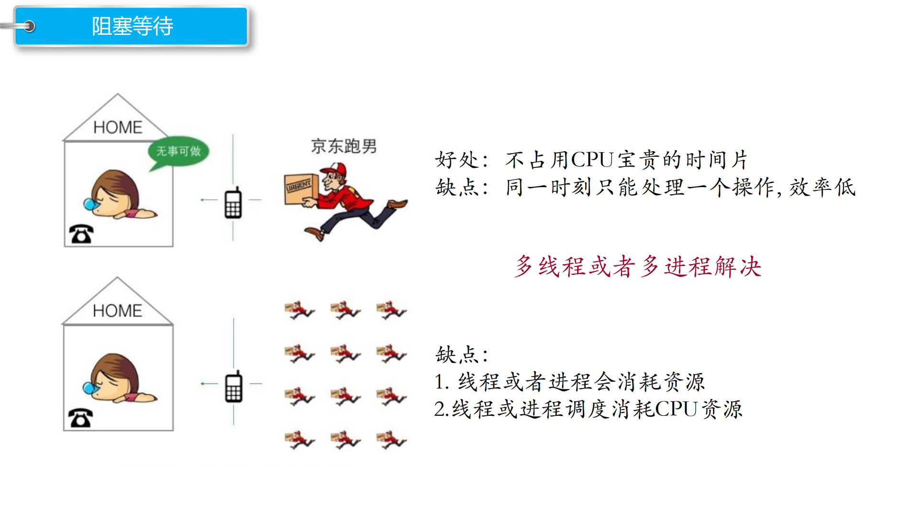
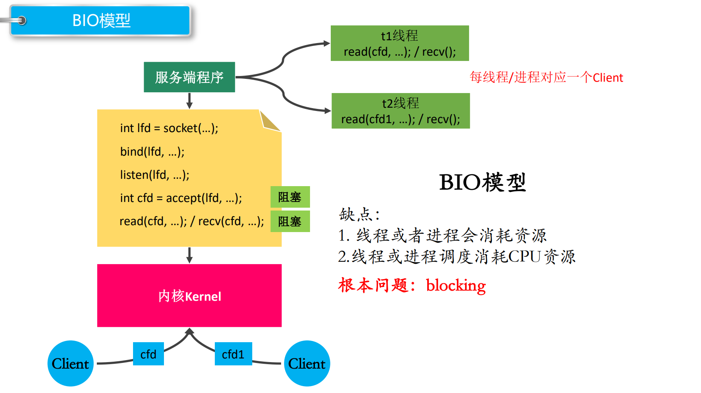
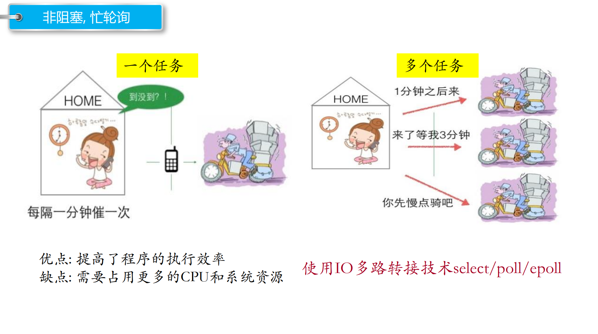
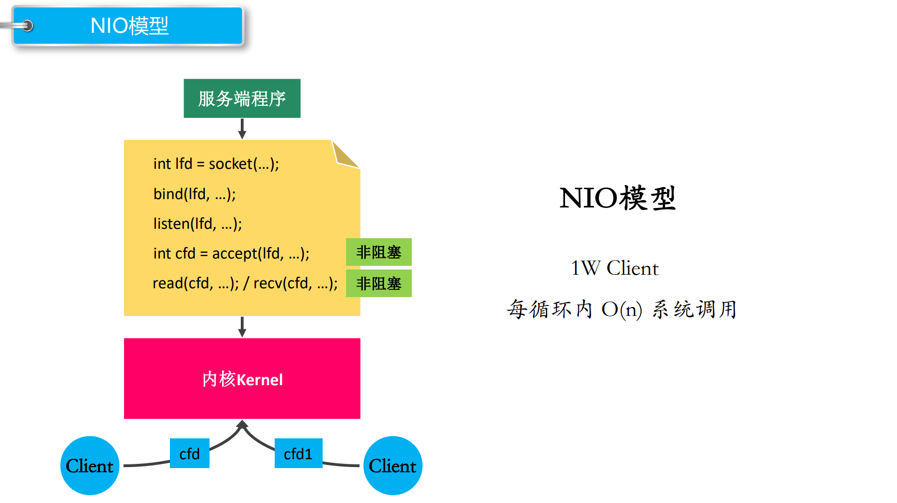
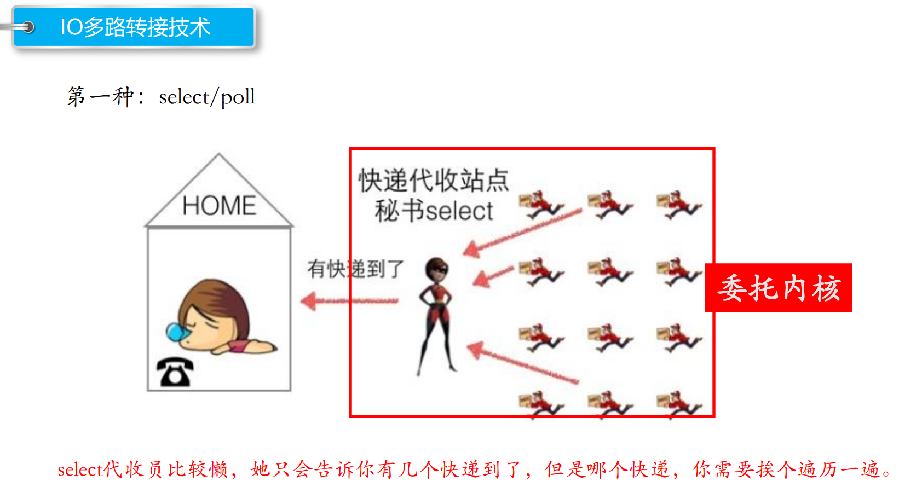
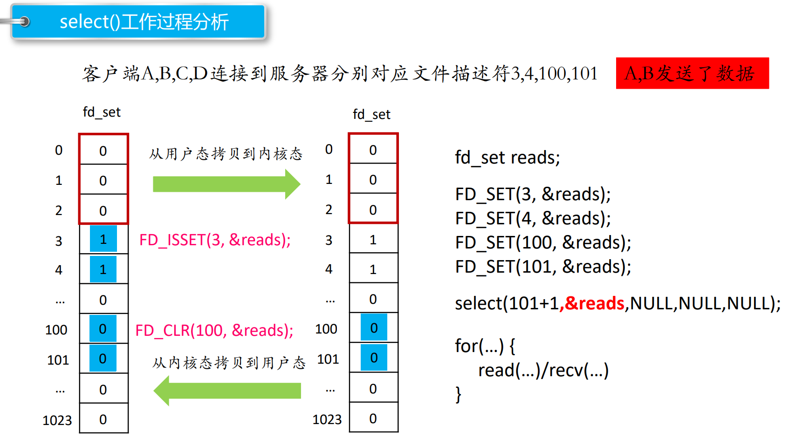
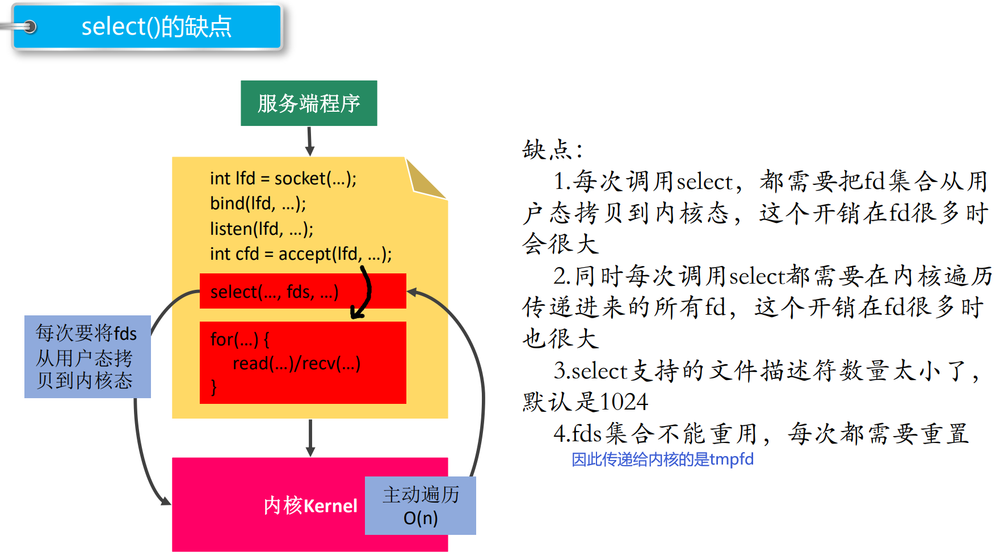
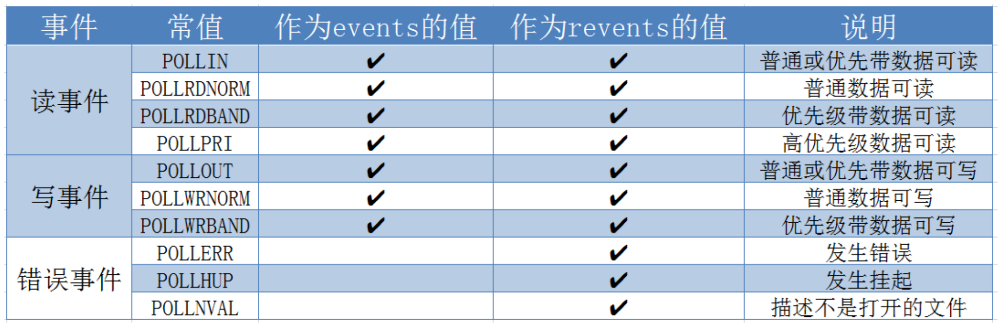
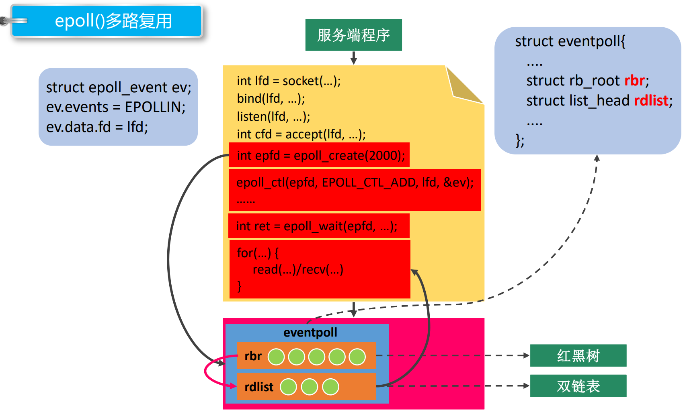

# 1. I/O多路复用（I/O多路转接）

**I/O 多路复用使得程序能同时监听多个文件描述符（缓冲区），能够提高程序的性能**，Linux 下实现 I/O 多路复用的系统调用主要有 **select、poll 和 epoll**。

I/O：

​		I：从磁盘文件读数据到内存

​		O：将内存数据写入到磁盘文件中


**I/O多路复用技术可以做到不使用多线程就可以实现并发服务器**


## I/O模型

**BIO模型**





accept与read都是阻塞的

以阻塞的方式运行程序，如`accept` ，主线程阻塞地从ACCEPT队列取出已连接的客户端，如果没有就会被阻塞，如果有就取出客户端地址信息并返回cfd，然后创建一个子线程（cfd给子线程），让其负责与客户端进行通话。主线程只负责while `accept` 取。


**NIO模型**





只有**一个主线程负责`accept` 以及与客户端的通信**，accept与read都是非阻塞的，主线程while循环遍历cfd列表，如果有客户端到达（cfd列表中fd就绪），就接收，并为其创建一个cfd（维持了一个cfd数组列表），如果没有就跳过accept，执行下面的与客户端通信的语句；如果有cfd列表中的客户端发送消息，就和它进行通信。

给每个客户端以不同的cfd，维持了一个cfd列表，若想知道客户端有没有发送消息，需要遍历cfd列表（只有一个主线程负责通信）。

如果有很多客户端，则cfd列表很长，效率低下。


I/O多路转接：




​		原先有多路，需要挨个检测，即需要多次`read` ，read所有文件描述符，看有没有信息到达，如果有就通信，没有就read下一个文件描述符，直到将文件描述符表读完（非阻塞）。  缓冲区有数据，说明有客户端连接请求。

​		调用`select` / `poll` **让内核负责检测每一路**（将客户端所对应的文件描述符列表告诉内核，让内核负责检测，检测完了发送给程序），主线程只进行一次检测，就可以知道有哪些数据到达了。

​		`select` `poll` 都会维持一个cfd列表（通过构建fd_set数组/pollfd数组），并委托内核检测。内核检测到变化会通知主线程，主线程扫描fd列表处理。相较于主线程自己检测，委托给内核的方式更快。这样可以以单线程的方式实现并发处理多客户端。

​		`epoll` 也会维持一个cfd列表（通过专门的操作函数，epoll_creat/epoll_ctl等），不过处在内核态（避免了拷贝），有更好的数据结构，效率更高。内核检测到了变化会通知主线程并告诉其具体哪些fd缓冲区发生了变化（更有针对性，效率更高），主线程逐个分别处理。`epoll` 存储被委托cfd的数据结构是红黑树，查询效率高，有变化的cfd存储到双链表中，并输出给主线程，拷贝的数据更少。


# 2. select

主旨思想：

1. 首先要**构造一个关于文件描述符的列表**，**将要监听的文件描述符添加到该列表中**。

2. **调用一个系统函数，监听该列表中的文件描述符**，直到这些描述符中的一个或者多个进行I/O操作时（有I/O操作说明有了客户端连接），该函数才返回。

​		a.这个函数是**阻塞**

​		b.函数对文件描述符的检测的操作是由**内核完成**的

3. 在返回时，它会告诉进程有多少（哪些）描述符要进行I/O操作（有客户端写入服务器的读缓冲区）。


每个客户端都有一个fd，多个客户端的fd构成了一个fd列表，委托内核检测该fd列表（中的几个）

将fd列表中的某几个位置为1，表示要检测该位对应的fd的缓冲区，内核才去检测，如果有客户端写入数据到该缓冲区，就保持为1，如果没有就返回0.

```
// sizeof(fd_set) = 128 1024	， 一共1024位，每个位可对应一个fd，可以检测1024个fd，其中0、1、2被标准输入、标准输出、标准错误占用
#include <sys/time.h>
#include <sys/types.h>
#include <unistd.h>
#include <sys/select.h>
int select(int nfds, fd_set *readfds, fd_set *writefds, fd_set *exceptfds, struct timeval *timeout);
    - 参数：
        - nfds : 委托内核检测的最大文件描述符的值 + 1	（底层是for循环，中间的判断条件是<，从0开始遍历到最大文件描述符）
        - readfds : 要检测的文件描述符的读的集合，委托内核检测哪些文件描述符fd的读的属性（即fd内存检测读缓冲区）
            - 一般检测读操作
            - 对应的是对方发送过来的数据，因为读是被动地接收数据，检测的就是读缓冲区
            - 是一个传入传出参数
            - 调用时将要检测的fd对应的位 置为1，内核检测这些位置（fd），如果该fd有被写入数据，继续保持为1，如果没有，置为0
        - writefds : 要检测的文件描述符的写的集合，委托内核检测哪些文件描述符的写的属性
            - 委托内核检测写缓冲区是不是还可以写数据（不满的话就可以写）
            - 调用时将要检测的fd对应的位置为1，如果该fd写缓冲区没满，继续保持为1，如果满了，置为0）
        - exceptfds : 检测发生异常的文件描述符的集合
        - timeout : 设置的超时时间
              struct timeval {
              long tv_sec; /* seconds */
              long tv_usec;  /* microseconds */
              };
            - NULL : 永久阻塞，直到检测到了文件描述符有变化
            - tv_sec = 0 && tv_usec = 0 ， 不阻塞
            - tv_sec > 0 || tv_usec > 0 ， 阻塞对应的时间
    - 返回值 :
        - - 1 : 失败
        - > 0 (n) : 检测的集合中有n个文件描述符发生了变化----有n个fd对应的读缓冲区被客户端写入数据
        
        
// 将参数文件描述符fd对应的标志位设置为 0，将set中fd位置置为0
void FD_CLR(int fd, fd_set *set);
// 判断fd对应的标志位是 0 还是 1 ， 返回值 ： fd对应的标志位的值， 0 ，返回 0 ， 1 ，返回 1
int FD_ISSET(int fd, fd_set *set);
// 将参数文件描述符fd 对应的标志位，设置为 1
void FD_SET(int fd, fd_set *set);
// fd_set一共有1024 bit, 全部初始化为 0
void FD_ZERO(fd_set *set);
```



1. 在用户态创建一个fd列表（类型位fd_set）
2. 利用`FD_SET` 函数将3、4、100、101位置置为1
3. 调用`select` 函数，fd列表被拷贝到了内核态，有内核监听
4. 内核从0开始扫描fd列表，扫描到101，只对3、4、100、101位对应的fd的读缓冲区检测判断，如果该读fd对应读缓冲区有被写入，就保持为1，如果没有就置为0，其中3、4保持为1，100、101被置为0
5. 内核扫描检查完成将fd列表拷贝返回到用户区，并告诉用户区现在有几个fd为1（有几个客户端发送数据）
6. 用户区程序扫描检查fd列表（从0到maxfd，每个都扫描），通过`FD_ISSET` 判断标志位是否为1，如果某个位置为1，则表示读缓冲区有数据，进行读，如果为0，则跳过。（从0扫描到101，每个都扫描，3、4对应的放到为1，代表缓冲区有客户端的输入，进行读）
7. 如果某个客户端断开连接了，则调用`FD_CLR` 将fd列表中的该位置置为0，再调用`select` 进行监听

内核态的检查函数比用户态的快


**使用`select` 就不需要使用多进程/多线程，便可以实现并发服务器**

只有一个进程/线程，便可以并发处理客户端的连接


**服务器：**

```c++
#include <stdio.h>
#include <arpa/inet.h>
#include <unistd.h>
#include <stdlib.h>
#include <string.h>
#include <sys/select.h>

int main() {

    // 创建socket
    int lfd = socket(PF_INET, SOCK_STREAM, 0);  // 返回一个用于监听的文件描述符fd
    struct sockaddr_in saddr;
    saddr.sin_port = htons(9999);
    saddr.sin_family = AF_INET;
    saddr.sin_addr.s_addr = INADDR_ANY;     // 绑定所有网卡的IP

    // 绑定
    bind(lfd, (struct sockaddr *)&saddr, sizeof(saddr));

    // 监听
    listen(lfd, 8);

    // 创建一个fd_set的集合，存放的是需要检测的文件描述符
    fd_set rdset, tmp;      // 每个fd_set变量可以表示1024个fd，
    // tmp是传递给内核的（内核会对其进行修改，没消息的fd被置为0）
    // rdset是需要被内核检测的fd（防止某些位被内核修改为0，因为有些fd在下一次调用select时仍然需要被内核检测）
    // rdset只允许FD_ZERO/FD_SET/FD_CLR操作，不交给内核操作
    FD_ZERO(&rdset);
    FD_SET(lfd, &rdset);    // 将要委托内核监听的fd置为1，lfd置为1
    int maxfd = lfd;

    while(1) {		// 循环调用select，让内核帮忙检测有哪些fd发生了变化，然后主线程取处理

        tmp = rdset;

        // 调用select系统函数，让内核帮检测哪些文件描述符有数据
        int ret = select(maxfd + 1, &tmp, NULL, NULL, NULL);   // 永久阻塞，已有缓冲区变化就去进行下面的代码
        if(ret == -1) {
            perror("select");
            exit(-1);
        } else if(ret == 0) {   // 设置为永久阻塞的话ret不会为0
            continue;
        } else if(ret > 0) {	// 委托给内核监听的fd缓冲区有发生变化的
            // 说明检测到了有文件描述符的对应的缓冲区的数据发生了改变
            if(FD_ISSET(lfd, &tmp)) {   // 内核对tmp修改了
                // 表示有新的客户端连接进来了（因为是监听描述符），需要调用accept从lfd的ACCEPT队列取出客户端
                struct sockaddr_in cliaddr;
                int len = sizeof(cliaddr);
                int cfd = accept(lfd, (struct sockaddr *)&cliaddr, &len);   // 取客户端信息，返回一个用于通信的描述符

                // 将新的文件描述符加入到集合中，因为下一次调用select时需要检查该fd，检查客户端有没有发送消息
                FD_SET(cfd, &rdset);    // 下次要检测

                // 更新最大的文件描述符
                maxfd = maxfd > cfd ? maxfd : cfd;
            }

            for(int i = lfd + 1; i <= maxfd; i++) {    // 遍历其他的客户端通信fd（lfd肯定在最前面，服务器启动后就已经创建了）
                if(FD_ISSET(i, &tmp)) {     // 内核对tmp修改了，某个通信fd发生了变化，主线程需要处理通信，没变化就跳过
                    // 说明这个文件描述符对应的客户端发来了数据，则进行通信
                    char buf[1024] = {0};
                    int len = read(i, buf, sizeof(buf));    // i 就是一个与客户端进行通信的fd
                    if(len == -1) {
                        perror("read");
                        exit(-1);
                    } else if(len == 0) {       // 说明对方（client）断开了连接
                        printf("client closed...\n");
                        close(i);
                        FD_CLR(i, &rdset);      // 下次select不用让内核再检测该fd缓冲区
                    } else if(len > 0) {
                        printf("read buf = %s\n", buf);
                        write(i, buf, strlen(buf) + 1);     // 反射服务器，再向客户端发送数据
                    }
                }
            }
            // 执行完之后又去调用select，阻塞在select，有变化就去处理
        }

    }
    close(lfd);
    return 0;
}
```

调用`select` 让内核帮忙检测fd有没有更新，比主线程自己检测更快


```
#include <stdio.h>
#include <arpa/inet.h>
#include <stdlib.h>
#include <unistd.h>
#include <string.h>

int main() {

    // 创建socket
    int fd = socket(PF_INET, SOCK_STREAM, 0);
    if(fd == -1) {
        perror("socket");
        return -1;
    }

    struct sockaddr_in seraddr;
    inet_pton(AF_INET, "127.0.0.1", &seraddr.sin_addr.s_addr);
    seraddr.sin_family = AF_INET;
    seraddr.sin_port = htons(9999);

    // 连接服务器
    int ret = connect(fd, (struct sockaddr *)&seraddr, sizeof(seraddr));

    if(ret == -1){
        perror("connect");
        return -1;
    }

    int num = 0;
    while(1) {
        char sendBuf[1024] = {0};
        sprintf(sendBuf, "send data %d", num++);
        write(fd, sendBuf, strlen(sendBuf) + 1);

        // 接收
        int len = read(fd, sendBuf, sizeof(sendBuf));
        if(len == -1) {
            perror("read");
            return -1;
        }else if(len > 0) {
            printf("read buf = %s\n", sendBuf);
        } else {
            printf("服务器已经断开连接...\n");
            break;
        }
        // sleep(1);
        usleep(1000);
    }

    close(fd);

    return 0;
}

```





# 3. poll

`fd_set` 只能记录标志位，每个标志位对应一个fd

`pollfd` 结构体包含的信息更多


```c
#include <poll.h>
    struct pollfd {
    int fd; 			/* 委托内核检测的文件描述符 */
    short events; 		/* 委托内核检测文件描述符的什么事件 */
    short revents;  	/* 文件描述符实际发生的事件 */			// 内核只会修改这个成员变量，不会修改别的，因此可以重用
};

struct pollfd myfd;
myfd.fd = 5 ;
myfd.events = POLLIN | POLLOUT;		// 检测两个事件

int poll(struct pollfd *fds, nfds_t nfds, int timeout);
    - 参数：
        - fds : 是一个struct pollfd 结构体数组，这是一个需要检测的文件描述符的集合，结构体数组，没有1024的限制
        - nfds : 这个是第一个参数数组中最后一个有效元素的下标 + 1
        - timeout : 阻塞时长
              0 : 不阻塞
              -1 : 阻塞，当检测到需要检测的文件描述符有变化，解除阻塞
              >0 : 阻塞的时长
    - 返回值：
        -1 : 失败
        >0 （n） : 成功,n表示检测到集合中有n个文件描述符发生变化
```

`pollfd` 结构体中，`events` 成员的宏值：



一般检测读事件（读缓冲区）


**服务器：**

```c++
#include <stdio.h>
#include <arpa/inet.h>
#include <unistd.h>
#include <stdlib.h>
#include <string.h>
#include <poll.h>


int main() {

    // 创建socket
    int lfd = socket(PF_INET, SOCK_STREAM, 0);
    struct sockaddr_in saddr;
    saddr.sin_port = htons(9999);
    saddr.sin_family = AF_INET;
    saddr.sin_addr.s_addr = INADDR_ANY;

    // 绑定
    bind(lfd, (struct sockaddr *)&saddr, sizeof(saddr));

    // 监听
    listen(lfd, 8);

    // 初始化检测的文件描述符数组
    struct pollfd fds[1024];            // 数组大小可以任意大
    for(int i = 0; i < 1024; i++) {     // 结构体被随机初始化了，需要清空
        fds[i].fd = -1;                 // -1表示不用检测该fd缓冲区
        fds[i].events = POLLIN;         // 统一检测读事件（读缓冲区)
    }
    fds[0].fd = lfd;        // 委托内核检测监听缓冲区lfd，为第一个
    int nfds = 0;           // 初始化为0，每加入一个新的cfd要更新

    while(1) {

        // 调用poll系统函数，让内核帮检测哪些文件描述符有数据
        int ret = poll(fds, nfds + 1, -1);   // fds是传入的委托内核检测的fd缓冲区    -1：设为阻塞
        if(ret == -1) {
            perror("poll");
            exit(-1);
        } else if(ret == 0) {
            continue;
        } else if(ret > 0) {
            // 说明检测到了有文件描述符的对应的缓冲区的数据发生了改变
            // 要利用 & 操作，防止revents不止包含了POLLIN（此时没办法用==判断）
            if(fds[0].revents & POLLIN) {       // fd[0]对应监听文件描述符，说明lfd缓冲区发生了变化
                // 表示有新的客户端连接进来了
                struct sockaddr_in cliaddr;     // accept前的准备
                int len = sizeof(cliaddr);
                int cfd = accept(lfd, (struct sockaddr *)&cliaddr, &len);   // 监听lfd的缓冲区

                // 将新的客户端的文件描述符加入到集合中
                int tempIndex = 0;
                for(int i = 1; i < 1024; i++) {
                    if(fds[i].fd == -1) {       // fds[i] 可用的话，找到第一个可用的fds
                        fds[i].fd = cfd;        // 将新客户端的cfd 加入要委托内核poll的fds中
                        fds[i].events = POLLIN;
                        tempIndex = i;
                        break;                  // 找到一个可用的fds 成员就可以了
                    }
                }

                // 更新最大的文件描述符的索引，加入一个新的cfd后就更新一次
                nfds = nfds > tempIndex ? nfds : tempIndex;     // 替换为让nfds存储索引
            }

            // i是数组的索引
            for(int i = 1; i <= nfds; i++) {       // 查看负责与客户端通信的fd缓冲区有没有变化的
                if(fds[i].revents & POLLIN) {
                    // 说明这个文件描述符对应的客户端发来了数据
                    char buf[1024] = {0};
                    int len = read(fds[i].fd, buf, sizeof(buf));
                    if(len == -1) {
                        perror("read");
                        exit(-1);
                    } else if(len == 0) {       // 客户端断开连接，就将该fds中的成员的fd置为-1
                        printf("client closed...\n");
                        close(fds[i].fd);
                        fds[i].fd = -1;
                    } else if(len > 0) {
                        printf("read buf = %s\n", buf);
                        write(fds[i].fd, buf, strlen(buf) + 1);
                    }
                }
            }

        }

    }
    // 执行完之后，再次while，调用epoll，委托内核检测缓冲区是否有变化

    close(lfd);
    return 0;
}
```


**客户端：**

```
#include <stdio.h>
#include <arpa/inet.h>
#include <stdlib.h>
#include <unistd.h>
#include <string.h>

int main() {

    // 创建socket
    int fd = socket(PF_INET, SOCK_STREAM, 0);
    if(fd == -1) {
        perror("socket");
        return -1;
    }

    struct sockaddr_in seraddr;
    inet_pton(AF_INET, "127.0.0.1", &seraddr.sin_addr.s_addr);
    seraddr.sin_family = AF_INET;
    seraddr.sin_port = htons(9999);

    // 连接服务器
    int ret = connect(fd, (struct sockaddr *)&seraddr, sizeof(seraddr));

    if(ret == -1){
        perror("connect");
        return -1;
    }

    int num = 0;
    while(1) {
        char sendBuf[1024] = {0};
        sprintf(sendBuf, "send data %d", num++);
        write(fd, sendBuf, strlen(sendBuf) + 1);

        // 接收
        int len = read(fd, sendBuf, sizeof(sendBuf));
        if(len == -1) {
            perror("read");
            return -1;
        }else if(len > 0) {
            printf("read buf = %s\n", sendBuf);
        } else {
            printf("服务器已经断开连接...\n");
            break;
        }
        sleep(1);
        usleep(1000);
    }

    close(fd);

    return 0;
}
```


# 4. epoll

**`select` 与 `poll` 都委托内核帮忙检测fd缓冲区是否有变化**，当其中任何一个有变化了，停止阻塞，返回到用户态的线程进行判断，相比于让线程自己判断，速度更快，可以实现I/O多路复用

**`select`  与  `poll`  都需要将fd列表**

- 从用户态拷贝到内核态
- 内核态遍历检测fd列表
- 再将fd列表从内核态拷贝到用户态
- 用户态检测fd列表查看是否被标记为缓冲区有变化

**`poll` 相比于`select` 的改进：**

- fd列表没有限制，是一个存储fd信息的数组，可以设为任意值
- fd列表可以重用

**`epoll` 是对前两者的改进**




- `epoll` 创建在内核态，避免了从用户态向内核态的拷贝（但存在从用户态到内核态的切换）

- `rbr` 记录需要被检测的fd缓冲区（红黑树结构，遍历、添加速度很快）（之前的fd列表是线性的数组结构）

- `rdlist` 记录rbr中发生改变的fd缓冲区的列表

- **存在从内核态向用户态拷贝fd，但都是就绪的fd，而不是整个fd列表；只向用户态返回就绪的fd（发生改变的），不需要用户态线程去遍历**

  


```C
#include <sys/epoll.h>

// 创建一个新的epoll实例。在内核中创建了一个数据，这个数据中有两个比较重要的数据，一个是需要检测的文件描述符的信息（红黑树），还有一个是就绪列表，存放检测到数据发送改变的文件描述符信息（双向链表）。
int epoll_create(int size);
    - 参数：
      	size : 目前没有意义了。随便写一个数，必须大于 0
    - 返回值：
        -1 : 失败
        >0 : 文件描述符，操作epoll实例的，通过该fd操作实例化出来的epoll
        
        
typedef union epoll_data {	// union结合体
    void *ptr;
    int fd;					// 一般只用这个，用户态的一些信息
    uint32_t u32;
    uint64_t u64;
} epoll_data_t;

struct epoll_event {
    uint32_t events;  /* Epoll events */			// 代表要检测的事件(eg：EPOLLIN)
    epoll_data_t data;  /* User data variable */
};

常见的Epoll检测事件(宏)：
    - EPOLLIN
    - EPOLLOUT
    - EPOLLERR
    
// 对epoll实例进行管理：添加文件描述符信息，删除信息，修改信息
int epoll_ctl(int epfd, int op, int fd, struct epoll_event *event);
    - 参数：
        - epfd : epoll实例对应的文件描述符（通过epfd对内核区的epoll进行操作）
        - op : 要进行什么操作
              EPOLL_CTL_ADD: 添加	（到红黑树）
              EPOLL_CTL_MOD: 修改
              EPOLL_CTL_DEL: 删除
        - fd : 要检测的文件描述符
        - event : 检测文件描述符什么事情	（op为删除操作时不用写）
        
// 检测函数
int epoll_wait(int epfd, struct epoll_event *events, int maxevents, int timeout);
- 参数：
    - epfd : epoll实例对应的文件描述符
    - events : 传出参数，保存了发送了变化的文件描述符的信息，该数组中存储了所有发生变化的fd
    - maxevents : 第二个参数结构体数组的大小
    - timeout : 阻塞时间
        - 0 : 不阻塞
        - -1 : 阻塞，直到检测到fd数据发生变化，解除阻塞
        - >0 : 阻塞的时长（毫秒）
- 返回值：
    - 成功，返回发送变化的文件描述符的个数 >0
    - 失败 -1
```


**服务器：**

```c++
#include <stdio.h>
#include <arpa/inet.h>
#include <unistd.h>
#include <stdlib.h>
#include <string.h>
#include <sys/epoll.h>

int main() {

    // 创建socket
    int lfd = socket(PF_INET, SOCK_STREAM, 0);
    struct sockaddr_in saddr;
    saddr.sin_port = htons(9999);
    saddr.sin_family = AF_INET;
    saddr.sin_addr.s_addr = INADDR_ANY;

    // 绑定
    bind(lfd, (struct sockaddr *)&saddr, sizeof(saddr));

    // 监听
    listen(lfd, 8);

    // 调用epoll_create()创建一个epoll实例
    int epfd = epoll_create(100);       // 通过epfd操作内核中的创建出的epoll实例

    // 将监听的文件描述符相关的检测信息添加到epoll实例中
    struct epoll_event epev;
    epev.events = EPOLLIN;
    epev.data.fd = lfd;
    epoll_ctl(epfd, EPOLL_CTL_ADD, lfd, &epev);
	
	// 用于接收epoll_wait内核态返回的发生变化的fd，数组的每个元素可以接收一个
    struct epoll_event epevs[1024];

    while(1) {

        int ret = epoll_wait(epfd, epevs, 1024, -1);    // epevs是传出参数数组，1024是其大小  -1:阻塞的
        // epevs是一个数组，数组中每个元素都是epoll_event遍历，存放的都是发生改变的fd
        // ret是数组的长度
        if(ret == -1) {
            perror("epoll_wait");
            exit(-1);
        }

        printf("ret = %d\n", ret);      // 输出有几个fd发生了改变

        for(int i = 0; i < ret; i++) {      // 遍历epevs数组，该数组存储了所有发生改变的fd，长度为ret

            int curfd = epevs[i].data.fd;   // 读取发生改变的fd，用curfd存储<-------------------需要用户态线程自己拷贝，同步IO

            if(curfd == lfd) {
                // 监听的文件描述符有数据达到，有客户端连接
                struct sockaddr_in cliaddr;
                int len = sizeof(cliaddr);
                int cfd = accept(lfd, (struct sockaddr *)&cliaddr, &len);

                // 将新来的客户端添加到内核区的epoll中
                epev.events = EPOLLIN;      // 重用之前的epev
                epev.data.fd = cfd;
                epoll_ctl(epfd, EPOLL_CTL_ADD, cfd, &epev);
            } else {	// 客户端信息到达，处理通信
                if(epevs[i].events & EPOLLOUT) {    // 只检测读缓冲区有变化的情况（当监听了EPOLLOUT事件时）
                    continue;                       // 当监听了很多缓冲区事件时，要分别处理
                }   
                // 有数据到达，需要通信
                char buf[1024] = {0};
                int len = read(curfd, buf, sizeof(buf));
                if(len == -1) {
                    perror("read");
                    exit(-1);
                } else if(len == 0) {
                    printf("client closed... \n");
                    epoll_ctl(epfd, EPOLL_CTL_DEL, curfd, NULL);
                    close(curfd);
                } else if(len > 0) {
                    printf("read buf = %s\n", buf);
                    write(curfd, buf, strlen(buf) + 1);
                }

            }

        }
    }

    close(lfd);
    close(epfd);    // 关闭文件描述符，防止浪费资源
    return 0;
}
```


**客户端：**

```
#include <stdio.h>
#include <arpa/inet.h>
#include <stdlib.h>
#include <unistd.h>
#include <string.h>

int main() {

    // 创建socket
    int fd = socket(PF_INET, SOCK_STREAM, 0·);
    if(fd == -1) {
        perror("socket");
        return -1;
    }

    struct sockaddr_in seraddr;
    inet_pton(AF_INET, "127.0.0.1", &seraddr.sin_addr.s_addr);
    seraddr.sin_family = AF_INET;
    seraddr.sin_port = htons(9999);

    // 连接服务器
    int ret = connect(fd, (struct sockaddr *)&seraddr, sizeof(seraddr));

    if(ret == -1){
        perror("connect");
        return -1;
    }

    int num = 0;
    while(1) {
        char sendBuf[1024] = {0};
        sprintf(sendBuf, "send data %d", num++);
        write(fd, sendBuf, strlen(sendBuf) + 1);

        // 接收
        int len = read(fd, sendBuf, sizeof(sendBuf));
        if(len == -1) {
            perror("read");
            return -1;
        }else if(len > 0) {
            printf("read buf = %s\n", sendBuf);
        } else {
            printf("服务器已经断开连接...\n");
            break;
        }
        sleep(1);
        usleep(1000);
    }

    close(fd);

    return 0;
}
```


## Epoll 的工作模式

当用于通信的缓冲区很小，一次读取可能读取不完，**`epoll` 若采用水平工作模式，则第二次`epoll_wait` 时内核还会通知主线程，直到其将fd缓冲区读完**

**若`epoll` 采用边沿触发模式，第一次主线程没有将数据读取完，第二次`epoll_wait` 时内核不会再通知主线程**，因此第二次就无法读取fd缓冲区数据了，因此**主线程应该保证在第一次被内核通知时将fd缓冲区中的数据读取完毕，**使用一个read的while循环，同时将read设为非阻塞（不然fd缓冲区当被读取完毕后就阻塞在那里了）

**这样水平触发、边沿触发达到了同样的效果，但是边沿触发模式中内核通知主线程的次数较少，成本更低**


`epoll_wait` 委托内核帮忙检测缓冲区是否变化，有了变化，就去分别处理相应的变化（如果是lfd，就`accept` 客户端，并将得到的cfd设置到epfd中的rbr；如果是cfd，就去通信，其中是LT模式的话，就read一次，是ET模式的话，就while循环一次性read完，read是非阻塞方式，这样read完了直接跳出），然后再次调用`epoll_wait` 阻塞等待。


### LT模式


- **LT 模式 （水平触发）** 默认的模式

​		假设委托内核检测读事件 --> 检测fd的读缓冲区

​		读缓冲区有数据 --> epoll检测到了会给用户通知

​			a. 用户不读数据，数据一直在缓冲区，epoll 会一直通知

​			b. 用户只读了一部分数据（可能由于缓冲区小），epoll会通知

​			c. 缓冲区的数据读完了（客户端也没有再写），不通知

​			d. 缓冲区的数据读完了（客户端有再写），通知

只要主线程没有将缓冲区数据读取完，就会通知

LT（level - triggered）是缺省的工作方式，并且同时支持 block 和 no-block socket。在这种做法中，内核告诉你一个文件描述符是否就绪了，然后你可以对这个就绪的 fd 进行 IO 操作。如果你不作任何操作，内核还是会继续通知你的。

**即：有缓冲区发生了变化，`epoll_wait` 内核会通知主线程，主线程若没有读取数据/只读取了一部分，下次调用`epoll_wait` 时，还是会通知主线程。（除非该fd中没有数据了，下次调用`epoll_wait` 时内核才不会通知主线程。）**


**服务器：**

```c
#include <stdio.h>
#include <arpa/inet.h>
#include <unistd.h>
#include <stdlib.h>
#include <string.h>
#include <sys/epoll.h>

int main() {

    // 创建socket
    int lfd = socket(PF_INET, SOCK_STREAM, 0);
    struct sockaddr_in saddr;
    saddr.sin_port = htons(9999);
    saddr.sin_family = AF_INET;
    saddr.sin_addr.s_addr = INADDR_ANY;

    // 绑定
    bind(lfd, (struct sockaddr *)&saddr, sizeof(saddr));

    // 监听
    listen(lfd, 8);

    // 调用epoll_create()创建一个epoll实例
    int epfd = epoll_create(100);           // 100没意义，随意设置（>0即可）

    // 将监听的文件描述符相关的检测信息添加到epoll实例中
    struct epoll_event epev;
    epev.events = EPOLLIN;
    epev.data.fd = lfd;
    epoll_ctl(epfd, EPOLL_CTL_ADD, lfd, &epev);     // 向epfd红黑树中添加数据

    struct epoll_event epevs[1024];  // 用于从epoll双向链表中读取数据，将fd缓冲区有变化的fd输出到该数组中

    while(1) {

        int ret = epoll_wait(epfd, epevs, 1024, -1);    // 委托内核监听该epfd中红黑树中的fd缓冲区
        if(ret == -1) {
            perror("epoll_wait");
            exit(-1);
        }

        printf("ret = %d\n", ret);

        // 执行到这里说明红黑树中的fd有变化的了，即双向链表有元素了，并被输出到了epevs数组中
        for(int i = 0; i < ret; i++) {      // 遍历epevs数组中的每个元素

            int curfd = epevs[i].data.fd;

            if(curfd == lfd) {      // 输出的epves数组中该元素是lfd的缓冲区
                // 监听的文件描述符有数据达到，有客户端连接
                struct sockaddr_in cliaddr;
                int len = sizeof(cliaddr);
                int cfd = accept(lfd, (struct sockaddr *)&cliaddr, &len);   // 从ACCEPT队列中取出客户端

                epev.events = EPOLLIN;			// 缺省情况下，水平触发<--------------------
                epev.data.fd = cfd;
                epoll_ctl(epfd, EPOLL_CTL_ADD, cfd, &epev); // 将与客户端通信的cfd委托给内核监听（插入到红黑树）
            } else {        // 说明epves数组中的该元素是用于与客户端通信的fd
                if(epevs[i].events & EPOLLOUT) {    // 实际开发中分别处理每种情况
                    continue;
                }   
                // 有数据到达，需要通信
                char buf[5] = {0};   // 每次只能读5个数据，一次读不完就需要读很多次，水平出发模式每次都会被epoll_wait通知
                int len = read(curfd, buf, sizeof(buf));    // 若本次没有从cfd中读取完，下次还会被epoll_wait通知（因此不用）<----------
                if(len == -1) {
                    perror("read");
                    exit(-1);
                } else if(len == 0) {
                    printf("client closed...\n");
                    epoll_ctl(epfd, EPOLL_CTL_DEL, curfd, NULL);
                    close(curfd);
                } else if(len > 0) {
                    printf("read buf = %s\n", buf);
                    write(curfd, buf, strlen(buf) + 1);
                }

            }

        }
    }

    close(lfd);
    close(epfd);
    return 0;
}
```


**客户端：**

```c
#include <stdio.h>
#include <arpa/inet.h>
#include <stdlib.h>
#include <unistd.h>
#include <string.h>

int main() {

    // 创建socket
    int fd = socket(PF_INET, SOCK_STREAM, 0);
    if(fd == -1) {
        perror("socket");
        return -1;
    }

    struct sockaddr_in seraddr;
    inet_pton(AF_INET, "127.0.0.1", &seraddr.sin_addr.s_addr);
    seraddr.sin_family = AF_INET;
    seraddr.sin_port = htons(9999);

    // 连接服务器
    int ret = connect(fd, (struct sockaddr *)&seraddr, sizeof(seraddr));

    if(ret == -1){
        perror("connect");
        return -1;
    }

    int num = 0;
    while(1) {
        char sendBuf[1024] = {0};
        // sprintf(sendBuf, "send data %d", num++);
        fgets(sendBuf, sizeof(sendBuf), stdin);       // 等待键盘录入数据

        write(fd, sendBuf, strlen(sendBuf) + 1);

        // 接收
        int len = read(fd, sendBuf, sizeof(sendBuf));
        if(len == -1) {
            perror("read");
            return -1;
        }else if(len > 0) {
            printf("read buf = %s\n", sendBuf);
        } else {
            printf("服务器已经断开连接...\n");
            break;
        }
    }

    close(fd);

    return 0;
}
```


### ET模式

客户端向fd中写入数据了：该fd就绪了


- **ET 模式（边沿触发）**

​	假设委托内核检测读事件 --> 检测fd的读缓冲区

​		读缓冲区有数据 --> epoll检测到了会给用户通知

​			a. 用户不读数据，数据一直在缓冲区中，epoll下次检测的时候就不通知了

​			b. 用户只读了一部分数据，epoll不通知

​			c. 缓冲区的数据读完了（客户端也没有再写），不通知

​			d. 缓冲区的数据读完了（客户端有再写），通知

ET（edge - triggered）是高速工作方式，只支持 no-block socket。在这种模式下，当描述符从未就绪变为就绪时，内核通过epoll告诉你。然后它会假设你知道文件描述符已经就绪，并且不会再为那个文件描述符发送更多的就绪通知，直到你做了某些操作导致那个文件描述符不再为就绪状态了。但是请注意，如果一直不对这个 fd 作 IO 操作（从而导致它再次变成未就绪），内核不会发送更多的通知（only once）。

**ET 模式在很大程度上减少了 epoll 事件被重复触发的次数，因此效率要比 LT 模式高**。epoll工作在 ET 模式的时候，**必须使用非阻塞套接字**，以避免由于一个文件描述符的阻塞读/阻塞写操作把处理多个文件描述符的任务饿死（因为ET模式要一次性将缓冲区数据读完）。

缓冲区有了变化，`epoll_wait` 内核会通知主线程，主线程若只读取了写缓冲区的一部分数据，则下一次内核不会再通知主线程。（这样**若第一次没有读取完，下次就读取不到了，因此应该用while一次性将读缓冲区中的数据读完，而read会导致阻塞（影响程序的性能，让其不能处理其他的），因此ET模式只能用于非阻塞，**避免read的阻塞，这样read读完没数据后，主线程就可以跳出循环，执行其他语句）

直到将fd缓冲区的数据读取完了，使得该缓冲区变为未就绪，等客户端再次向缓冲区写入数据时，`epoll_wait` 会通知主线程该缓冲区变为了就绪。


```c
struct epoll_event {
    uint32_t events;  		/* Epoll events */
    epoll_data_t data;  	/* User data variable */
};
常见的Epoll检测事件：
    - EPOLLIN
    - EPOLLOUT
    - EPOLLERR
    - EPOLLET	// 边沿触发
```


**服务器：**

```c
#include <stdio.h>
#include <arpa/inet.h>
#include <unistd.h>
#include <stdlib.h>
#include <string.h>
#include <sys/epoll.h>
#include <fcntl.h>
#include <errno.h>

int main() {

    // 创建socket
    int lfd = socket(PF_INET, SOCK_STREAM, 0);
    struct sockaddr_in saddr;
    saddr.sin_port = htons(9999);
    saddr.sin_family = AF_INET;
    saddr.sin_addr.s_addr = INADDR_ANY;

    // 绑定
    bind(lfd, (struct sockaddr *)&saddr, sizeof(saddr));

    // 监听
    listen(lfd, 8);

    // 调用epoll_create()创建一个epoll实例
    int epfd = epoll_create(100);

    // 将监听的文件描述符相关的检测信息添加到epoll实例中
    struct epoll_event epev;
    epev.events = EPOLLIN;      // lfd使用默认的（每次都会通知）
    epev.data.fd = lfd;
    epoll_ctl(epfd, EPOLL_CTL_ADD, lfd, &epev);     // 向epfd的红黑树中写入，委托内核检测lfd缓冲区变化

    struct epoll_event epevs[1024];     // 提前准备好用于接受epfd双向链表（有变化的缓冲区）的数组

    while(1) {

        int ret = epoll_wait(epfd, epevs, 1024, -1);    
        // 委托内核检测epfd中的缓冲区是否有变化，有变化的输出到epfd的双向链表中，并输出到epevs数组（阻塞的）
        if(ret == -1) {
            perror("epoll_wait");
            exit(-1);
        }

        printf("ret = %d\n", ret);

        // 执行到这里说明epfd的rbr中有发生变化的fd缓冲区，输出到了epfd双链表中，并被输出到了epevs数组中
        for(int i = 0; i < ret; i++) {      // 遍历epevs（epevs数组中存储的都是有变化的缓冲区fd）

            int curfd = epevs[i].data.fd;       // 取出epevs第i个元素（结构体）的fd

            if(curfd == lfd) {      // 如果发生变化的缓冲区是监听缓冲区
                // 监听的文件描述符有数据达到，有客户端连接
                struct sockaddr_in cliaddr;
                int len = sizeof(cliaddr);
                int cfd = accept(lfd, (struct sockaddr *)&cliaddr, &len);

                // 设置cfd属性非阻塞，即read该fd时read是非阻塞的（客户端的fd是非阻塞的，lfd是阻塞的）
                // read是非阻塞，这样在read完数据之后就可以跳出循环
                int flag = fcntl(cfd, F_GETFL);
                flag |= O_NONBLOCK;             // 将与客户端通信的cfd设为非阻塞<----------------
                fcntl(cfd, F_SETFL, flag);

                epev.events = EPOLLIN | EPOLLET;    // 设置边沿触发，只会被epoll_wait通知一次<----------------------
                epev.data.fd = cfd;
                epoll_ctl(epfd, EPOLL_CTL_ADD, cfd, &epev); // 将该客户端fd委托给内核，将cfd写入到epfd的rbr
            } else {        // 有客户端要进行通信
                if(epevs[i].events & EPOLLOUT) {        // 实际开发中用于分情况分别处理
                    continue;
                }

                // 循环读取出所有数据（只读一次有可能读不完，读不完也不会通知，这样就再也读不到了，因此要一次读完）
                char buf[5];
                int len = 0;
                while( (len = read(curfd, buf, sizeof(buf))) > 0) {     // 要用while循环读完<---------------------
                    // 将所有数据读取完（不读取完的话，第二次不通知了，就没办法再读取了）
                    // 非阻塞方式read，没有数据了就跳出while，再去执行epoll_wait
                    // 打印数据
                    // printf("recv data : %s\n", buf);
                    write(STDOUT_FILENO, buf, len);
                    write(curfd, buf, len);             // 反射服务器
                }
                if(len == 0) {
                    printf("client closed....");
                }else if(len == -1) {
                    if(errno == EAGAIN) {   // EAGAIN只会出现在非阻塞情况，发生在数据读完了又去读（要忽略此错误）
                        printf("data over.....");   // 只输出提示，而不exit，还要进行循环
                    }else {
                        perror("read");
                        exit(-1);
                    }
                    
                }

            }

        }
        // 处理完了所有缓冲区
    }   // 进入下一次while循环，epoll_wait

    close(lfd);
    close(epfd);
    return 0;
}
```


**客户端：**

```c
#include <stdio.h>
#include <arpa/inet.h>
#include <stdlib.h>
#include <unistd.h>
#include <string.h>

int main() {

    // 创建socket
    int fd = socket(PF_INET, SOCK_STREAM, 0);
    if(fd == -1) {
        perror("socket");
        return -1;
    }

    struct sockaddr_in seraddr;
    inet_pton(AF_INET, "127.0.0.1", &seraddr.sin_addr.s_addr);
    seraddr.sin_family = AF_INET;
    seraddr.sin_port = htons(9999);

    // 连接服务器
    int ret = connect(fd, (struct sockaddr *)&seraddr, sizeof(seraddr));

    if(ret == -1){
        perror("connect");
        return -1;
    }

    int num = 0;
    while(1) {
        char sendBuf[1024] = {0};
        // sprintf(sendBuf, "send data %d", num++);
        fgets(sendBuf, sizeof(sendBuf), stdin);       // 等待键盘录入数据

        write(fd, sendBuf, strlen(sendBuf) + 1);

        // 接收
        int len = read(fd, sendBuf, sizeof(sendBuf));
        if(len == -1) {
            perror("read");
            return -1;
        }else if(len > 0) {
            printf("read buf = %s\n", sendBuf);
        } else {
            printf("服务器已经断开连接...\n");
            break;
        }
    }

    close(fd);

    return 0;
}
```

