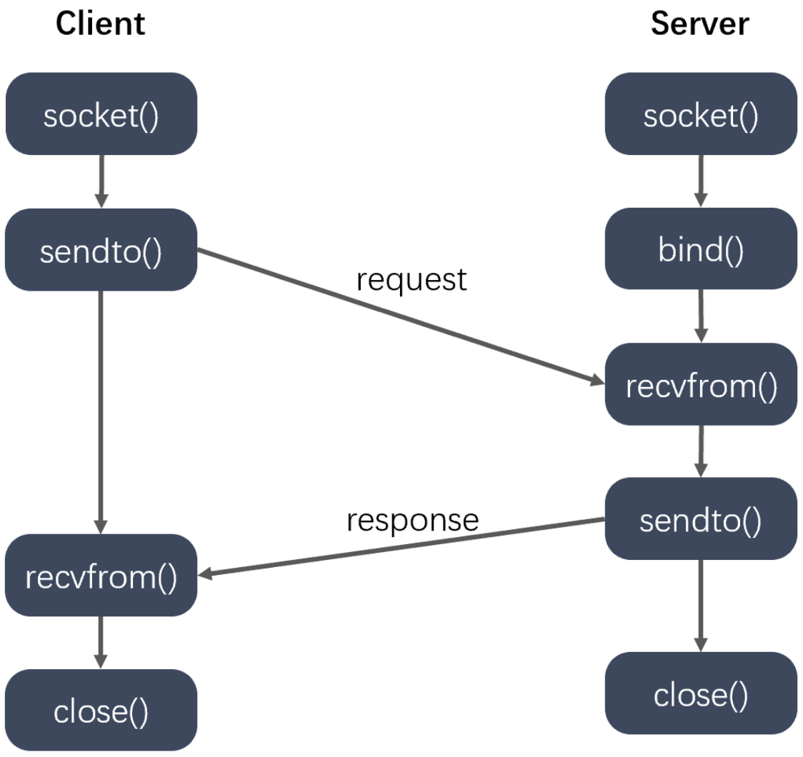
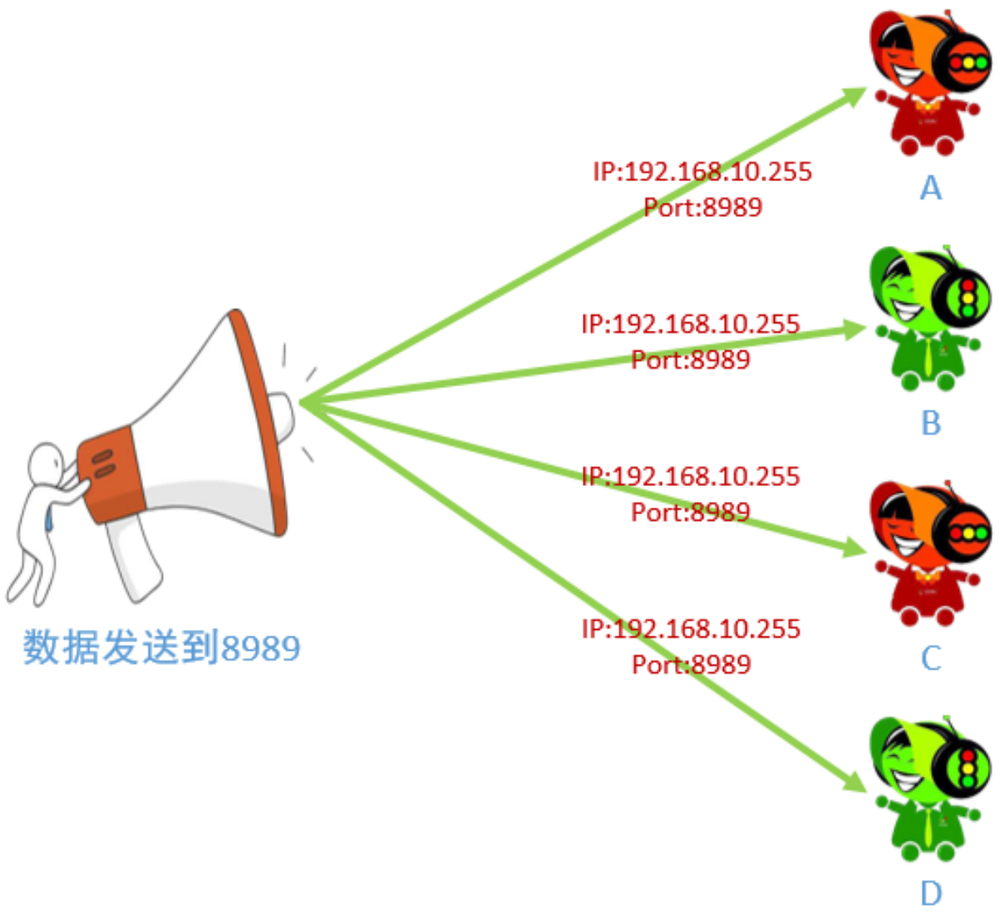
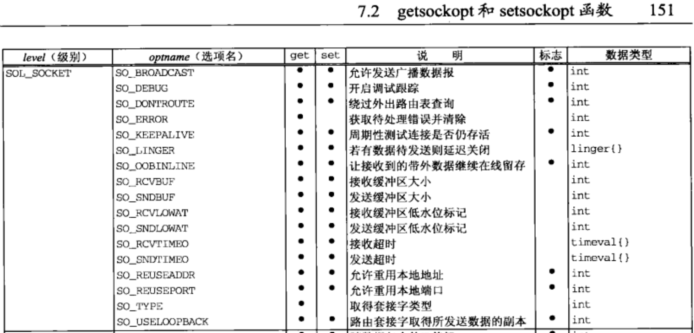
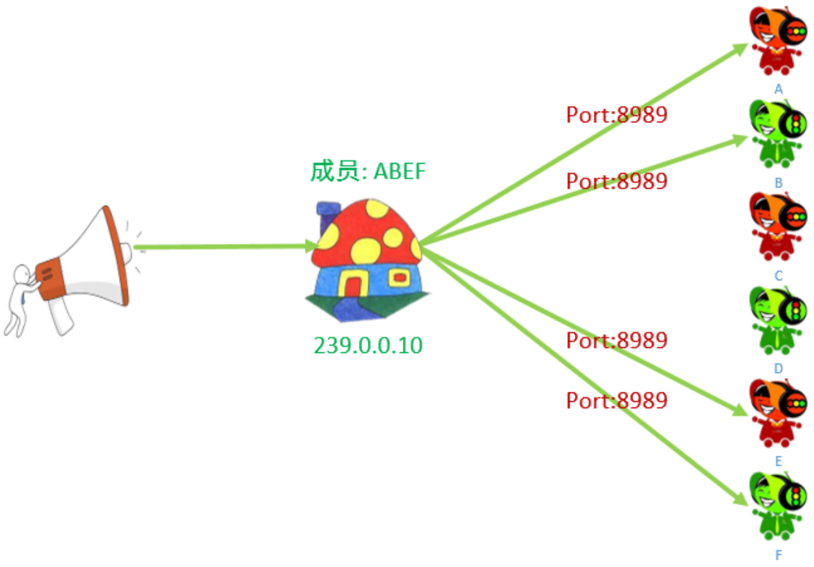
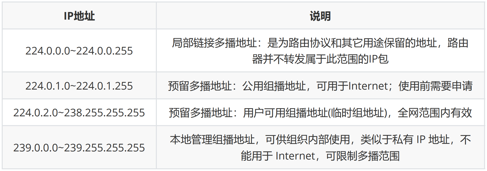
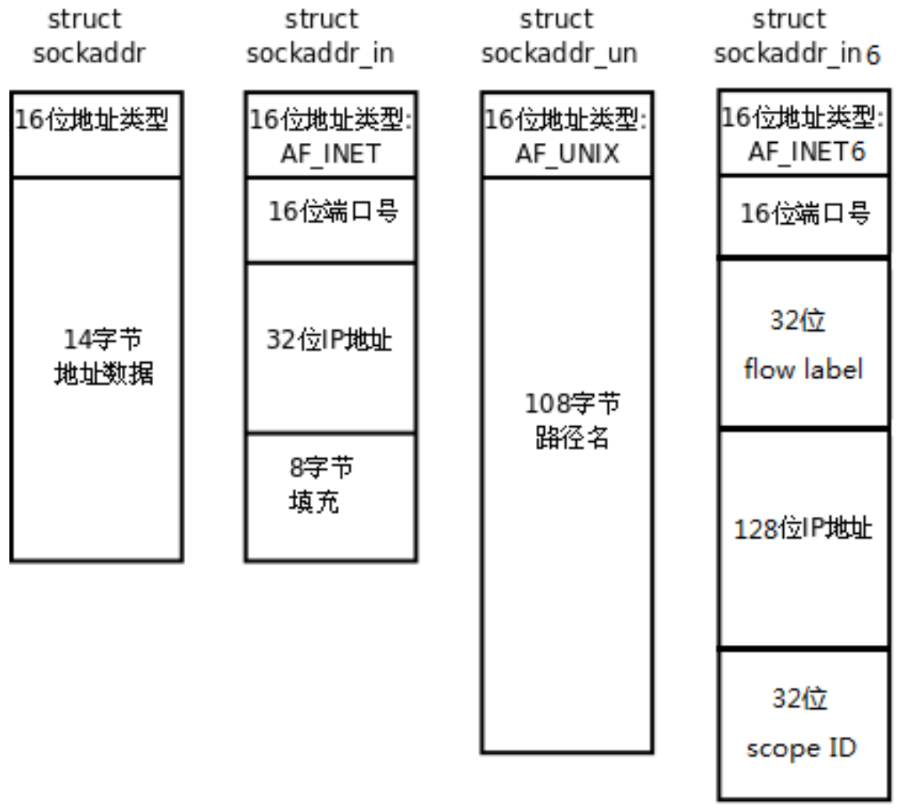
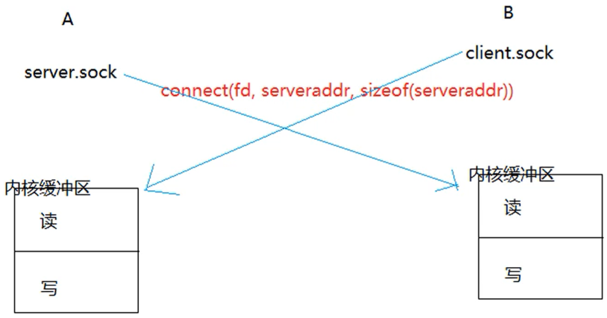

# 1. UDP

## 1.1 UDP 通信



Server端：

- socket() 创建的是用于通信的fd，而不是lfd
- bind() 绑定要监听的地址信息
- recvfrom() 从源地址接收数据
- sendto() 向目标地址发送数据

Client端：

- socket() 创建的是用于通信的fd
- sendto() 向目标地址发送数据（该信息以被server绑定，这样才能让server收到）
- recvfrom() 从源地址接收数据


```c
#include <sys/types.h>
#include <sys/socket.h>
ssize_t sendto(int sockfd, const void *buf, size_t len, int flags, const struct sockaddr *dest_addr, socklen_t addrlen);
    - 参数：
        - sockfd : 通信的fd
        - buf : 要发送的数据
        - len : 发送数据的长度
        - flags : 0
        - dest_addr : 通信的另外一端的地址信息
        - addrlen : 地址的内存大小
    - 返回值：
    	- 成功：实际发送的数据长度
    	- 失败：-1
    	

ssize_t recvfrom(int sockfd, void *buf, size_t len, int flags, struct sockaddr *src_addr, socklen_t *addrlen);
    - 参数：
        - sockfd : 通信的fd
        - buf : 接收数据的数组
        - len : 数组的大小
        - flags : 0
        - src_addr : 用来保存另外一端的地址信息，不需要可以指定为NULL
        - addrlen : 地址的内存大小
    - 返回值：
    	- 成功：实际接收的数据长度
    	- 失败：-1
```


**udp服务器：**

```c
#include <stdio.h>
#include <stdlib.h>
#include <unistd.h>
#include <string.h>
#include <arpa/inet.h>

int main() {

    // 1.创建一个通信的socket
    int fd = socket(PF_INET, SOCK_DGRAM, 0);    // SOCK_DGRAM数据报的格式，0表示udp
    // 返回的fd用于通信，不管多少客户端，始终使用这一个fd进行通信
    if(fd == -1) {
        perror("socket");
        exit(-1);
    }   

    struct sockaddr_in addr;        // 实际用的是sockaddr_in 结构体（IPv4）
    addr.sin_family = AF_INET;
    addr.sin_port = htons(9999);        // 进行与（所有与这个端口连接的客户端）的通信
    addr.sin_addr.s_addr = INADDR_ANY;

    // 2.绑定
    // 将该fd与addr地址绑定，该fd以后只接收与addr连接的客户端的信息并通信
    int ret = bind(fd, (struct sockaddr *)&addr, sizeof(addr)); // sockaddr结构体只起到了地址转换的作用
    // 将fd与相应端口绑定，服务器以后才能接收到客户端发送给相应端口的信息
    if(ret == -1) {
        perror("bind");
        exit(-1);
    }

    // 3.通信
    while(1) {
        char recvbuf[128];
        char ipbuf[16];         // 用于存放客户端IP信息（3*4+3+1=16）

        struct sockaddr_in cliaddr;     // 传出参数，保存与服务器连接通信的客户端地址信息
        int len = sizeof(cliaddr);

        // 接收数据，将通信fd的数据写到recvbuf，并将客户端地址信息写到cliaddr
        // 任何客户端都可以与服务器的该端口连接，recvfrom都会接收并保存相应的信息
        int num = recvfrom(fd, recvbuf, sizeof(recvbuf), 0, (struct sockaddr *)&cliaddr, &len);

        printf("client IP : %s, Port : %d\n",       // 打印客户端IP、端口的信息
            inet_ntop(AF_INET, &cliaddr.sin_addr.s_addr, ipbuf, sizeof(ipbuf)), // 返回值是ipbuf数组，正好用于打印
            ntohs(cliaddr.sin_port));       // 客户端的端口号信息（是随机分配的），返回的是转换好的端口号，直接打印

        printf("client say : %s\n", recvbuf);       // 与客户端通信的缓冲区（recvfrom从fd读数据到该缓冲区）

        // 反射服务器，将从fd读到的数据recvbuf写到fd缓冲区
        // 要写入客户端地址（一个服务器可能有很多客户端连接，只通过一个fd与这些客户端通信），通过cliaddr分别每个客户端
        sendto(fd, recvbuf, strlen(recvbuf) + 1, 0, (struct sockaddr *)&cliaddr, sizeof(cliaddr));

    }
    // 一次recvfrom结束，while循环进行下一次recvfrom
    // 每次recvfrom的客户端可能不同，recvfrom后就会对该客户的进行通信，通信结束后下一次可能与另一个客户端通信，都是用的一个fd
    // 不同客户端通过recvfrom获得的cliaddr不同
    // udp不需要多进程/多线程便可实现并发服务器（多客户端）
    // 不管多少客户端，服务器都是使用创建出来的一个fd进行通信，通过不断的while循环实现并发处理多个服务器

    close(fd);
    return 0;
}
```


**udp客户端：**

```c
#include <stdio.h>
#include <stdlib.h>
#include <unistd.h>
#include <string.h>
#include <arpa/inet.h>

int main() {

    // 1.创建一个通信的socket
    int fd = socket(PF_INET, SOCK_DGRAM, 0);		// fd用于和服务器通信
    
    if(fd == -1) {
        perror("socket");
        exit(-1);
    }   

    // 服务器的地址信息
    struct sockaddr_in saddr;
    saddr.sin_family = AF_INET;
    saddr.sin_port = htons(9999);       // 与服务器暴露出的端口号进行相连
    inet_pton(AF_INET, "127.0.0.1", &saddr.sin_addr.s_addr);

    int num = 0;
    // 3.通信
    while(1) {

        // 发送数据
        char sendBuf[128];
        sprintf(sendBuf, "hello , i am client %d \n", num++);
        sendto(fd, sendBuf, strlen(sendBuf) + 1, 0, (struct sockaddr *)&saddr, sizeof(saddr));		// 用fd与saddr服务器进行通信

        // 接收数据
        int num = recvfrom(fd, sendBuf, sizeof(sendBuf), 0, NULL, NULL);     // 不用再保存服务器端的地址（已经有了，即saddr）
        printf("server say : %s\n", sendBuf);

        sleep(1);
    }

    close(fd);
    return 0;
}
```


## 1.2 广播

向子网中多台计算机发送消息，并且子网中所有的计算机都可以接收到发送方发送的消息，每个广播消息都包含一个特殊的IP地址，这个IP中子网内主机标志部分的二进制全部为 1  (点分十进制：255) 。

​		a. 只能在局域网中使用。

​		b. 客户端需要绑定服务器广播使用的端口，才可以接收到广播消息（绑定好服务器用来发送广播消息的端口）

​		c. 服务器需要设置UDP的广播属性






```c
// 设置广播属性的函数	（设置端口复用也是用这个函数）
int setsockopt(int sockfd, int level, int optname,concst void *optval, socklen_t optlen);
    - sockfd : 文件描述符
    - level : SOL_SOCKET
    - optname : SO_BROADCAST
    - optval : int类型的值，为 1 表示允许广播
    - optlen : optval的大小（optval可能是int或结构体类型）
```


每个主机上都有很多端口

每个fd都与一个缓冲区相连，**每个fd都需要和一个端口号进行绑定**，让fd负责与这个端口接收、发送消息

若将server的lfd和端口9999绑定，server的lfd将负责接收任何客户端发送到9999端口的信息

而client的fd一般不指定端口，内核会自动为其分配端口，用自动分配到端口与服务器进行通信


一个主机上的一个端口只能被一个fd绑定


广播实现中：服务器向子网中所有主机的9999端口发送消息，子网中的客户端要有一个fd与9999端口绑定，这样才能接收消息。一台电脑上不能有多个客户端与9999端口绑定，可以通过虚拟机实现。


向同一自网中的每一台主机进行广播发送。


**服务器：**

```c
#include <stdio.h>
#include <stdlib.h>
#include <unistd.h>
#include <string.h>
#include <arpa/inet.h>

int main() {

    // 1.创建一个通信的socket
    int fd = socket(PF_INET, SOCK_DGRAM, 0);
    if(fd == -1) {
        perror("socket");
        exit(-1);
    }   

    // 2.服务器设置广播属性（设置好用于广播的端口）
    int op = 1;
    setsockopt(fd, SOL_SOCKET, SO_BROADCAST, &op, sizeof(op));  // op为1表示允许广播
    
    // 3.创建一个广播的地址
    struct sockaddr_in cliaddr;
    cliaddr.sin_family = AF_INET;
    cliaddr.sin_port = htons(9999);     // 选定的用于广播的端口号（客户端要与该端口绑定才能收到广播）
    inet_pton(AF_INET, "192.168.193.255", &cliaddr.sin_addr.s_addr);    // 广播地址，主机号全为1，点分十进制255
    // 服务器将向子网中的所有主机的9999端口发送消息

    // 3.通信
    // 服务端是发送数据的一方，不需要再帮绑定
    int num = 0;
    while(1) {
       
        char sendBuf[128];
        sprintf(sendBuf, "hello, client....%d\n", num++);
        // 发送数据
        sendto(fd, sendBuf, strlen(sendBuf) + 1, 0, (struct sockaddr *)&cliaddr, sizeof(cliaddr));
        printf("广播的数据：%s\n", sendBuf);
        sleep(1);
    }

    close(fd);
    return 0;
}
```


**客户端：**

```c
#include <stdio.h>
#include <stdlib.h>
#include <unistd.h>
#include <string.h>
#include <arpa/inet.h>

int main() {

    // 1.创建一个通信的socket
    int fd = socket(PF_INET, SOCK_DGRAM, 0);
    if(fd == -1) {
        perror("socket");
        exit(-1);
    }   

    struct in_addr in;

    // 2.客户端绑定本地的IP和端口
    struct sockaddr_in addr;
    addr.sin_family = AF_INET;
    addr.sin_port = htons(9999);            // 服务器的广播端口
    addr.sin_addr.s_addr = INADDR_ANY;

    int ret = bind(fd, (struct sockaddr *)&addr, sizeof(addr));     
    // 将fd与服务器广播地址绑定，fd才能收到消息
    if(ret == -1) {
        perror("bind");
        exit(-1);
    }

    // 3.通信
    while(1) {
        
        char buf[128];
        // 接收数据
        int num = recvfrom(fd, buf, sizeof(buf), 0, NULL, NULL);
        printf("server say : %s\n", buf);

    }

    close(fd);
    return 0;
}
```


## 1.3 组播(多播)

单播地址标识单个 IP 接口，广播地址标识某个子网的所有 IP 接口，**多播地址标识一组 IP 接口**。

单播和广播是寻址方案的两个极端（要么单个要么全部），多播则意在两者之间提供一种折中方案。多播数据报只应该由对它感兴趣的接口接收，也就是说由运行相应多播会话应用系统的主机上的接口（IP）接收。另外，广播一般局限于局域网内使用，而多播则既可以用于局域网，也可以跨广域网使用。

​		a. 组播既可以用于局域网，也可以用于广域网

​		b. 客户端需要加入多播组，才能接收到多播的数据



组播地址

IP 多播通信必须依赖于 IP 多播地址，在 IPv4 中它的范围从 224.0.0.0 到 239.255.255.255，并被划分为局部链接多播地址、预留多播地址和管理权限多播地址三类:



- 设置组播

```c
int setsockopt(int sockfd, int level, int optname,const void *optval, socklen_t optlen);

	// 服务器设置多播的信息，外出接口
    - level : IPPROTO_IP
    - optname : IP_MULTICAST_IF
    - optval : struct in_addr
    
    // 客户端加入到多播组：
    - level : IPPROTO_IP
    - optname : IP_ADD_MEMBERSHIP
    - optval : struct ip_mreq
    
struct ip_mreq
{
    /* IP multicast address of group. */
    struct in_addr imr_multiaddr; 			// 组播的IP地址
    
    /* Local IP address of interface. */
    struct in_addr imr_interface; 			// 本地的IP地址
};

typedef uint32_t in_addr_t;
struct in_addr			// 整数，表示IP地址
{
    in_addr_t s_addr;
};
```


**多播服务器：**

```
#include <stdio.h>
#include <stdlib.h>
#include <unistd.h>
#include <string.h>
#include <arpa/inet.h>

int main() {

    // 1.创建一个通信的socket
    int fd = socket(PF_INET, SOCK_DGRAM, 0);
    if(fd == -1) {
        perror("socket");
        exit(-1);
    }   

    // 2.设置多播的属性，设置外出接口，用于发送组播信息
    struct in_addr imr_multiaddr;
    // 初始化多播地址
    inet_pton(AF_INET, "239.0.0.10", &imr_multiaddr.s_addr);
    setsockopt(fd, IPPROTO_IP, IP_MULTICAST_IF, &imr_multiaddr, sizeof(imr_multiaddr));
    
    // 3.初始化客户端的地址信息
    struct sockaddr_in cliaddr;         // 向cliaddr写入信息，客户端进程与cliaddr绑定，实现通信
    cliaddr.sin_family = AF_INET;
    cliaddr.sin_port = htons(9999);
    inet_pton(AF_INET, "239.0.0.10", &cliaddr.sin_addr.s_addr);

    // 3.通信
    int num = 0;
    while(1) {
       
        char sendBuf[128];
        sprintf(sendBuf, "hello, client....%d\n", num++);
        // 发送数据
        sendto(fd, sendBuf, strlen(sendBuf) + 1, 0, (struct sockaddr *)&cliaddr, sizeof(cliaddr));
        printf("组播的数据：%s\n", sendBuf);
        sleep(1);
    }

    close(fd);
    return 0;
}
```


**客户端：**

```
#include <stdio.h>
#include <stdlib.h>
#include <unistd.h>
#include <string.h>
#include <arpa/inet.h>

int main() {

    // 1.创建一个通信的socket
    int fd = socket(PF_INET, SOCK_DGRAM, 0);
    if(fd == -1) {
        perror("socket");
        exit(-1);
    }   

    struct in_addr in;

    // 2.客户端绑定本地的IP和端口（让服务器向该端口发送消息）
    struct sockaddr_in addr;
    addr.sin_family = AF_INET;
    addr.sin_port = htons(9999);        // 服务器向9999端口发送消息，客户端需提前绑定好
    addr.sin_addr.s_addr = INADDR_ANY;

    int ret = bind(fd, (struct sockaddr *)&addr, sizeof(addr));
    if(ret == -1) {
        perror("bind");
        exit(-1);
    }

    // 加入多播组的准备工作
    struct ip_mreq op;
    inet_pton(AF_INET, "239.0.0.10", &op.imr_multiaddr.s_addr);     // 多播组IP
    op.imr_interface.s_addr = INADDR_ANY;       // 本机IP

    // 让fd加入到多播组
    setsockopt(fd, IPPROTO_IP, IP_ADD_MEMBERSHIP, &op, sizeof(op));

    // 3.通信
    while(1) {
        
        char buf[128];
        // 接收数据
        int num = recvfrom(fd, buf, sizeof(buf), 0, NULL, NULL);
        printf("server say : %s\n", buf);

    }

    close(fd);
    return 0;
}
```


# 2. 本地套接字

本地套接字的作用：**本地的进程间通信**

有关系的进程间的通信√

没有关系的进程间的通信√

本地套接字实现流程和网络套接字类似，一般采用TCP的通信流程。




本地套接字原理：



类似于管道


```c
// 本地套接字通信的流程 - tcp

// 服务器端
1. 创建监听的套接字
	int lfd = socket(AF_UNIX/AF_LOCAL, SOCK_STREAM, 0 );	// 本地套接字
2. 监听的套接字绑定本地的套接字文件 -> server端
   struct sockaddr_un addr;
   // 绑定成功之后，指定的sun_path中的套接字文件会自动生成。
   bind(lfd, addr, len);
3. 监听
   listen(lfd, 100);
4. 等待并接受连接请求
   struct sockaddr_un cliaddr;
   int cfd = accept(lfd, &cliaddr, len);
5. 通信
   接收数据：read/recv
   发送数据：write/send
6. 关闭连接
   close();

// 客户端的流程
1. 创建通信的套接字
   int fd = socket(AF_UNIX/AF_LOCAL, SOCK_STREAM, 0 );
2. 套接字绑定本地的IP 端口
   struct sockaddr_un addr;
   // 绑定成功之后，指定的sun_path中的套接字文件会自动生成。
   bind(lfd, addr, len);
3. 连接服务器
   struct sockaddr_un serveraddr;
   connect(fd, &serveraddr, sizeof(serveraddr));
4. 通信
   接收数据：read/recv
   发送数据：write/send
5. 关闭连接
   close();
```


```c
// 头文件: sys/un.h
#define UNIX_PATH_MAX 108
struct sockaddr_un {
    sa_family_t sun_family; 			// 地址族协议 af_local
    char sun_path[UNIX_PATH_MAX]; 		// 套接字文件的路径, 这是一个伪文件, 大小永远=0
};	
```


**服务器：**

```
#include <stdio.h>
#include <string.h>
#include <unistd.h>
#include <stdlib.h>
#include <arpa/inet.h>
#include <sys/un.h>

int main() {

    unlink("server.sock");		// 删除上一次运行时生成的server.sock文件

    // 1.创建监听的套接字
    int lfd = socket(AF_LOCAL, SOCK_STREAM, 0);
    if(lfd == -1) {
        perror("socket");
        exit(-1);
    }

    // 2.绑定本地套接字文件
    struct sockaddr_un addr;
    addr.sun_family = AF_LOCAL;
    strcpy(addr.sun_path, "server.sock");       // 创建一个server.sock套接字文件

    int ret = bind(lfd, (struct sockaddr *)&addr, sizeof(addr));    
    // 只要lfd与addr绑定成功了，就会生成一个addr的suun_path文件即server.sock文件（大小为0，伪文件）       
    // 绑定本地套接字文件，之前绑定的是本主机的（某个端口）
    if(ret == -1) {
        perror("bind");
        exit(-1);
    }

    // 3.设置监听
    ret = listen(lfd, 100);
    if(ret == -1) {
        perror("listen");
        exit(-1);
    }

    // 4.等待客户端连接
    struct sockaddr_un cliaddr;
    int len = sizeof(cliaddr);
    int cfd = accept(lfd, (struct sockaddr *)&cliaddr, &len);		// 生成一个用于通信的cfd
    if(cfd == -1) {
        perror("accept");
        exit(-1);
    }

    printf("client socket filename: %s\n", cliaddr.sun_path);   // 客户端的

    // 5.通信
    while(1) {

        char buf[128];
        int len = recv(cfd, buf, sizeof(buf), 0);

        if(len == -1) {
            perror("recv");
            exit(-1);
        } else if(len == 0) {
            printf("client closed....\n");
            break;
        } else if(len > 0) {
            printf("client say : %s\n", buf);
            send(cfd, buf, len, 0);
        }

    }

    close(cfd);
    close(lfd);

    return 0;
}
```


**客户端：**

```
#include <stdio.h>
#include <string.h>
#include <unistd.h>
#include <stdlib.h>
#include <arpa/inet.h>
#include <sys/un.h>

int main() {

    unlink("client.sock");

    // 1.创建套接字
    int cfd = socket(AF_LOCAL, SOCK_STREAM, 0);
    if(cfd == -1) {
        perror("socket");
        exit(-1);
    }

    // 2.绑定本地套接字文件----由于要进行本地套接字通信，客户端也要绑定本地套接字文件
    struct sockaddr_un addr;
    addr.sun_family = AF_LOCAL;
    strcpy(addr.sun_path, "client.sock");
    int ret = bind(cfd, (struct sockaddr *)&addr, sizeof(addr));
    // 只要绑定成功，就会生成一个client.sock文件（大小为0，伪文件）
    if(ret == -1) {
        perror("bind");
        exit(-1);
    }

    // 3.连接服务器（需知道服务器的地址信息）
    struct sockaddr_un seraddr;
    seraddr.sun_family = AF_LOCAL;
    strcpy(seraddr.sun_path, "server.sock");    // 要与服务器绑定监听的一样
    ret = connect(cfd, (struct sockaddr *)&seraddr, sizeof(seraddr));
    if(ret == -1) {
        perror("connect");
        exit(-1);
    }

    // 4.通信
    int num = 0;
    while(1) {

        // 发送数据
        char buf[128];
        sprintf(buf, "hello, i am client %d\n", num++);
        send(cfd, buf, strlen(buf) + 1, 0);
        printf("client say : %s\n", buf);

        // 接收数据
        int len = recv(cfd, buf, sizeof(buf), 0);

        if(len == -1) {
            perror("recv");
            exit(-1);
        } else if(len == 0) {
            printf("server closed....\n");
            break;
        } else if(len > 0) {
            printf("server say : %s\n", buf);
        }

        sleep(1);

    }

    close(cfd);
    return 0;
}
```


运行结束后，如果下次运行时，存在server.sock，则无法再运行server，要先删除（client同理）

利用`unlink()` 函数可以实现删除（在程序的一开始就删除）


