# 1.阻塞/非阻塞、同步/异步(网络IO)

典型的一次IO的两个阶段是什么？数据就绪 和 数据读写

数据就绪：根据系统IO操作的就绪状态

​		阻塞：数据若没有到达，就一直阻塞等待，线程被挂起

​		非阻塞：不管有没有到达，都立即返回（应用程序根据返回值判断）

数据读写：根据应用程序和内核的交互方式

​		同步：应用程序自己从内核拷贝数据到用户态

​		异步：内核负责拷贝数据到用户态，应用程序直接使用

陈硕：在处理 IO 的时候，阻塞和非阻塞都是同步 IO，只有使用了特殊的下· API 才是异步 IO。

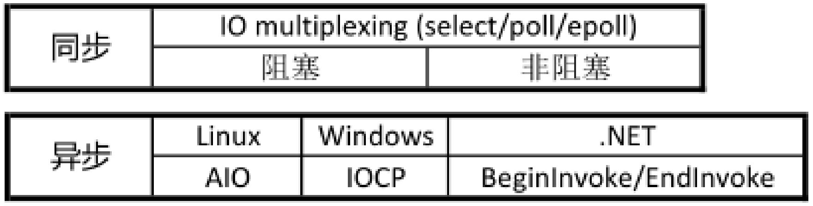

**I/O多路复用是同步的（内核只负责检测缓冲区是否变化，具体的操作是用户态的）**


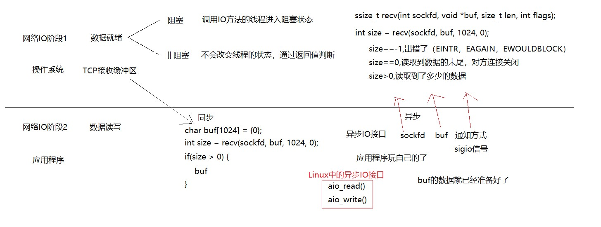

- 同步：内核只负责判断通知，应用程序在用户态从sockfd读取数据到buf，直到将fd中的数据全部读取到buf（并返回读取到的数据量size），才能继续向下执行。（耗时操作都是在用户态）
- 异步：**内核负责将sockfd中的数据搬运到buf，并通过通知方式通知主线程（应用程序），利用内核提供的服务，效率高。编写复杂。**

异步（高效率）一般和非阻塞（高效率）使用


**一个典型的网络IO接口调用，分为两个阶段，分别是“数据就绪” 和 “数据读写”，数据就绪阶段分为阻塞和非阻塞，表现得结果就是，阻塞当前线程（阻塞，挂起线程）还是是直接返回（非阻塞，直接返回，通过返回值判断）。**

**同步表示A向B请求调用一个网络IO接口时（或者调用某个业务逻辑API接口时），数据的读写都是由请求方A自己来完成的（不管是阻塞还是非阻塞）；**

**异步表示A向B请求调用一个网络IO接口时（或者调用某个业务逻辑API接口时），向B传入请求的事件以及事件发生时通知的方式，A就可以处理其它逻辑了，当B监听到事件处理完成后，会用事先约定好的通知方式，通知A处理结果。**


- 同步阻塞

- 同步非阻塞

- 异步阻塞（较少使用）

- 异步非阻塞


# 2.Unix/Linux上的五种IO模型

## a. 阻塞 blocking

调用者调用了某个函数，等待这个函数返回，期间什么也不做，不停的去检查这个函数有没有返回，必须等这个函数返回才能进行下一步动作。

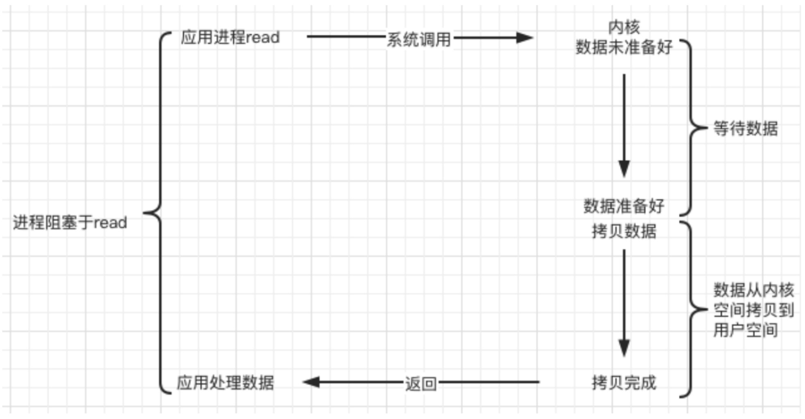

（同步）


`read`  `recv` 

阻塞与非阻塞是文件描述符的属性，是通过文件描述符fd设置的


## b. 非阻塞 non-blocking（NIO）

非阻塞等待，每隔一段时间就去检测IO事件是否就绪。没有就绪（直接返回）就可以做其他事。非阻塞I/O执行系统调用总是立即返回，不管事件是否已经发生，若事件没有发生，则返回-1，此时可以根据 errno 区分这两种情况，对于accept，recv 和 send，事件未发生时，errno 通常被设置成 EAGAIN（条件还没有发生，让程序再次尝试），此时不应该exit。

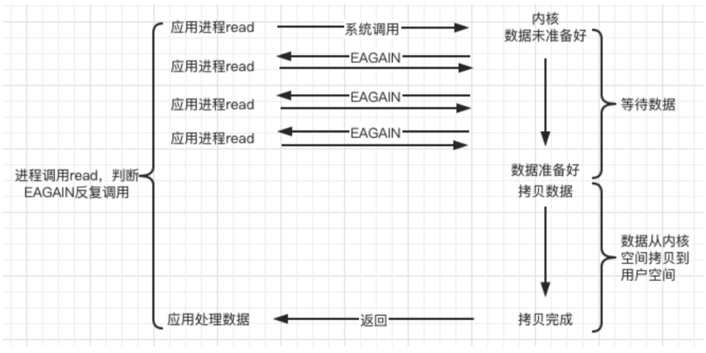

拷贝数据用户自己实现，同步


## c. IO复用（IO multiplexing）

单线程的阻塞/非阻塞只能处理一个客户端

单线程+IO复用 可以实现检测多个事件

**Linux 用  `select/poll/epoll`  函数实现 IO 复用模型，这些函数也会使进程阻塞，但是和阻塞IO所不同的是这些函数可以同时阻塞多个IO操作（从而实现检测多个IO缓冲区事件）。而且可以同时对多个读操作、写操作的IO函数进行检测（委托内核进行）。直到有数据可读或可写时，才真正调用IO操作函数。（用户态自己处理）**

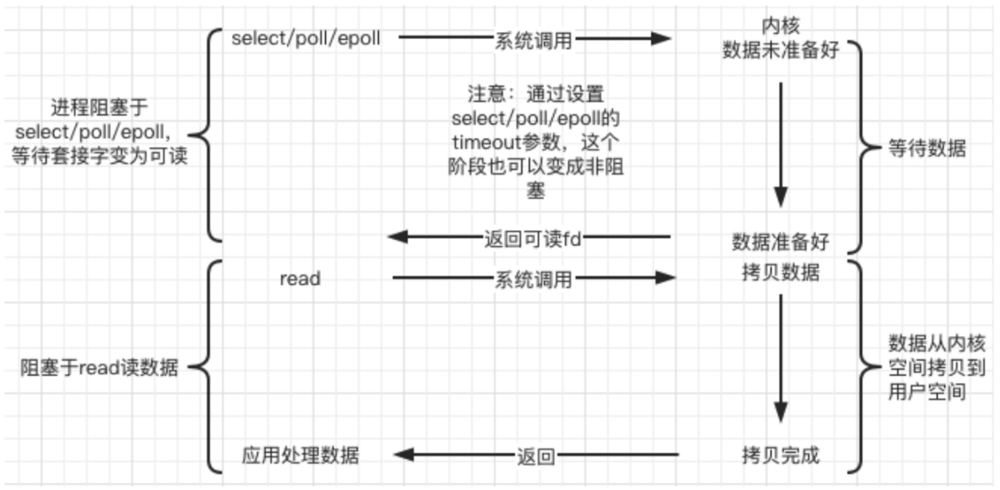

IO复用：可以实现一次检测多个事件（委托内核），事件发生了（检测的IO缓冲区有变化），主线程去相应处理。

并不是高并发的手段，要实现并发，需要多线程


IO多路复用也会阻塞，但和BIO不同的是，可以实现多个IO缓冲区的阻塞检测（委托内核实现）

BIO模式下，应用程序自己实现IO缓冲区检测，每次只能阻塞检测一个


## d. 信号驱动（signal-driven）

Linux 用套接口进行信号驱动 IO，安装一个信号处理函数，进程继续运行并不阻塞，当IO事件就绪，进程收到SIGIO 信号，然后处理 IO 事件。

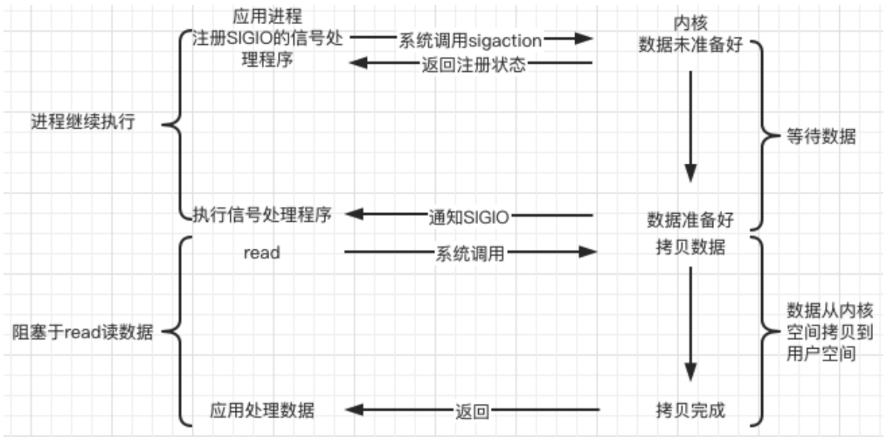


内核在第一个阶段是异步（让内核去检测，主线程可以做自己的事情，事件发生了内核通过信号通知线程），在第二个阶段是同步（用户态自己读取拷贝数据）；与非阻塞IO的区别在于它提供了消息通知机制，不需要用户进程不断的轮询检查，减少了系统API的调用次数，提高了效率。

## e. 异步（asynchronous）

Linux中，可以调用 aio_read 函数告诉内核描述字缓冲区指针和缓冲区的大小、文件偏移及通知的方式，然后立即返回（主线程可以做自己的事情），当**内核将数据拷贝到缓冲区（用户态）**后，再通知应用程序，应用程序直接使用，不用自己拷贝。

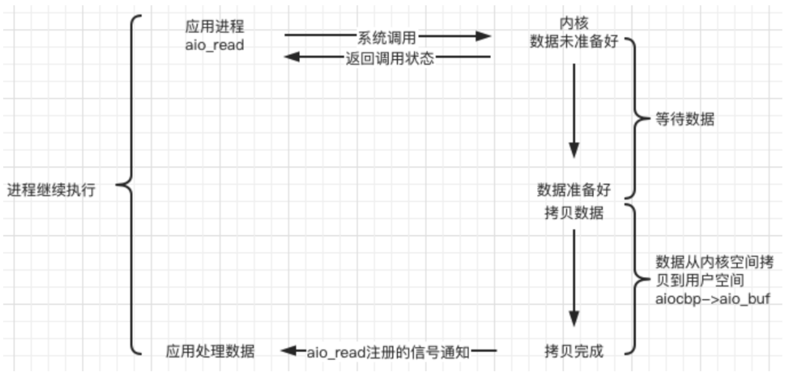

异步，在内核态实现将数据从内核态拷贝到用户态，不用用户线程自己实现

IO复用：内核通知已经就绪（或者将就绪的准备好），用户态拷贝


异步、信号较复杂

项目中主要用IO多路复用、非阻塞


```c
/* Asynchronous I/O control block. */		// 异步IO控制块
struct aiocb
{
    int aio_fildes; 				/* File desriptor. */  要监听的文件描述符
    int aio_lio_opcode; 			/* Operation to be performed. */
    int aio_reqprio; 				/* Request priority offset. */
    volatile void *aio_buf; 		/* Location of buffer. */  输出数组，内核将数据输出到这里，用户态进行操作即可，不用自己拷贝数据
    size_t aio_nbytes; 				/* Length of transfer. */
    struct sigevent aio_sigevent; 	/* Signal number and value. */	通知机制，内核将数据拷贝好了如何通知用户线程
    
    /* Internal members. */
    struct aiocb *__next_prio;
    int __abs_prio;
    int __policy;
    int __error_code;
    __ssize_t __return_value;
    
    
#ifndef __USE_FILE_OFFSET
	__off_t aio_offset; /* File offset. */
char __pad[sizeof (__off64_t) - sizeof (__off_t)];
#else
	__off64_t aio_offset; /* File offset. */
#endif
	char __glibc_reserved[32];
};
```


# 3. Web Server（网页服务器）

一个 Web Server 就是一个服务器软件（程序），或者是运行这个服务器软件的硬件（计算机）。其主要功能是通过 HTTP 协议与客户端（通常是浏览器（Browser））进行通信，来接收，存储，处理来自客户端的 HTTP 请求，并对其请求做出 HTTP 响应，返回给客户端其请求的内容（文件、网页等）或返
回一个 Error 信息。

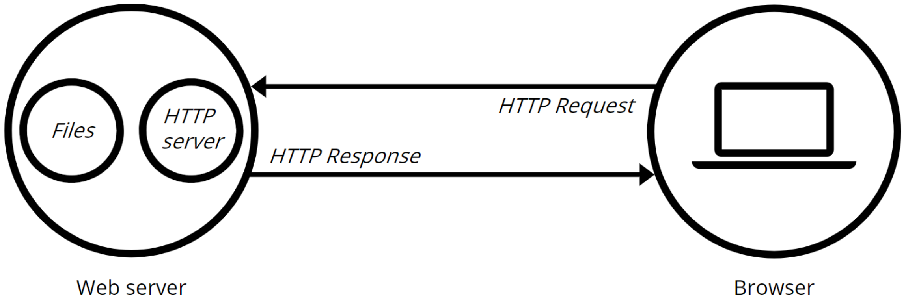

通常用户使用 Web 浏览器与相应服务器进行通信。在浏览器中键入“域名”或“IP地址:端口号”，浏览器则先将你的域名解析成相应的 IP 地址或者直接根据你的IP地址向对应的 Web 服务器发送一个 HTTP 请求。这一过程首先要通过 TCP 协议的三次握手建立与目标 Web 服务器的连接，然后 HTTP 协议生成针对目标 Web 服务器的 HTTP 请求报文，通过 TCP、IP 等协议发送到目标 Web 服务器上。


HTTP协议基于TCP协议


# 4.HTTP协议(应用层的协议)

## 简介

超文本传输协议（Hypertext Transfer Protocol，HTTP）是一个简单的请求 - 响应协议，它**通常运行在TCP 之上**。它**指定了客户端可能发送给服务器什么样的消息以及得到什么样的响应**。请求和响应消息的头以 ASCII 形式给出；而消息内容则具有一个类似 MIME 的格式。HTTP是万维网的数据通信的基础。

HTTP的发展是由蒂姆·伯纳斯-李于 1989 年在欧洲核子研究组织（CERN）所发起。HTTP的标准制定由万维网协会（World Wide Web Consortium，W3C）和互联网工程任务组（Internet Engineering Task Force，IETF）进行协调，最终发布了一系列的RFC，其中最著名的是 1999 年 6 月公布的 RFC 2616，定
义了HTTP协议中现今广泛使用的一个版本——HTTP 1.1。

## 概述

服务器主机上运行着很多程序，处理HTTP请求的服务器程序端口为80，客户端向该80端口发送消息

**HTTP 是一个客户端终端（用户）和服务器端（网站）请求和应答的标准（TCP）**。通过使用网页浏览器网络爬虫或者其它的工具，客户端发起一个HTTP请求到服务器上指定端口（默认端口为 80 ）。我们称这个客户端为用户代理程序（user agent）。应答的服务器上存储着一些资源，比如 HTML 文件和图像。我们称这个应答服务器为源服务器（origin server）。在用户代理和源服务器中间可能存在多个“中间层”，比如代理服务器、网关或者隧道（tunnel）。

尽管 TCP/IP 协议是互联网上最流行的应用，HTTP 协议中，并没有规定必须使用它或它支持的层。事实上，HTTP可以在任何互联网协议上，或其他网络上实现。HTTP 假定其下层协议提供可靠的传输。因此，任何能够提供这种保证的协议都可以被其使用。因此也就是其在 TCP/IP 协议族使用 TCP 作为其传输层。

通常，由HTTP客户端发起一个请求，创建一个到服务器指定端口（默认是 80 端口）的 TCP 连接。HTTP服务器则在那个端口监听客户端的请求。一旦收到请求，服务器会向客户端返回一个状态，比如"HTTP/1.1 200 OK"，以及返回的内容，如请求的文件、错误消息、或者其它信息。

## 工作原理

研究HTTP就是研究HTTP报文

HTTP 协议定义 Web 客户端如何从 Web 服务器请求 Web 页面，以及服务器如何把 Web 页面传送给客户端。HTTP 协议采用了**请求/响应模型**。客户端向服务器发送一个请求报文，请求报文包含请求的方法、URL、协议版本、请求头部和请求数据。服务器以一个状态行作为响应，响应的内容包括协议的版本、成功或者错误代码、服务器信息、响应头部和响应数据。

以下是 HTTP 请求/响应的步骤：

```
1. 客户端连接到 Web 服务器
	一个HTTP客户端，通常是浏览器，与 Web 服务器的 HTTP 端口（默认为 80 ）建立一个 TCP 套接字连接。例如，http://www.baidu.com。（URL）
2. 发送 HTTP 请求
	通过 TCP 套接字，客户端向 Web 服务器发送一个文本的请求报文，--->一个请求报文由请求行、请求头部、空行和请求数据 4 部分组成。<---
3. 服务器接受请求并返回 HTTP 响应
    Web 服务器解析请求，定位请求资源。服务器将资源复本写到 TCP 套接字，由客户端读取。--->一个响应由状态行、响应头部、空行和响应数据 4 部分组成。<---
4. 释放连接 TCP 连接
	若 connection 模式为 close，则服务器主动关闭 TCP连接，客户端被动关闭连接，释放 TCP 连接；若connection 模式为 keepalive，则该连接会保持一段时间，在该时间内可以继续接收请求;
5. 客户端浏览器解析 HTML 内容
	客户端浏览器首先解析状态行，查看表明请求是否成功的状态代码。然后解析每一个响应头，响应头告知以下为若干字节的 HTML 文档和文档的字符集。客户端浏览器读取响应数据 HTML，根据HTML 的语法对其进行格式化，并在浏览器窗口中显示。
```
例如：**在浏览器地址栏键入URL，按下回车之后会经历以下流程：**

```
1. 浏览器向 DNS 服务器请求解析该 URL 中的域名所对应的 IP 地址;
2. 解析出 IP 地址后，根据该 IP 地址和默认端口 80 ，和该IP服务器上处理HTTP的程序建立 TCP 连接;
3. 浏览器发出读取文件（URL 中域名后面部分对应的文件）的 HTTP 请求，该请求报文作为 TCP 三次握手的第三个报文的数据发送给服务器;
4. 服务器对浏览器请求作出响应，并把对应的 HTML 文本发送给浏览器;( Web 服务器解析请求，定位请求的资源，将资源复本写到 TCP 套接字，由客户端读取。)
5. 释放 TCP 连接;
6. 浏览器将该 HTML 文本并显示内容。
```


HTTP 协议是基于 TCP/IP 协议之上的应用层协议，基于 请求-响应 的模式。HTTP 协议规定，请求从客户端发出，最后服务器端响应该请求并返回。换句话说，肯定是先从客户端开始建立通信的，服务器端在没有接收到请求之前不会发送响应。


## HTTP 请求报文格式


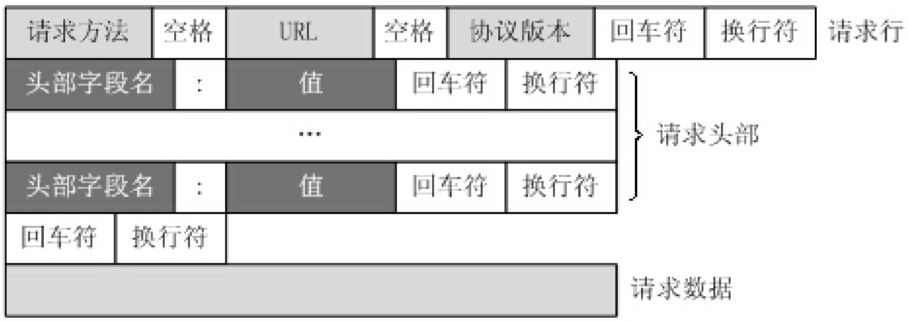

请求空行的作用是隔开请求头部与请求数据

```
GET / HTTP/1.1			// 请求行
Host: [http://www.baidu.com](http://www.baidu.com)		// 本行及以下均为请求头部--每一行格式均为--头部字段名：值（键值对）
User-Agent: Mozilla/5.0 (Windows NT 10.0; Win64; x64; rv:86.0) Gecko/20100101 Firefox/86.	// 客户端浏览器信息
Accept: text/html,application/xhtml+xml,application/xml;q=0.9,image/webp, _/_ ;q=0.			// 客户端可以接收解析什么类型的数据
Accept-Language: zh-CN,zh;q=0.8,zh-TW;q=0.7,zh-HK;q=0.5,en-US;q=0.3,en;q=0.					// 客户端可以接受的语言信息
Accept-Encoding: gzip, deflate, br			// 压缩方式
Connection: keep-alive						// 让服务器不要立即断开连接，保持一段时间
Cookie: BAIDUID=6729CB682DADC2CF738F533E35162D98:FG=1;
BIDUPSID=6729CB682DADC2CFE015A8099199557E; PSTM=1614320692; BD_UPN=13314752;
BDORZ=FFFB88E999055A3F8A630C64834BD6D0;
__yjs_duid=1_d05d52b14af4a339210722080a668ec21614320694782; BD_HOME=1;
H_PS_PSSID=33514_33257_33273_31660_33570_26350;
BA_HECTOR=8h2001alag0lag85nk1g3hcm60q
Upgrade-Insecure-Requests: 1
Cache-Control: max-age=0
						// 请求空行（回车符+空行符）			（GET方法没有请求数据字段）
```


## HTTP响应报文格式


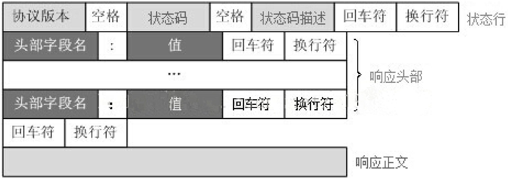


```
HTTP/1.1 200 OK					// 状态行
Bdpagetype: 1					// 响应头部（对响应正文的描述）
Bdqid: 0xf3c9743300024ee
Cache-Control: private
Connection: keep-alive			// 让客户端浏览器保持连接一段时间
Content-Encoding: gzip			// 服务器发送过来的响应正文的压缩方式
Content-Type: text/html;charset=utf-	// 响应正文格式
Date: Fri, 26 Feb 2021 08:44:35 GMT		// 发送时间
Expires: Fri, 26 Feb 2021 08:44:35 GMT
Server: BWS/1.							// 服务器信息
Set-Cookie: BDSVRTM=13; path=/
Set-Cookie: BD_HOME=1; path=/
Set-Cookie: H_PS_PSSID=33514_33257_33273_31660_33570_26350; path=/; domain=.baidu.com
Strict-Transport-Security: max-age=
Traceid: 1614329075128412289017566699583927635684
X-Ua-Compatible: IE=Edge,chrome=
Transfer-Encoding: chunked
				// 响应空行
......			// 响应正文
```


## HTTP请求方法

HTTP/1.1 协议中共定义了八种方法（也叫“动作”）来以不同方式操作指定的资源：

1. **GET**：**向指定的资源发出“显示”请求**。使用 GET 方法应该**只用在读取数据**，而不应当被用于产生“副作用”的操作中，例如在 Web Application 中。其中一个原因是 GET 可能会被网络蜘蛛等随访问。
2. HEAD：与 GET 方法一样，都是向服务器发出指定资源的请求。只不过服务器将不传回资源的本文部分。它的好处在于，使用这个方法可以在不必传输全部内容的情况下，就可以获取其中“关于该资源的信息”（元信息或称元数据）。
3. **POST**：**向指定资源提交数据，请求服务器进行处理**（例如提交表单或者上传文件）。数据被包含在请求本文中。**这个请求可能会创建新的资源或修改现有资源，或二者皆有。**
4. PUT：向指定资源位置上传其最新内容。
5. DELETE：请求服务器删除 Request-URI 所标识的资源。
6. TRACE：回显服务器收到的请求，主要用于测试或诊断。
7. OPTIONS：这个方法可使服务器传回该资源所支持的所有 HTTP 请求方法。用'*'来代替资源名称，向 Web 服务器发送 OPTIONS 请求，可以测试服务器功能是否正常运作。
8. CONNECT：HTTP/1.1 协议中预留给能够将连接改为管道方式的代理服务器。通常用于SSL加密服务器的链接（经由非加密的 HTTP 代理服务器）。


## HTTP状态码

**所有HTTP响应的第一行都是状态行**，依次是当前HTTP版本号， 3 位数字组成的状态代码，以及描述状态的短语，彼此由空格分隔。

状态代码的第一个数字代表当前响应的类型：

```
1xx消息		——请求已被服务器接收，继续处理
2xx成功		——请求已成功被服务器接收、理解、并接受
3xx重定向	   ——需要后续操作才能完成这一请求
4xx请求错误	   ——请求含有词法错误或者无法被执行
5xx服务器错误  ——服务器在处理某个正确请求时发生错误
```
虽然 RFC 2616 中已经推荐了描述状态的短语，例如"200 OK"，"404 Not Found"，但是WEB开发者仍然能够自行决定采用何种短语，用以显示本地化的状态描述或者自定义信息。

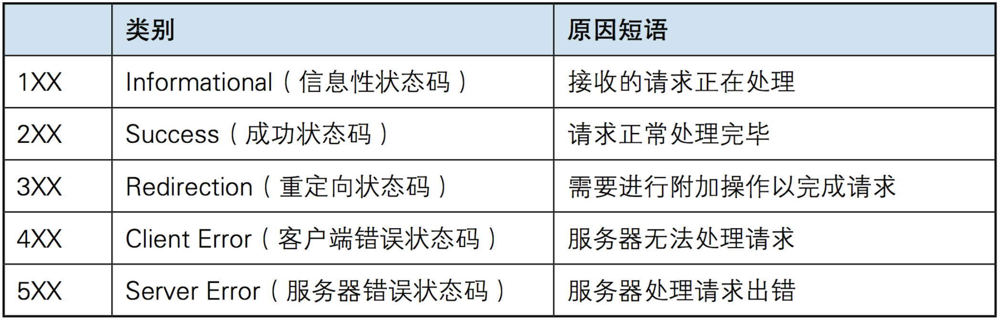

更多状态码：https://baike.baidu.com/item/HTTP%E7%8A%B6%E6%80%81%E7%A0%81/5053660?fr=aladdin


# 5.服务器编程基本框架

虽然服务器程序种类繁多，但其基本框架都一样，不同之处在于逻辑处理（如何解析请求、如何做出响应）。

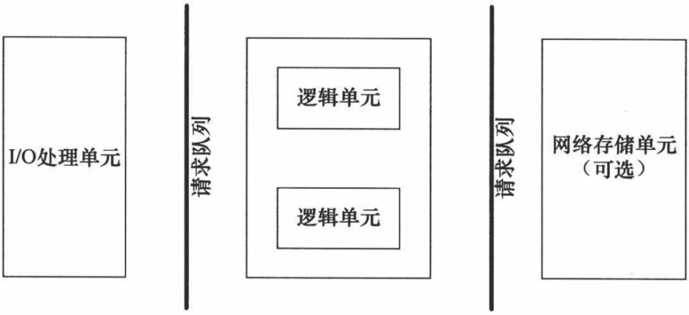

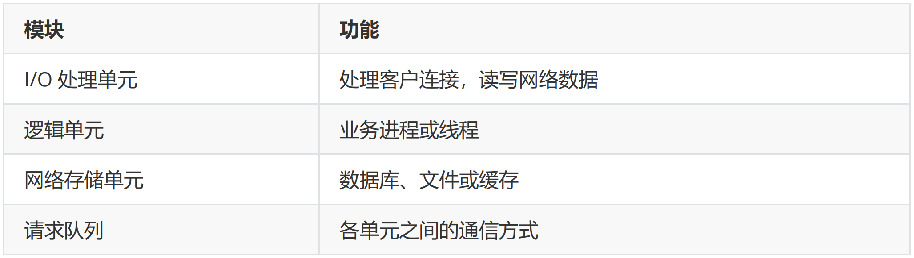

- I/O 处理单元是服务器管理客户连接的模块（管理连接到服务器的客户端）。它通常要完成以下工作：1、**等待并接受新的客户连接**，2、**接收客户数据**（将数据通过请求队列发送给逻辑单元），3、将（逻辑单元通过请求队列发送过来的）服务器响应数据返回给客户端。但是数据的收发不一定在 I/O 处理单元中执行，也可能在逻辑单元中执行，具体在何处执行取决于事件处理模式。

- 一个逻辑单元通常是一个进程或线程（一般是一个进程/线程负责处理一个客户端的请求----解析请求、作出响应，实现并发就需要多线程）。它分析并处理客户数据，然后将结果传递给 I/O 处理单元或者直接发送给客户端（具体使用哪种方式取决于事件处理模式）。服务器通常拥有多个逻辑单元，以实现对多个客户任务的并发处理。

- 网络存储单元可以是数据库、缓存和文件，但不是必须的。

- 请求队列是各单元之间的通信方式的抽象。I/O 处理单元接收到客户请求时，需要以某种方式通知一个逻辑单元来处理该请求。同样，多个逻辑单元同时访问一个存储单元时，也需要采用某种机制来协调处理竞态条件。请求队列通常被实现为池的一部分（进程池、线程池）。


# 6.两种高效的事件处理模式

- 服务器程序通常需要处理三类事件：I/O 事件、信号、定时事件。
- 有两种高效的事件处理模式：Reactor和 Proactor，
  - 同步 I/O 模型通常用于实现 Reactor 模式，
  - 异步 I/O 模型通常用于实现 Proactor 模式。

在 Linux 下的异步 I/O 是不完善的，aio 系列函数是由 POSIX 定义的异步操作接口，不是真正的操作系统级别支持的，而是在用户空间模拟出来的异步，并且仅仅支持基于本地文件的 aio 异步操作，网络编程中的 socket 是不支持的，这也使得**基于 Linux 的高性能网络程序都是使用 Reactor 方案**。
而 Windows 里实现了一套完整的支持 socket 的异步编程接口，这套接口就是 IOCP，是由操作系统级别实现的异步 I/O，真正意义上异步 I/O，因此在 Windows 里实现高性能网络程序可以使用效率更高的 Proactor 方案。


## Reactor模式

要求**主线程（I/O处理单元）只负责监听文件描述符上是否有事件发生**，有的话就立即将该事件通知工作线程（逻辑单元）----将 socket 可读可写事件（IO事件）放入请求队列，交给工作线程（子线程）处理。除此之外，主线程不做任何其他实质性的工作。**读写数据，接受新的连接(accept)，以及处理客户请（业务逻辑）求均在工作线程中完成。**

使用同步 I/O（以 epoll_wait 为例）实现的 Reactor 模式的工作流程是：

1. 主线程往 epoll 内核事件表中注册 socket 上的读就绪事件（委托内核检测读缓冲区）。
2. 主线程调用 epoll_wait 等待 socket 上有数据可读。
3. 当 socket 上有数据可读时， epoll_wait 通知主线程。主线程就将 socket 可读事件放入请求队列（主线程只负责放入队列通知工作线程）。
4. 睡眠在请求队列上的某个工作线程被唤醒，它从 socket 读取数据，并处理客户请求，然后往 epoll内核事件表中注册该 socket 上的写就绪事件（读取数据、处理均由工作线程实现，向网络写数据需要申请socket写就绪事件）。
5. 主线程调用 epoll_wait 等待 socket 可写。
6. 当 socket 可写时，epoll_wait 通知主线程。主线程将 socket 可写事件放入请求队列（以通知工作线程）。
7. 睡眠在请求队列上的某个工作线程被唤醒，它往 socket 上写入服务器处理客户请求的结果（并发送给客户端/IO处理单元）。

Reactor 模式的工作流程：

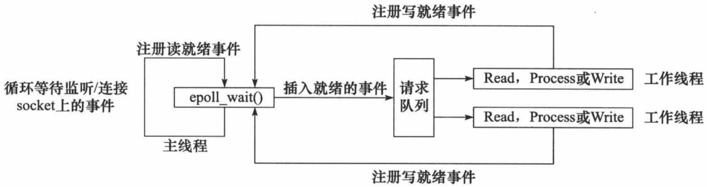


## Proactor模式

Proactor 模式将**所有 I/O 操作都交给主线程和内核来处理（进行读、写）**，**工作线程仅仅负责业务逻辑**。使用异步 I/O 模型（以 aio_read 和 aio_write 为例）实现的 Proactor 模式的工作流程是：

1. 主线程调用 aio_read 函数向内核注册 socket 上的读完成事件，并告诉内核用户读缓冲区的位置，以及读操作完成时如何通知应用程序（这里以信号为例）。
2. 主线程继续处理其他逻辑。
3. 当 socket 上的数据被读入用户缓冲区后，内核将向应用程序（工作线程）发送一个信号，以通知应用程序数据已经可用（数据由内核拷贝好）。
4. 应用程序（主线程）预先定义好的信号处理函数（内核以信号通知主线程）选择一个**工作线程来处理客户请求**。工作线程处理完客户请求后，调用 aio_write 函数向内核注册 socket 上的写完成事件，并告诉内核用户写缓冲区的位置，以及写操作完成时如何通知应用程序（然后应用程序就想干啥干啥等通知）。
5. 主线程继续处理其他逻辑。
6. 当用户缓冲区的数据被写入 socket 之后（内核负责将工作线程产生的数据写入后），内核将向应用程序发送一个信号，以通知应用程序数据已经发送完毕。
7. 应用程序预先定义好的信号处理函数选择一个工作线程来做善后处理，比如决定是否关闭 socket。

Proactor 模式的工作流程：

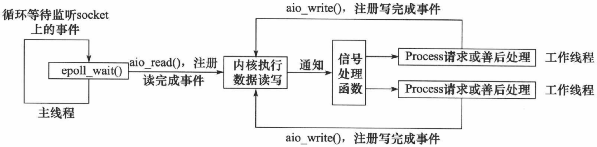

## 模拟 Proactor 模式


使用同步 I/O 方式模拟出 Proactor 模式。原理是：**主线程执行数据读写操作，读写完成之后，主线程向工作线程通知这一”完成事件“**。那么**从工作线程的角度来看，它们就直接获得了数据读写的结果，接下来要做的只是对读写的结果进行逻辑处理。**

使用同步 I/O 模型（以 epoll_wait为例）模拟出的 Proactor 模式的工作流程如下：

1. 主线程往 epoll 内核事件表中注册 socket 上的读就绪事件。
2. 主线程调用 epoll_wait 等待 socket 上有数据可读。
3. 当 socket 上有数据可读时，epoll_wait 通知主线程。**主线程从 socket 循环读取数据，直到没有更多数据可读，然后将读取到的数据封装成一个请求对象并插入请求队列（让工作线程直接可以使用）。**
4. 睡眠在请求队列上的某个**工作线程**被唤醒，它**获得请求对象并处理客户请求（解析请求、生成响应），处理结束后往 epoll 内核事件表中注册 socket 上的写就绪事件。**
5. 主线程调用 epoll_wait 等待 socket 可写。
6. 内核检测到当 socket 可写时，epoll_wait 通知主线程。**主线程往 socket 上写入工作线程处理客户请求的结果**（写操作在主线程实现，工作线程只负责逻辑处理、准备好数据）。
7. 结束，写入完成后不会再通知工作线程


工作线程只负责逻辑处理（以及准备好相应数据），主线程负责写，写好后通知工作线程

同步 I/O 模拟 Proactor 模式的工作流程：

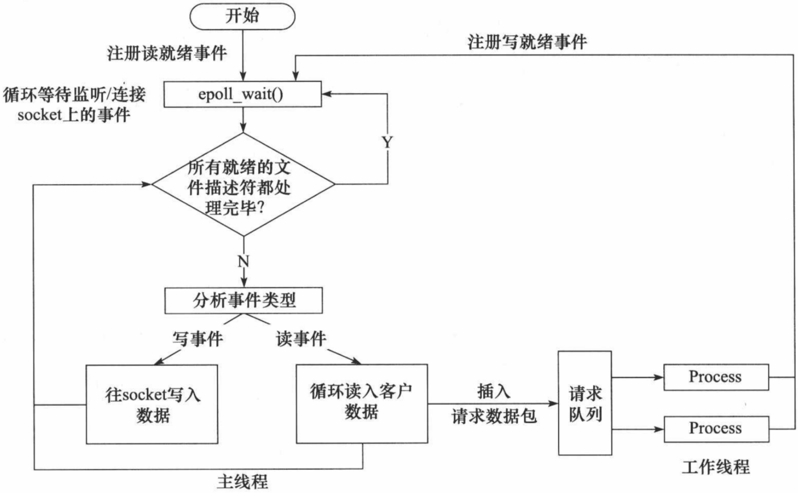

主线程工作线程（请求队列）、socket


# 7.线程池

线程池是由服务器**预先创建的一组子线程**，线程池中的线程数量应该和 CPU 数量差不多。线程池中的所有子线程都运行着相同的代码。当有新的任务到来时，**主线程将通过某种方式选择线程池中的某一个子线程来为之服务**。相比与动态地创建子线程，**选择一个已经存在的子线程的代价显然要小得多**。至于主线程选择哪个子线程来为新任务服务，则有多种方式：

- 主线程使用某种算法来主动选择子线程。最简单、最常用的算法是随机算法和 Round Robin（轮流选取）算法，但更优秀、更智能的算法将使任务在各个工作线程中更均匀地分配，从而减轻服务器的整体压力。
- **主线程和所有子线程通过一个共享的工作队列来同步，子线程都睡眠在该工作队列上。当有新的任务到来时，主线程将任务添加到工作队列中。这将唤醒正在等待任务的子线程，不过只有一个子线程将获得新任务的”接管权“，它可以从工作队列中取出任务并执行之，而其他子线程将继续睡眠在工作队列上。**

### 线程池的一般模型为：

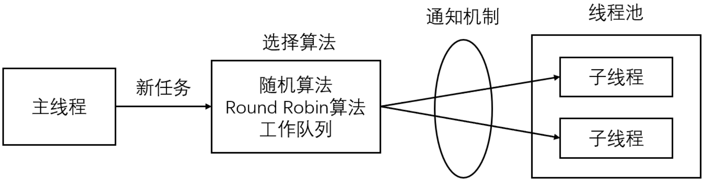

线程池中的线程数量最直接的限制因素是中央处理器(CPU)的处理器(processors/cores)的数量 `N` ：如果你的CPU是4-cores的，对于CPU密集型的任务(如视频剪辑等消耗CPU计算资源的任务)来说，那线程池中的线程数量最好也设置为 4 （或者+1防止其他因素造成的线程阻塞）；**对于IO密集型的任务，一般要多于CPU的核数，因为线程间竞争的不是CPU的计算资源而是IO，IO的处理一般较慢，多于cores数的线程将为CPU争取更多的任务，不至在线程处理IO的过程造成CPU空闲导致资源浪费。**

- 空间换时间，浪费服务器的硬件资源，换取运行效率。
- 池是一组资源的集合，这组资源在服务器启动之初就被完全创建好并初始化，这称为静态资源。
- 当服务器进入正式运行阶段，开始处理客户请求的时候，如果它需要相关的资源，可以直接从池中获取，无需动态分配。
- 当服务器处理完一个客户连接后，可以把相关的资源放回池中，无需执行系统调用释放资源。


# 8. 有限状态机

逻辑单元内部的一种高效编程方法：有限状态机（finite state machine）。

有的应用层协议头部包含数据包类型字段，**每种类型可以映射为逻辑单元的一种执行状态，服务器可以根据它来编写相应的处理逻辑**。如下是一种状态独立的有限状态机：

```
STATE_MACHINE( Package _pack )
{
    PackageType _type = _pack.GetType();
    switch( _type )
    {
        case type_A:
            process_package_A( _pack );
            break;
        case type_B:
            process_package_B( _pack );
            break;
    }
}
```

这是一个简单的有限状态机，只不过该状态机的每个状态都是相互独立的，即状态之间没有相互转移。

状态之间的转移是需要状态机内部驱动，如下代码：

```
STATE_MACHINE()
{
    State cur_State = type_A;
    while( cur_State != type_C )
    {
        Package _pack = getNewPackage();
        switch( cur_State )
        {
            case type_A:
                process_package_state_A( _pack );
                cur_State = type_B;
                break;
            case type_B:
                process_package_state_B( _pack );
                cur_State = type_C;
                break;
        }
    }
}
```

该状态机包含三种状态：type_A、type_B 和 type_C，其中 type_A 是状态机的开始状态，type_C 是状态机的结束状态。状态机的当前状态记录在 cur_State 变量中。在一趟循环过程中，状态机先通过getNewPackage 方法获得一个新的数据包，然后根据 cur_State 变量的值判断如何处理该数据包。数据包处理完之后，状态机通过给 cur_State 变量传递目标状态值来实现状态转移。那么当状态机进入下一趟循环时，它将执行新的状态对应的逻辑。

# 9.EPOLLONESHOT事件

即使可以使用 ET 模式，一个socket 上的某个事件还是可能被触发多次。这在并发程序中就会引起一个问题。比如一个线程在读取完某个 socket 上的数据后开始处理这些数据，而**在数据的处理过程中该socket 上又有新数据可读（EPOLLIN 再次被触发），此时另外一个线程被唤醒来读取这些新的数据**。于是就出现了**两个线程同时操作一个 socket 的局面**。**一个socket连接在任一时刻都只被一个线程处理**，可以使用 epoll 的 EPOLLONESHOT 事件实现。

对于注册了 EPOLLONESHOT 事件的文件描述符，操作系统最多触发其上注册的一个可读、可写或者异常事件，且只触发一次，除非我们使用 epoll_ctl 函数重置该文件描述符上注册的 EPOLLONESHOT 事件。这样，当一个线程在处理某个 socket 时，其他线程是不可能有机会操作该 socket 的。但反过来思考，注册了 EPOLLONESHOT 事件的 socket 一旦被某个线程处理完毕， 该线程就应该**立即重置这个socket 上的 EPOLLONESHOT 事件**，以确保这个 socket 下一次可读时，其 EPOLLIN 事件能被触发，进而让其他工作线程有机会继续处理这个 socket。

# 10.服务器压力测试

Webbench 是 Linux 上一款知名的、优秀的 web 性能压力测试工具。它是由Lionbridge公司开发。

```
测试处在相同硬件上，不同服务的性能以及不同硬件上同一个服务的运行状况。
展示服务器的两项内容：每秒钟响应请求数和每秒钟传输数据量。
```
基本原理：Webbench 首先 fork 出多个子进程，每个子进程都循环做 web 访问测试。子进程把访问的
结果通过pipe 告诉父进程，父进程做最终的统计结果。

### 测试示例

```

```

webbench - c 1000 - t  30 [http://192.168.110.129:10000/index.html](http://192.168.110.129:10000/index.html)

参数：

- c 表示客户端数
- t 表示时间


改进：

LT模式改为ET模式


 